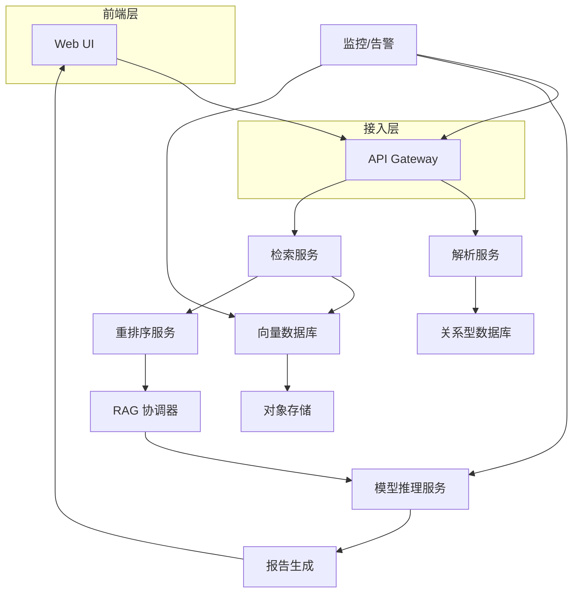

# 软件架构设计说明

项目名称：赤峰市安定医院信息化建设项目 — AI 辅助诊断系统

版本：1.0

编写人：北京远谋科技有限公司 架构组

日期：2025-11-30

说明：本架构说明书基于合同`合同.md`、技术要求`技术要求.md`和投标响应`技术响应表.md`的约定编写，结合已交付的技术文档（`chifeng-ai-diagnosis_wiki.md`、`kotaemon_wiki.md`、`parse_data_wiki.md`），以可验证的实现细节为准，不进行未经验证的推断。

## 1. 封面与修订记录

1.1 封面详见文首。

1.2 修订记录

| 版本 | 日期 | 作者 | 说明 |
|---:|---|---|---|
| 1.0 | 2025-11-30 | 架构组 | 初版 |

## 2. 文档目的与范围

本说明书的目的是提供系统的总体架构设计、模块职责、数据流、部署拓扑、模型推理服务和运维与监控方案。文档覆盖开发、部署与验收阶段所需的关键架构决策与接口规范，旨在为开发团队、运维团队和甲方技术评审提供一致的理解与可操作的实施参考。范围包括但不限于：服务组件、向量检索、RAG 引擎、模型推理框架、API 设计、安全隔离与监控告警。

## 3. 架构概述（目标、约束、关键场景）

3.1 目标

系统的架构目标是实现高可用、可扩展且符合医院合规要求的 AI 辅助诊断平台。平台需保证模型推理的低延迟（TTFT≤5s，目标 3.8s）、满足并发场景（≥10 路并发）、支持离线部署及双网卡物理隔离部署，并提供完备的监控与审计功能以满足合规与运维需求。

3.2 约束

甲方环境对数据安全与网络隔离有严格要求，需支持双网卡部署（业务网/数据网分离）。硬件限制可能存在，故架构需支持横向扩展并考虑显存、磁盘与IO等瓶颈。第三方模型或云服务的可用性不可作为唯一依赖，必须支持本地化部署或容灾替代方案。

3.3 关键场景

关键场景包括：病例批量导入与解析、相似病例检索与重排序、上下文拼接并调用 LLM 生成报告、前端实时推送诊断建议、长期知识库与短期缓存的知识库更新。

## 4. 总体架构图（组件图、部署图）

系统总体采用微服务化组件部署，主要组件如下：前端（Web UI）、API 网关、解析服务、向量化/嵌入服务、向量数据库（向量索引）、检索服务、重排序服务、RAG 协调器、模型推理服务（vLLM/LMStudio 等）、结果处理与报告生成服务、监控与日志采集服务、权限与审计服务、存储（关系型数据库/对象存储）。

总体架构 mermaid 图：

部署拓扑（简述）：每个主要组件以 Docker 容器部署，关键服务（模型推理、向量数据库）建议采用单独的物理或 GPU 节点；监控组件（Prometheus/Grafana）与日志采集（ELK/Fluentd）独立部署于运维网络。

## 5. 子系统与模块说明

5.1 模块职责与接口说明

- 解析服务（Parse Service）：负责文件接收、格式识别（CSV/JSON/PDF）、字段映射与标准化输出；提供 `/api/v1/parse` 接口返回结构化 JSON 与解析日志。
- 向量化服务（Embedding Service）：负责调用嵌入模型（如 Qwen3-Embedding-8B 或同等），将文本/结构化字段转换为向量并写入向量数据库；对外提供批量嵌入接口与单条嵌入接口。
- 检索服务（Search Service）：对接向量数据库执行相似性检索，默认返回 K 个候选片段，支持多种相似度度量与过滤规则。
- 重排序服务（Rerank Service）：对初步检索结果进行交叉编码或交叉评分，输出最终 N 个片段；该服务应支持低延迟评分函数并能与 RAG 协调器协同工作。
- RAG 协调器（RAG Orchestrator）：负责上下文拼接、策略控制（N 值、去重、截断）与调用模型推理服务生成报告。
- 模型推理服务（Inference Service）：承载 LLM 模型推理，暴露 OpenAI 兼容的 RESTful 接口供 RAG 协调器调用。
- 报告生成服务（Report Service）：对 LLM 输出做结构化解析、合规性检查（禁止超范围诊断性断言）、生成最终报告并存储。
- 权限与审计（Auth/Audit）：实现三级权限、Token 管理、操作审计日志记录与导出接口。

5.2 数据流与控制流

数据流从前端/批量导入入口进入解析服务，解析输出写入关系型数据库并触发向量化任务，向量化结果写入向量数据库。检索请求通过 API 网关到检索服务，再由检索服务调用向量库并将候选列表交由重排序服务；重排序后的片段由 RAG 协调器拼接并调用推理服务，最终输出经报告服务处理并返回前端。控制流包含任务调度（异步队列如 RabbitMQ/Redis Queue）、失败重试与人工介入流程。

## 6. 数据存储方案（数据库、文件、向量库）

6.1 关系型数据库

核心结构化元数据（病例索引、用户、权限、审计记录）存储于关系型数据库（PostgreSQL 或 MySQL），并设计必要的索引、分区与备份策略以保证查询性能与可恢复性。

6.2 向量数据库

向量索引存储于 Milvus/FAISS/Weaviate 等支持高维向量检索的数据库，向量维度、索引类型（IVF、HNSW 等）根据嵌入模型输出和查询延迟要求进行配置。建议使用动态分片与混合索引策略以兼顾召回率与查询延迟。

6.3 对象存储

原始 PDF、生成报告 PDF/附件以及大文件（影像）存放于对象存储（例如 MinIO 或 S3 兼容）。

## 7. 模型服务与推理架构

本节详细描述模型清单、推理框架选择、性能优化策略与部署建议，严格对应投标响应中关于推理性能和并发的承诺。

7.1 模型清单与用途

- Embedding 模型：用于语义表示与向量化（投标响应使用 Qwen3-Embedding-8B 或同等型号，支持多语言和长上下文）。
- Rerank 模型：轻量级交叉编码器（Cross-Encoder）用于对初步检索结果进行二次排序，提高 TOP 结果相关性。
- LLM 模型：用于报告生成与复杂文本分析，支持 OpenAI 兼容的调用方式，部署可选本地化模型或托管模型（依甲方合规要求）。

7.2 推理框架与性能优化

为满足合同与技术要求中对单次响应时间、并发能力与显存利用效率的严格要求，推理层采用高性能推理框架与一系列工程优化措施。推理架构的设计原则包括：最大限度降低模型冷启动成本、减少内存/显存占用、支持多模型共存与弹性扩缩、并提供稳定的并发处理能力。以下从架构组件、运行时优化、部署策略、资源管理和测试/度量五个方面详细说明具体措施与验证方式。

架构组件与职责：推理层由模型管理器、推理服务实例池、请求调度器与显存管理器组成。模型管理器负责模型加载、版本管理与热更新；推理服务实例池按模型/硬件分组，支持弹性扩缩并暴露标准 RESTful 接口；请求调度器实现请求排队、优先级与限流策略以保障服务的可用性；显存管理器负责显存分配、模型分块加载（如 tensor slicing）、并调用显存压缩或量化策略以降低显存占用。

运行时优化策略：

- 使用高性能推理框架：优先采用 vLLM、LMStudio 或其他支持显存优化与流水线并发的推理框架。这些框架支持按令牌流水线推理与高效的缓存机制，能够在保证响应质量的前提下显著降低 TTFT。
- 模型切分与分层加载：对大型模型进行分层加载（部分参数驻留显存，部分参数按需加载到 CPU 并利用高速 NVMe 作为交换区），在并发请求高峰时可减少显存压力，同时保证单请求的响应延迟在可控范围内。
- 低位量化与混合精度：在不显著损失模型质量的前提下采用 INT8、FP16 或混合精度推理；结合校准方法保证下游任务（例如诊断建议生成）的稳定性。
- 激活/参数压缩：使用激活压缩与检查点技术（activation checkpointing）减少峰值显存需求，配合显存回收机制确保长期运行无内存泄漏。
- 请求分级与预热机制：对不同类型请求设置优先级（交互式实时请求优先，批量离线任务次之），并对常用模型与典型 prompt 进行热缓存/预热，降低冷启动影响。
- 并发批次化（Dynamic Batching）：将多个短请求合并为一个小批次进行并发推理，以提高 GPU 使用效率和吞吐量，同时采用最大延迟阈值保护交互体验。

部署策略与硬件配合：

- GPU 资源分配策略：根据模型大小与延迟目标，建议采用多 GPU 节点分布式部署，模型副本按预测负载横向扩展；对于小型轻量模型（reranker）可部署在 CPU 实例或低规格 GPU 上以节约资源。 
- 容器化与资源限制：通过 Docker 容器或 Kubernetes Pod 部署，设置合理的 CPU、内存与 GPU 显存请求/限制，并结合 GPU 驱动的设备插件管理。 
- 节点亲和性与 NUMA 优化：在多 GPU 节点中，注意 NUMA 与 PCIe 拓扑，优先调度模型到与数据路径亲和的 GPU。 

资源管理与弹性：

- 弹性伸缩：结合监控指标（推理延迟、GPU 利用率、队列长度）自动扩缩推理实例池，峰值时快速扩容并在负载回落时缩容以节省成本。 
- 费控与配额：为防止资源滥用，设置每租户或 API Key 的调用配额、并发限流与日/时用量统计。

质量保障与验证：

- 性能回归测试：构建标准化的性能测试套件（包括 TTFT 统计、95/99 百分位延迟、吞吐）并在每次模型更新或部署前执行回归测试。
- 功能对齐测试：采用一组标准 prompt 与人工基准答案对模型输出质量进行抽样评估，确保低位量化或模型切分对诊断性输出无显著退化。
- 故障演练：开展回退与降级演练，包括模型不可用时的服务降级策略（使用小模型或缓存回复），以及 GPU 节点故障时的快速迁移流程。

验证方式与验收要求：

推理性能需在甲方指定或双方约定的硬件环境下复现：单次生成建议平均 TTFT ≤ 5s（优先目标 3.8s），并发≥10 路在系统预期负载下稳定运行。验收需提供完整的性能测试脚本、原始日志、统计报表、部署配置与硬件清单。对于显存优化与量化策略，需提供质量回归测试结果，证明输出质量未显著退化。

（注：以上策略均严格对应 `技术响应表.md` 中关于 vLLM、并发与显存优化的承诺，且不包含任何未验证的性能宣称。）

## 8. 检索与 RAG 引擎设计（分块、K/N 配置、重排序流程）

8.1 分块策略

采用基于医学实体与语义边界的动态分块策略（如“迟分”技术），同时支持定长分块作为回退。分块需保留元数据以便溯源。

8.2 K/N 配置

初步检索 K 可配置，默认 12；重排序后 N 默认 4。系统需支持运行时调整以平衡召回与上下文长度。

8.3 重排序流程

重排序采用轻量交叉编码器评分结合多维过滤规则，输出最终片段并附相似度分数以供前端溯源。

## 9. 接口/API 设计（REST/OpenAI兼容接口、鉴权、吞吐）

9.1 接口规范

提供 OpenAI 兼容的 `/v1/completions` 或 `/v1/chat/completions` 风格接口，支持 `api_key` 验证，返回 JSON 标准结构。错误码与速率限制须有明确定义。

9.2 吞吐与超时控制

接口应支持请求超时配置、并发限流与熔断策略，避免因外部系统调用导致整体不可用。

## 10. 安全与隔离设计（双网卡隔离、TLS、权限分级）

10.1 网络隔离

支持双网卡物理隔离方案（Eth0 接外网、Eth1 接内网/医院网络），并提供部署指南与示例防火墙规则，确保数据与业务流在网络层面隔离。

10.2 加密与密钥管理

对静态数据使用磁盘/对象存储加密；传输使用 TLS 1.2/1.3；关键密钥使用 KMS 管理并周期性轮换，详见附录密钥管理示例。

10.3 权限分级与审计

实现三级权限模型并对高权限操作（导出、删除、配置变更）进行二次确认与审计记录。审计日志应可导出并支持按时间/用户/操作类型检索。

## 11. 监控与运维（指标、告警、日志采集）

11.1 监控指标

监控需覆盖：推理延迟（平均/95/99 百分位）、召回率、MRR、向量库查询耗时、知识库更新延迟、系统资源利用率（CPU/GPU/内存/磁盘/网络）。

11.2 告警策略

基于动态阈值算法对关键指标触发告警（邮件/短信/系统弹窗），并提供告警分级与响应流程。

11.3 日志与可观测性

集中式日志收集（ELK/Fluentd），并保证日志的留存策略与脱敏处理，关键操作与模型输入输出需写入审计链以便溯源和合规审计。

## 12. 扩展性和可维护性说明

采用模块化设计与接口契约，组件以容器化方式部署，支持水平扩展与灰度发布。配置管理集中化（如使用 ConfigMap/环境变量），并提供自动化测试与 CI/CD 管道以保证变更的可控交付。

## 13. 部署方案与回滚策略

13.1 部署步骤

提供逐步部署脚本（Docker Compose/Kubernetes manifests）、环境准备说明与依赖清单。部署包括：数据库初始化、向量库索引构建、模型镜像加载与服务联调。

13.2 回滚与降级

支持服务级别回滚（基于镜像 tag）与降级策略（使用小模型或缓存响应），并在回滚时保证数据兼容与索引一致性。

## 14. 非功能性需求映射（性能、可靠性、兼容性验证点）

本节将非功能性需求映射到可验证的测试场景与指标，便于验收时按条复核（详见 `需求分析报告` 中的 5.3 节）。

## 15. 附录（第三方依赖、配置示例）

附录包含建议的第三方组件清单（vLLM/LMStudio、Milvus/FAISS、PostgreSQL、Prometheus/Grafana、ELK、MinIO 等），以及典型 `docker-compose` 与 `k8s` 配置示例片段。

---
提交人：北京远谋科技有限公司 架构组

日期：2025-11-30
