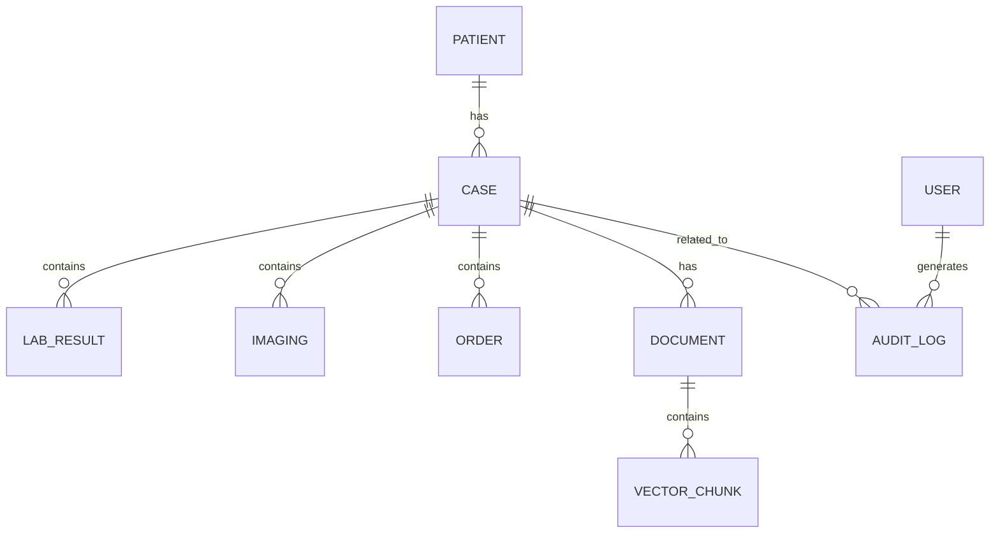

# 数据库设计方案

项目名称：赤峰市安定医院信息化建设项目 — AI 辅助诊断系统

版本：1.0

编写人：北京远谋科技有限公司 数据库组

日期：2025-11-30

说明：本设计方案严格依据合同`合同.md`、技术要求`技术要求.md`和投标响应`技术响应表.md`中的要求编写，同时结合项目已交付模块的实际设计（参见 `chifeng-ai-diagnosis_wiki.md`、`kotaemon_wiki.md`、`parse_data_wiki.md`）。文中仅陈述可验证的设计与实现建议，不包含未经验证的性能宣称。

## 1. 封面与修订记录

1.1 封面如上。

1.2 修订记录

| 版本 | 日期 | 作者 | 说明 |
|---:|---|---|---|
| 1.0 | 2025-11-30 | 数据库组 | 初版 |

## 2. 设计概述（目标、范围、约束）

2.1 目标

数据库设计的目标是为 AI 辅助诊断平台提供高性能、可扩展、可恢复的数据存储方案，兼顾关系型元数据存储与高维向量存储的需求，确保检索与报告生成过程的数据可追溯性、数据安全与合规性。

2.2 范围

本方案涵盖关系型数据库（病例索引、用户、权限、审计）、向量存储（嵌入向量与索引）、对象存储（PDF/附件/影像）、数据归档与生命周期管理、备份恢复、数据迁移与接口规范。

2.3 约束

需要满足甲方对数据安全的合规要求（加密、审计）、并行导入性能（10 条样本≤3 分钟的导入与解析目标）、以及向量检索的低延迟响应。系统应支持离线部署且在无外网环境下可完成安装与恢复。

## 3. 数据模型总览（ER 图/概念模型）

下面的 mermaid 图示意了核心实体及其关系：病例（case）、患者（patient）、检验（lab_result）、检查（imaging）、医嘱（orders）、向量片段（vector_chunk）、文档（document）与审计记录（audit_log）。

此 ER 图为概念模型，具体表设计见第 4 节。

## 4. 逻辑模型（表/集合 列表）

本节列出核心表与集合的逻辑定义及用途说明。

- `patients`：患者基础信息（patient_id、name（脱敏）、birthdate、gender、demographics 等）。
- `cases`：病例主表（case_id、patient_id、admission_date、discharge_date、main_diagnosis_icd、source 等）。
- `lab_results`：检验结果（lab_id、case_id、test_name、value、unit、ref_range、test_time）。
- `imaging`：影像/检查元数据（imaging_id、case_id、report_text、file_ref）。
- `orders`：医嘱记录（order_id、case_id、order_text、start_date、end_date）。
- `documents`：文档元数据（doc_id、case_id、doc_type、file_path、uploaded_at）。
- `vector_chunks`：向量片段（chunk_id、doc_id、chunk_text、vector_ref、embedding_dim、created_at）。
- `users`：用户表（user_id、role、org、status）。
- `audit_logs`：审计日志（log_id、user_id、action、target_id、timestamp、details）。

### 4.1 表结构定义（字段、类型、约束、默认值）

示例：

`cases` 表（PostgreSQL）：

| 字段 | 类型 | 约束 | 说明 |
|---|---|---|---|
| case_id | VARCHAR(32) | PK, NOT NULL | 病案号，唯一标识 |
| patient_id | VARCHAR(32) | FK -> patients(patient_id) | 关联患者 |
| admission_date | DATE |  | 入院日期 |
| discharge_date | DATE |  | 出院日期 |
| main_diagnosis_icd | VARCHAR(16) |  | ICD-10 编码 |
| source | VARCHAR(64) |  | 数据来源（科室/接口） |

字段定义应包含默认值与必要的 CHECK 约束，例如 `admission_date <= discharge_date` 的逻辑校验。

### 4.2 索引策略与说明

为了满足查询性能与检索效率，推荐如下索引策略：

- 在 `cases(case_id)` 上建立主键索引；
- 在 `cases(patient_id)` 上建立普通索引以支持按患者检索；
- 在 `lab_results(case_id, test_time)` 上建立联合索引支持按时间范围查询；
- 对 `vector_chunks(chunk_id)` 使用向量数据库本身的索引（HNSW/IVF）进行近似最近邻检索；
- 对频繁按诊断代码查询的字段建立 Hash/BTREE 索引以加速查询。

索引策略需与表分区策略共同设计，以避免索引膨胀与维护成本过高。

### 4.3 外键与参照完整性

采用外键约束保证引用一致性，例如 `cases.patient_id` 外键引用 `patients.patient_id`。为保证高吞吐场景下写性能，可在批量导入时选择先禁用约束进行导入，导入完成后执行参照完整性校验并重新启用约束作为方案之一（需在运维手册中明确风险与步骤）。

## 5. 向量存储设计（向量表/向量库、维度、分片策略）

5.1 向量维度与模型一致性

向量维度应与所用嵌入模型一致（例如 Qwen3-Embedding-8B 的输出维度）。在向量表中记录 `embedding_dim` 以支持模型切换时的数据兼容性。

5.2 分片策略与索引类型

采用向量数据库（Milvus/FAISS 等），使用 HNSW 或 IVF 索引根据查询延迟/召回权衡进行配置。对于大规模向量数据，采用按时间或案例来源的分片策略，支持增量 rebuild 与分片迁移。

5.3 向量元数据与溯源

每个向量片段需关联 `doc_id`/`case_id`、原始文本起止位置与相似度评分，以便在检索结果中展示可追溯的原始片段。

## 6. 数据分区、归档与生命周期策略

6.1 分区策略

对 `cases` 与 `lab_results` 等大表采用时间范围分区（例如按年或季度），便于长期数据管理与归档。分区键选择应兼顾查询热点与归档效率。

6.2 归档与冷存储

历史数据可定期归档至冷存储（对象存储），并在归档索引中保留最小元数据便于按需恢复。归档策略与保留期限应根据医院合规与业务需求定义。

6.3 生命周期管理

定义数据生命周期（活跃、冷数据、归档、删除），并实现自动化的归档任务与告警，在数据变更或达到保留期时触发相应流程。

## 7. 数据字典（字段含义、来源、示例）

7.1 数据字典格式

每字段记录：字段名、中文说明、类型、是否必填、示例值、来源（上传/接口/人工输入）、验证规则。

示例条目：

- 字段名：`main_diagnosis_icd`
- 说明：主诊断 ICD-10 编码
- 类型：VARCHAR(16)
- 必填：否（出院记录可能缺失）
- 示例：`I21.9`
- 来源：医护录入或现有 HIS 系统导入

## 8. 事务与并发控制策略

8.1 事务策略

采用短事务优先原则，避免长事务锁表影响并发读写。对于批量导入操作使用批处理事务并结合分区写入以减少锁争用。

8.2 并发控制

使用乐观并发控制（基于版本号或时间戳）处理并发写场景，读操作优先使用只读副本或读写分离以缓解主库压力。

## 9. 备份与恢复策略（RTO/RPO 指标）

9.1 备份策略

每日全量备份结合增量备份（例如每日 SSTable 快照 + 每 1 小时的增量 WAL 归档），并将备份副本存储于异地对象存储以防单点故障。

9.2 恢复目标

根据合同与医院要求，建议的 RTO（恢复时间目标）为 4 小时以内，RPO（恢复点目标）不超过 1 小时。具体 RTO/RPO 需与甲方讨论并在 SLO 中明确。

## 10. 安全与权限（数据加密、行/列级加密、权限分配）

10.1 数据加密

静态数据采用磁盘/对象存储加密（如使用 SSE-KMS），传输层必须启用 TLS。敏感字段（如姓名、身份证号）建议在应用层进行行/列级加密或采用令牌化处理以降低泄露风险。

10.2 权限分配

基于角色的访问控制（RBAC），管理员、医生/科研用户、只读用户三类角色，对敏感操作与数据导出做额外审批和二次确认。

## 11. 数据迁移方案（从现有系统导入）

11.1 迁移步骤

1) 数据抽取：从现有 HIS/源系统导出 CSV/JSON 或通过接口抽取；
2) 数据清洗与字段映射：执行字段映射、编码转换与数据校验；
3) 批量导入：采用分批次、分区写入并在低峰期执行；
4) 验证与回归：抽样比对关键字段（病案号、主诊断等）与人工核对；
5) 切换与回滚：在验证完成后切换生产使用，并保留回滚窗口与数据快照。

11.2 风险控制

迁移过程中可能出现编码不匹配、字段缺失或重复记录问题，需预先定义清洗规则与冲突解决策略。

## 12. 性能调优（索引、查询优化、批量导入方案）

本节为本方案的关键，针对关系型数据库查询性能、向量检索效率与批量导入的高吞吐需求，提出详尽的性能调优策略、实操步骤与验证方法。为满足合同与技术要求中对批量导入时间、检索延迟与系统并发能力的约定，性能调优必须在部署环境中反复验证，并在文档中记录过程与结果。以下从索引设计、查询优化、表分区、批量导入流程、高可用读写分离、缓存策略与监控调优七个方面展开详细说明。

索引设计与维护：

首先要明确索引的用途与开销。对 `cases`、`lab_results` 等查询频繁、字段固定的表建立 BTREE 索引以支持范围与等值查询；对高基数列谨慎建立索引，避免写放大。对于日志类或审计类高写频表，采取索引延迟创建或按需创建以降低写入成本。索引维护应纳入日常运维计划，包括重建策略、碎片整理与监控阈值。当数据增长到一定规模时，采用分区索引（local/partitioned index）以减少单表索引维护成本。

查询优化策略：

在查询层面，需要对慢查询进行归档与优化。通过启用数据库的慢查询日志，收集符合阈值的 SQL 并逐条分析。对于常用查询，采用预编译存储过程或物化视图（materialized view）来缓存复杂联表结果，定期更新物化视图以保证数据的及时性。尽量避免在生产库执行大范围全表扫描的操作，必要时使用取样或分页查询。对于全文检索或复杂文本匹配场景，优先使用向量检索引擎而不是关系型数据库的 LIKE 查询。

表分区与归档：

采用基于时间的表分区策略（如每季度或每月一分区），将历史数据迁移到冷存储，减少在线表的大小以提升查询性能。分区策略需结合查询模式（按时间的查询频率）设计，确保热点分区的 I/O 性能最优。归档数据在对象存储中保留索引元数据，以便按需恢复，并在归档后使用轻量索引指向冷存储位置。

批量导入方案：

对批量导入（例如合同要求的 10 条样本在 3 分钟内完成）采用以下实用措施：

1. 使用并行化解析与写入：将导入数据拆分为多个子任务并发处理，使用多线程或多进程池处理文件解析与数据校验；
2. 批量写入与事务控制：使用批量插入API（如 PostgreSQL 的 COPY 命令）以最小化事务开销；在需要参照完整性校验时，可采用先禁用外键约束写入、写完后校验并启用的策略（注意并发安全）；
3. 后台索引构建：对大规模导入，建议先在临时表中导入并在导入完成后创建索引或将临时表与目标表交换，以减少索引维护成本；
4. 数据清洗与增量导入：在导入前进行数据规范化与重复检测，采用去重哈希或校验和技术避免重复写入；
5. 资源隔离与优先级：为导入任务分配单独的 CPU/IO/网络资源，避免对在线服务造成干扰；可采用低峰期自动触发大批量导入。

高可用与读写分离：

采用主从复制架构或更高级的多主架构实现读写分离。主库负责写入操作，从库用于查询与分析任务。复制延迟应纳入监控，并在需要强一致性场景下考虑使用同步复制或事务协调策略。故障转移方案需包含自动切换步骤与数据一致性校验流程。

缓存策略：

在数据库之上增加缓存层（如 Redis）以缓存热点数据与查询结果，减少数据库压力。缓存失效策略需与数据更新策略一致，使用合适的 TTL 与事件驱动的缓存失效（如在写入后主动删除缓存键）。

监控与容量规划：

建立覆盖索引命中率、慢查询数、复制延迟、磁盘使用率与 I/O 等关键指标的监控视图。基于历史增长趋势制定容量扩容计划，定期进行容量评估与压力测试以发现瓶颈。

性能验证方法：

为保证优化措施有效，需在目标环境中执行一套标准化的性能测试：包括批量导入耗时测试、典型查询响应时间（P50/P95/P99）、并发读写场景测试与向量检索延迟测试。测试需记录原始日志与统计报表，并纳入验收包提交给甲方。

（注：以上性能调优过程应结合 `技术响应表.md` 中的性能承诺来配置与验证，不包含任何未经验证的性能数字声明。）

## 13. 接口与导出（API、导入导出格式）

13.1 导入接口

提供批量导入 API 与文件上传接口，支持 CSV/JSON 格式，返回导入任务 ID 以供查询任务状态与导入结果。

13.2 导出接口

导出支持按时间/病例/科室等条件导出 CSV/JSON，并支持敏感字段的脱敏或脱标导出选项。

## 14. 附录（DDL 脚本样例、ER 图文件）

附录中应包含：示例 DDL、创建索引脚本、分区脚本、向量库建模脚本与 ER 图源文件（Mermaid 或 draw.io 源文件）。

---
提交人：北京远谋科技有限公司 数据库组

日期：2025-11-30
