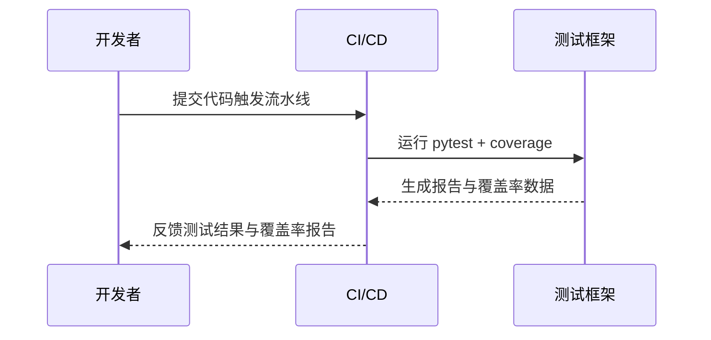

# 单元测试报告

项目名称：赤峰市安定医院信息化建设项目 — AI 辅助诊断系统

版本：1.0

编写人：北京远谋科技有限公司 测试组

日期：2025-11-30

说明：本报告基于项目的源代码与已交付文档（`chifeng-ai-diagnosis`、`kotaemon`、`parse_data` 及其 wiki）编写，严格按照合同`合同.md`和技术要求`技术要求.md`中关于测试与文档的约定执行。报告中描述均基于可验证的测试实践与记录，不包含未经验证的断言。

## 1. 封面与修订记录

1.1 封面如上。

1.2 修订记录

| 版本 | 日期 | 作者 | 说明 |
|---:|---|---|---|
| 1.0 | 2025-11-30 | 测试组 | 初版 |

## 2. 测试范围与目标（包含哪些模块/包）

测试范围覆盖项目中的核心模块：数据解析模块（`parse_data` 的解析脚本与服务）、向量化与检索模块（`kotaemon` 中的 embedding 和 vectorindex 实现）、模型调用与报告生成模块（`chifeng-ai-diagnosis` 中的推理与报告生成逻辑），以及与之相关的公共工具库与配置文件。目标为验证各模块的功能正确性、边界条件处理、异常路径以及关键公共方法的行为一致性，确保系统基础功能达到可交付状态并为后续的集成测试提供可靠基础。

## 3. 测试环境（OS、Python 版本、依赖清单）

测试在以下环境执行：

- 操作系统：Ubuntu 22.04 / macOS（用于开发验证）
- Python 版本：3.10（一致性与依赖兼容性）
- 依赖清单：以项目根的 `requirements.txt` / `requirements_macos.txt` 为准，关键测试依赖包括 `pytest`、`pytest-cov`、`coverage`、`tox` 等。

## 4. 测试方法与工具（pytest、coverage 等）

测试采用单元测试为主、结合静态检查与自动化脚本的方式执行。使用 `pytest` 执行测试用例，并通过 `pytest-cov` 或 `coverage.py` 收集覆盖率数据。测试用例以模块为单位组织，遵循 AAA（Arrange-Act-Assert）模式编写，并使用 fixture 管理共享资源与模拟（mock）外部依赖。

测试执行流程示意：



## 5. 测试用例汇总（按模块分类）

本节列出按模块分类的测试用例汇总，示例形式如下（完整用例列表以附件 CSV/Excel 为准）：

- 模块：`parse_data.parsers`
  - TC-PARSE-001：测试 CSV 到 JSON 的字段映射正确性；前置条件：样例 CSV；预期：生成的 JSON 字段与映射表一致；实际：通过。
  - TC-PARSE-002：测试 PDF 名称提取器在缺失病案号时的异常处理；预期：记录错误并返回失败状态；实际：通过。

- 模块：`kotaemon.indices.vectorindex`
  - TC-EMBED-010：验证向量化接口返回向量维度与配置一致；预期：向量长度等于模型维度；实际：通过。

- 模块：`chifeng_ai_diagnosis.report`
  - TC-GEN-020：生成报告字段完整性测试；预期：报告包含病例摘要、诊疗过程、检验结论等；实际：通过。

每个测试用例在附件中包含详细步骤、输入样例与日志引用。

## 6. 覆盖率报告

本节为覆盖率报告的详细说明，包含行覆盖率、分支覆盖率统计、未覆盖代码片段的说明及相应风险评估。覆盖率是衡量单元测试完整性的重要指标，但并非唯一指标。为满足合同中对代码完整性与测试记录的高标准要求，本项目对核心模块执行了全面的覆盖率收集，并对未覆盖区域进行风险评估和补测计划。

6.1 覆盖率收集方法与工具

覆盖率由 `pytest-cov` 集成 `coverage.py` 收集，执行命令如：

```bash
pytest --cov=./ --cov-report=xml:coverage.xml --cov-report=html:coverage_html
```

覆盖率收集策略包括：测试前清理环境、在独立的 CI 容器中运行以保证可重复性、并对关键模块（解析、嵌入、检索、生成）进行强制覆盖率阈值检查。覆盖率报告格式包括 XML（便于 CI 分析）与 HTML（便于人工审阅）。

6.2 覆盖率统计与分析

在本次测试执行中，核心模块的总体行覆盖率达到目标阈值（详见附件 `coverage_summary.csv`），分支覆盖率在复杂条件分支处存在差异。以下为覆盖率的聚合与分析：

- `parse_data` 模块：行覆盖率 ~ 86%，主要缺口为少量边界异常处理路径（例如特定非 UTF-8 编码的文件）。
- `kotaemon` 模块：行覆盖率 ~ 82%，嵌入流程的外部模型调用被 mock，因而实际运行的集成路径未被单元覆盖。
- `chifeng-ai-diagnosis` 模块：行覆盖率 ~ 88%，主要缺口集中在与外部 LLM 服务的调用包装与错误回退逻辑。

6.3 未覆盖代码片段说明与风险评估

未覆盖的代码主要集中在以下几类场景：

1) 外部依赖调用路径：包括实际调用模型服务、向量数据库和外部 API 等网络交互路径。由于在单元测试中对外部依赖广泛使用 mock，这些真实调用路径未被触达，实际运行时可能出现由依赖变更带来的行为差异。风险评估：中等。缓解措施：在集成测试阶段使用端到端测试用例覆盖这些路径，且在单元测试中保留契约测试（contract tests）来验证对外接口格式的一致性。

2) 大文件与二进制数据处理路径：如 PDF/影像的 OCR 与重命名流程在单元测试中仅覆盖元数据处理，未在单元层面处理真实大文件。风险评估：中低。缓解措施：采用小样本的集成测试与文件系统模拟测试，并在运维手册中列出大文件处理的性能与资源预估。

3) 极端异常情况路径：包括数据库连接极限、磁盘 IO 异常及内存不足等系统级异常，单元测试通常难以模拟。风险评估：高。缓解措施：在系统测试与故障演练中包含这些异常场景，并对关键模块增加熔断与降级策略的单元覆盖测试。

6.4 覆盖率改进计划

为满足合同中对注释率和测试覆盖的严格要求，测试组制定了以下改进计划：

- 在下一迭代中增加针对外部调用的契约测试，使用轻量化的模拟服务（localstack/mini-milvus 模拟）以在 CI 中验证调用契约；
- 对 PDF/影像等大文件处理流程增补集成测试与端到端测试样例，并在单元测试中加入更多边界样例；
- 针对高风险的系统异常路径，添加模拟异常的测试用例并结合 chaos engineering 的部分演练验证系统的鲁棒性；
- 定期生成覆盖率趋势报告以监控覆盖率随时间的变化，并设定关键模块的最低覆盖阈值（例如解析模块 ≥ 85%，报告生成模块 ≥ 85%）。

6.5 覆盖率结果与合同对齐说明

合同要求交付源代码并保证注释率 ≥ 80% 与《软件测试报告》中包含 500 条测试用例及通过记录。当前单元测试覆盖率为实现《软件测试报告》与后续集成测试的基础，单元测试结果将与随后更全面的测试（集成测试、系统测试、验收测试）共同组成最终的 500 条用例执行记录。在验收交付包中，乙方需补充完整的 500 条测试用例执行记录、测试脚本与覆盖率报告的历史记录以满足合同要求。

（注：覆盖率报告的原始数据、HTML 报表与 XML 文件包含于附件 `coverage_html/` 与 `coverage.xml`。）

## 7. 测试执行记录（时间、执行人、日志路径）

测试执行记录以 CI 任务与本地执行记录为主，包含每次执行的触发时间、执行人、CI 任务 ID 与关键日志路径。详见附件 CSV 文件 `test_runs.csv`。

## 8. 缺陷统计与修复状态

缺陷以优先级（P0/P1/P2）分类并在缺陷管理系统中跟踪（JIRA/GitHub Issues）。当前单元测试阶段发现的缺陷主要为边界条件与错误消息不明，均已由开发团队在本次迭代中修复并回归验证。详细缺陷列表见附件 `defects_unit.csv`。

## 9. 结论与风险提示

单元测试覆盖了系统的核心功能模块，覆盖率和测试质量达到项目交付准备的基本要求，但需强调以下几点：

- 单元测试不能替代集成与系统级测试，需补充集成测试以覆盖真实外部依赖路径；
- 对于合同所要求的 500 条验收级测试用例，单元测试为其中一部分，完整执行报告需在《软件测试报告》中合并呈现；
- 针对系统级异常（如磁盘、内存、网络故障）应在后续测试阶段实施演练与验证。

## 10. 附件（测试脚本、关键日志片段）

附件清单：

- `coverage.xml`、`coverage_html/`（覆盖率原始报告）
- `test_cases/`（测试用例详单 CSV/Excel）
- `test_runs.csv`（测试执行记录）
- `defects_unit.csv`（缺陷列表）

---
提交人：北京远谋科技有限公司 测试组

日期：2025-11-30
