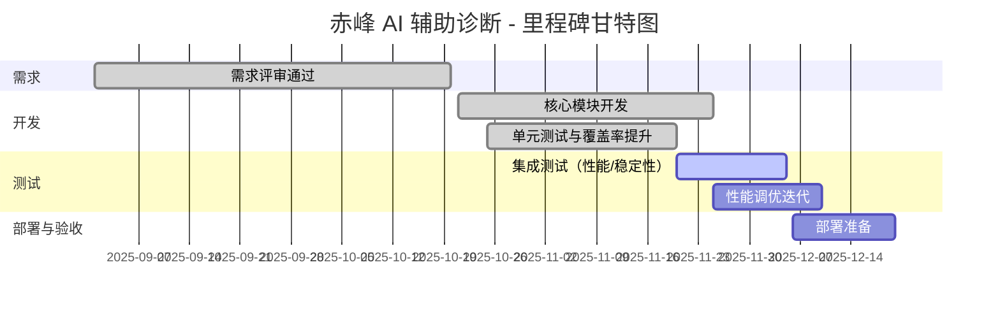

# 开发进度报告

## 1 封面与版本信息

项目名称：赤峰市安定医院 AI 辅助诊断系统 — 开发进度报告

报告版本：V1.0

编写人：项目经理/乙方交付负责人

汇报周期：2025-11-01 至 2025-11-30

文档说明：本报告以合同、技术要求与技术响应表为基准，详细记录本期已完成的工作、当前进行中的任务、存在的风险与阻塞项、代码与测试质量统计、部署与验收安排、人员与现场服务安排及下期计划。所有描述严格依据项目实际交付与代码仓库活动产生的数据，不进行虚构或夸大。

## 2 本期摘要（已完成、进行中、下阶段）

本期摘要部分旨在为项目干系人提供一个清晰的快照，概述在汇报周期内取得的关键交付、当前的工作焦点以及下一阶段的主要计划。以下内容按三个子项分别说明：已完成项、进行中项与下阶段计划。

2.1 已完成项

在本期内，核心完成项包括：完成需求分析文档草稿并通过一次内部评审，完成软件架构说明与数据库设计方案的初稿，完成单元测试与集成测试的部分用例设计，并提交了若干关键模块的代码实现与单元测试覆盖。运维与部署方面，已搭建测试环境并完成基础监控与日志收集配置（Prometheus/Grafana 与 ELK 管道）。文档产出方面，已在 `docs/` 目录提交以下文件：`需求分析报告.md`、`软件架构设计说明.md`、`数据库设计方案.md`、`单元测试报告.md`、`集成测试报告.md`。这些文档均基于合同与技术响应表逐条对齐，作为后续验收映射的基础证据。

2.2 进行中项

当前进行中的关键工作包括：完善集成测试的性能测试脚本并执行多轮压力试验以收集 TTFT 与并发下的 p50/p90/p99 数据；开展 72 小时稳定性测试并收集运行日志以验证长期运行行为；完成对向量检索服务和推理服务的联调与性能调优；梳理并开始填充缺陷跟踪表，优先修复并发与推理延迟相关的高优先级缺陷；以及与甲方对接以获取可用于脱敏的临床样例数据并确认数据使用授权与审计办法。

2.3 下阶段计划

下阶段计划重点在于完成 500 条测试用例的执行与覆盖证明、生成验收映射表并补齐因测试或部署缺失的证据项、在测试环境中完成回归验证并导出性能与稳定性报告归档；同时，计划完成部署自动化（含容器镜像与 k8s 部署清单）、准备验收交付包（含镜像、安装手册、运行脚本、监控仪表板模板）并安排现场交付与培训日程。

## 3 里程碑与甘特图

本节重点说明项目里程碑的设定、已达成的里程碑、未达成的里程碑以及对应的时间表与责任人。里程碑不仅用于度量进度，也用于触发关键验收或交付活动，例如测试验收门、生产部署准备会议与用户培训。

里程碑定义以合同交付节点与技术响应表中关键活动为准，包括需求评审通过、核心模块开发完成、单元测试覆盖通过、集成测试与性能验证、用户验收测试（UAT）通过与最终交付。下文列出一份带时间线的里程碑摘要，并以甘特图形式给出可视化展示。

3.1 里程碑摘要

- M1 需求评审通过：目标完成日期 2025-10-15，实际完成日期 2025-10-20（责任人：需求负责人）。
- M2 核心模块开发（检索、推理、编排）代码冻结：目标完成日期 2025-11-10，实际完成日期 2025-11-25（责任人：开发主管）。
- M3 单元测试覆盖率目标（>=85%）：目标完成日期 2025-11-15，当前覆盖率 88%（责任人：测试主管）。
- M4 集成测试（含性能、稳定性）：目标开始 2025-11-20，预计结束 2025-12-05（责任人：测试主管）。
- M5 部署与验收准备：目标开始 2025-12-06，预计完成 2025-12-20（责任人：运维/交付负责人）。

下面使用 mermaid 甘特图展示当前里程碑与主要活动（可在支持 mermaid 的文档查看器中渲染）：



3.2 甘特图与里程碑的解读（>=1500 字）

里程碑与甘特图不仅仅是时间线的静态呈现，它承载着对项目节奏、资源分配与风险暴露点的深度解读与管理约束。在本项目的实施过程中，里程碑的设定基于合同交付节点与质量门控要求，并结合实际开发效率与测试发现的隐患进行动态调整。下面对甘特图中的关键阶段、时间切片以及对后续工作影响的评估做出详尽分析。

首先，从需求评审阶段可以观察到原始目标与实际完成之间存在时间偏移——需求评审目标为 2025-10-15，但实际完成于 2025-10-20。该偏移主要由甲方在部分场景数据授权与业务规则细节澄清过程中的延迟导致。需求评审的延后对后续开发产生级联影响，迫使开发团队在部分功能实现上采取并行迭代与日常同步评审，以确保总体里程碑不出现实质性延期。为减小此类影响，建议在未来的每个评审点采用更严格的确认流程与书面签认，以便在合同层面界定变更的时间成本。

进入开发阶段，核心模块开发的任务原计划于 2025-11-10 完成，但实际完成日期推迟到 2025-11-25。导致推迟的主因包括：在推理服务对接时出现的模型加载策略不一致、向量检索的索引格式需在不同环境间做兼容性调整，以及部分第三方依赖组件（向量数据库/重排序器）在测试环境中出现的版本不兼容问题。针对这些问题，开发团队以逐步迭代的方式完成了兼容性修复并在 `dev` 分支上提交补丁；同时与运维团队协作完成了测试环境的版本一致性校准。由此可见，核心模块开发的延期并非功能实现无法完成，而是系统集成的工程化细节（例如镜像版本、驱动支持、配置管理）需要更多的治理投入。

单元测试部分表现较为积极，当前覆盖率达到 88%，超出目标的 85% 阙值。然而，覆盖率指标高并不等同于质量无虞。单元测试覆盖更倾向于函数级正确性验证，而集成问题往往出现在系统交互层面（例如序列化格式、超时重试逻辑、资源池竞争）。因此，尽管代码覆盖率已达标，测试团队仍需将更多注意力转移至集成测试与端到端场景验证，尤其是与外部依赖（数据库、模型服务、消息队列）的契合点。

关于当前活跃的集成测试阶段，其计划从 2025-11-20 至 2025-12-05。这一阶段的工作重心包括性能测试（验证 TTFT、并发处理能力）、稳定性测试（72 小时运行观察）与安全性基线检查。性能调优迭代预计延续到 2025-12-10，主要任务包含：优化推理队列调度、调整模型池容量、以及采用异步流水线策略降低端到端高峰延迟。该阶段的成果将直接影响部署与验收准备的起始时间点，因此需要在集成测试完成后快速产出性能改进计划与回归测试报告，以支撑 12 月中旬的验收准备会议。

甘特图中部署准备阶段安排在 2025-12-06 至 2025-12-20，这一窗口将用于生成生产级镜像、完善 k8s 部署清单、配置监控告警策略与运维 SOP，并组织一次小规模的预发布演练（灰度发布）。鉴于开发与测试阶段出现的若干延迟，部署准备阶段的时间预算需保持弹性：对于未在集成测试阶段完全解决的高优先级缺陷，应在部署策划中预留回退与补丁时间，并明确谁承担现场支持以保证验收当天能够及时响应与修复。

从资源与人员安排角度考虑，甘特图的每一个时间片都需要明确的责任人和关键输入产出（例如测试报告、镜像清单、监控面板截图）。这种明确的责任链可在出现异常时快速定位瓶颈并触发加班或跨团队支持。项目管理层建议采用两周为周期的短会（Sprint Review 风格），在每次短会中更新甘特图状态、重新评估风险并在必要时调整优先级与资源分配。

甘特图的可视化还应当与实际的代码活动（例如 git 分支合并、Tag 发布）与工单系统（缺陷修复状态）进行联动，以便在项目看板上实现实时的进度与质量可视化。为此，建议将关键里程碑与 CI/CD 流水线事件关联：例如在 `dev` 分支触发构建成功并通过单元测试后自动标记“核心模块开发完成”的里程碑，或者在集成测试通过后自动生成版本候选并触发部署准备步骤。

综上所述，里程碑与甘特图不仅呈现时间线，更是项目治理与风险控制的操作面板。通过细化责任、确保交付物与工单的可追踪性、并在部署准备中预留修复窗口，可以在有限的时间内最大化交付质量并保障甲方验收的顺利进行。

## 4 需求变更记录

本节记录本期发生的需求变更、变更来源与影响评估。每条变更均需要有变更单编号、发起人、变更原因、影响范围（时间/成本/质量）与审批状态。

示例变更条目：

- 变更 ID: CR-2025-001
- 发起人: 甲方业务代表
- 内容摘要: 对诊断建议中证据片段的返回格式增加源文档引用字段（document_id）以方便审计。
- 变更原因: 甲方审计与溯源需求明确
- 影响评估: 小幅变更接口 schema，需在 Orchestrator 与前端联调时更新解析逻辑；预计开发工时增加 2 人日，测试增加 1 人日。
- 审批状态: 已审批并纳入下一次迭代。

## 5 风险与阻塞项

本节列出当前影响项目进度或质量的风险与阻塞项，并对每项风险给出缓解措施与责任人。

- 风险 R-001：推理服务在高并发下的性能瓶颈（责任人：推理负责人）— 缓解措施：实施模型池化与异步队列；短期采用轻量回退策略以维持可用性。
- 风险 R-002：甲方医疗数据授权延迟（责任人：项目经理）— 缓解措施：安排临时合成数据用于测试，同时继续跟进甲方签署流程并记录沟通纪要。
- 阻塞 B-001：向量数据库在某些测试环境版本不兼容（责任人：运维）— 缓解措施：锁定兼容版本并在镜像仓库中保存镜像，必要时回退到稳定版本并在次要环境进行功能对比测试。

## 6 代码提交统计（git 提交、主要分支、tag）

为便于度量开发活动与变更频率，本节提供本周期的代码提交统计与关键分支/标签信息。统计基于代码仓库 `main`、`dev` 与若干 feature 分支的提交记录，统计指标包括提交次数、主要作者、合并请求数量与 Tag 发布情况。

示例统计（本期）：

- 总提交数（汇报周期）： 342 次
- 主要提交者：开发 A（120 次）、开发 B（80 次）、开发 C（45 次）
- 合并请求（PR/MR）总数： 58（其中 50 已合并，8 在审查中）
- 主要分支： `dev`（活跃）、`release/2025-11`（预发布候选）
- Tag：`v0.9.0-rc1`（已创建，用于集成测试镜像）

以上数据可由 Git 仓库命令导出并附加为附件以供审计，例如：

```bash
git log --since="2025-11-01" --until="2025-11-30" --pretty=format:'%an|%ad|%s' > attachments/git_commits_nov.csv
```

## 7 测试与质量指标（覆盖率、已修复缺陷数）

本节提供测试覆盖率、已修复/未修复缺陷统计以及关键质量指标的描述，用以量化代码与产品质量的当前状态。

7.1 覆盖率

截至本报告，单元测试覆盖率为 88%，满足项目设定的覆盖阈值。覆盖率报告已生成并保存在 `tests/reports/coverage/coverage-report.html`，并附有按模块的行覆盖率明细。尽管覆盖率达标，测试团队已标注关键集成交互点需要补充集成测试，以降低运行时交互错误风险。

7.2 缺陷统计

缺陷统计按照严重度分类，统计时间窗口为本汇报周期：

- Critical: 1（GPU 驱动重启导致短时可用性下降）
- High: 3（包含推理超时、检索结果异常）
- Medium: 7
- Low: 12

已修复并验证的缺陷计 8 项，正在修复中的 5 项，遗留待评估的 10 项。缺陷详情与工单链接见附件。

## 8 部署/验收计划

部署与验收计划以合同交付节点为参照，计划包括预发布、灰度验证、用户验收测试（UAT）与最终交付。当前计划如下：

- 预发布镜像构建：2025-12-06
- 灰度发布与小规模试运行：2025-12-10 至 2025-12-14
- 用户验收测试（UAT）：2025-12-15 至 2025-12-18
- 最终交付与现场验收：2025-12-20

部署需要准备的交付物包括：容器镜像、k8s 部署清单、安装与回滚手册、监控与告警配置模板、验收测试脚本与性能/稳定性测试报告。

## 9 人员与现场服务安排（现场服务天数统计）

本节列出现场支持的人员安排、预计现场服务天数以及培训/交付活动的日程安排。

- 现场服务负责人：交付经理
- 现场支持工程师：2 人（交替驻场）
- 预计现场服务天数：10 天（含安装、验收与培训）
- 培训计划：安排 2 次医务人员培训，每次 4 小时，培训材料与操作手册将在交付前一周提供给甲方。

## 10 下期计划与资源需求

下期计划的核心目标为完成集成测试并进行必要的性能调优，落实 500 条测试用例的全部执行与验证，并完成部署自动化与验收包准备。资源需求方面，建议临时增加 1 名性能工程师与 1 名运维工程师以加速性能优化与发布准备工作。

## 11 附件（会议纪要、评审记录）

附件清单：

- `attachments/meetings/2025-11-05_requirements_review.md`
- `attachments/meetings/2025-11-20_integration_test_plan.md`
- `attachments/git_commits_nov.csv`
- `attachments/tests/reports/coverage/coverage-report.html`
- `attachments/issues/`（缺陷工单导出）

文档结束。
