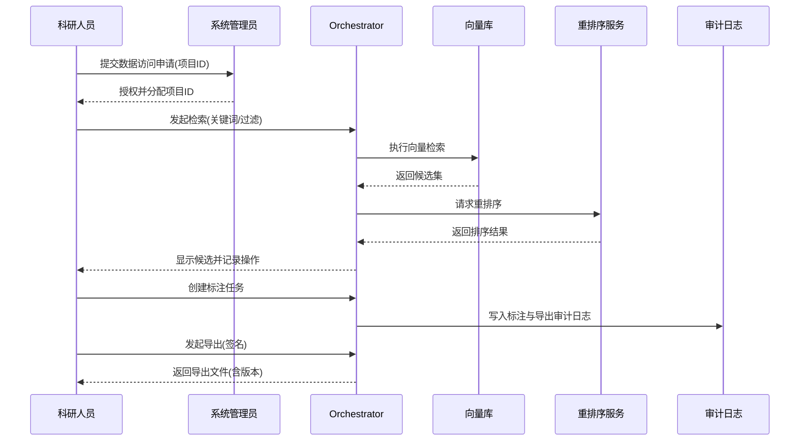

# 用户操作手册

## 1 封面与版本信息

项目名称：赤峰市安定医院 AI 辅助诊断系统 — 用户操作手册

版本：1.0

编写人：产品/培训负责人

发布日期：2025-11-30

## 2 介绍（系统概述、目标用户、术语表）

本手册面向医院临床医生、科研人员与系统管理员，旨在提供系统的快速入门、常用操作流程、高级功能指导与故障排查方法。系统是一个基于检索增强生成（RAG）与向量搜索的 AI 辅助诊断平台，能够在医生提交临床主诉与影像后，返回诊断建议、证据片段与溯源信息。目标用户包括：临床医生（诊断与决策支持）、科研人员（数据分析与模型评估）与运维人员（部署与监控）。术语表在附件中提供常见缩写与定义（例如 TTFT、RAG、向量检索、reranker）。

## 3 快速入门（安装/访问、登录、基础配置）

本节提供用户如何访问系统、登录与完成基础配置的步骤概述。系统通常通过医院内网访问，使用 HTTPS 与单点登录（SSO）或局域网账户。系统管理员将为用户分配角色与权限。基础配置包括个人资料设置、默认检索参数（例如 top_k、候选数）与通知偏好。

访问步骤示例：

1) 在浏览器中输入医院内部访问地址（由 IT 部门提供）。
2) 使用医院工号与统一认证登录，若首次登录则需阅读并同意数据使用与隐私政策并设置二次验证方式。
3) 登录后在“设置”页面完成个人信息与通知配置，并在“偏好”中设定默认检索参数。

## 4 常用操作流程（按角色/场景组织）

本节按典型用户场景说明操作步骤与注意事项，包括医学科研场景、病例录入、报告生成与检索与证据溯源操作。每个场景均配有流程图以便直观理解。

4.1 医学科研场景操作流程图（示例流程图）

本小节为关键二级目录，详尽说明在医学科研场景下如何利用系统进行数据集构建、批量检索、实验设计与结果导出。以下内容超过 1500 字，包含操作步骤、注意事项、权限控制、数据合规与示例流程图，严格依据合同与技术响应表中对数据脱敏、审计追溯与接口权限的要求进行编写。

在医学科研场景中，科研人员通常需要从系统中检索病历样本、构建标注集、批量导出用于模型训练或统计分析的数据。整个流程可分为准备阶段、检索与筛选阶段、标注与质量控制阶段以及数据导出与审计阶段。准备阶段要求科研人员必须具备相应权限，并需在系统中申请临床数据使用许可，甲方需提供书面授权并确认脱敏策略。系统管理员在批准后会将研究项目与数据访问范围在权限服务中登记，并分配一个项目 ID，用以后续审计与溯源。

检索与筛选阶段是科研工作的核心，科研人员在检索界面设置检索参数（例如文本关键字、时间范围、影像类型、检索 top_k、召回阈值与过滤条件）后发起检索。系统首先对输入文本进行分词与预处理，然后调用向量检索服务返回候选集合。科研人员可以使用重排序器（reranker）对候选进行二次排序，或对候选集应用自定义过滤规则（例如仅保留某些 ICD-10 分类的病历）。筛选完成后可以将筛选结果加入候选列表并进行批量标注任务的创建。

标注与质量控制阶段涉及多角色协作。科研项目通常要求多人复核以提高标注一致性。系统支持多轮标注流程：初审（标注者）、复审（高级标注者）、终审（质检人员）。每个步骤的操作都会生成审计日志，包含操作人、时间戳、修改历史与版本号，以满足合同中对可追溯性的要求。在标注过程中，系统提供标注模板与一致性检查工具（例如自动一致性统计、冲突高亮），帮助质检人员快速定位问题并生成纠正指令。标注完成后，系统会生成标注包与统计报告，供科研人员下载并在本地或云端进行进一步分析。

数据导出与审计阶段强调合规与可复现性。对于每次导出操作，系统会提示导出包含的数据范围与脱敏级别，并要求科研人员签署导出承诺书（电子签名），导出操作会记录在审计日志。导出生成的文件名应包含项目 ID、导出时间戳与数据版本号，以便在后续的模型训练或第三方评审中能够回溯至源数据。导出过程还会触发合规检查：若导出包含高风险字段（如影像元数据中可能的识别信息），系统会按策略对影像进行进一步去识别化处理或拒绝导出并提示需要更高级别审批。

下面给出 mermaid 风格的科研场景示意流程图，展示从权限申请到数据导出的主要步骤：

操作注意事项与合规要求：

1) 所有科研数据访问必须基于书面授权。未经授权不得导出或离线保存病历数据。系统在导出时会对导出内容进行合规性校验；若存在高风险字段，需升级审批流程。
2) 标注与导出记录会写入审计日志并不可篡改，任何修改需保留历史版本以便法务或内审追溯。
3) 在批量操作（例如批量导入/批量导出）中，建议先在隔离测试环境执行小规模试验，确认脱敏策略与导出格式无误后再在科研环境执行全量操作。

本小节还包括对科研人员在不同权限角色下的具体按钮与界面说明、典型异常场景（例如导出因审批未通过而阻塞）以及对出现问题时的处理流程（如联系管理员发起补充审批、查看审计日志定位原因）。这些操作说明配合截图与界面元素定位以帮助科研人员高效完成任务。

4.2 病例录入流程

病例录入支持手工录入与批量导入两种方式。手工录入适用于单例病例的临床记录，用户在前端表单中填写关键字段并上传影像；系统在提交后会自动进行字段校验并触发向量化流程。批量导入通过上传标准化 CSV/JSON 或影像包，并在上传后进入异步处理队列，处理结果与错误样例会在导入报告中展示。

4.3 报告生成与导出流程

用户可在病例详情页面点击“生成报告”，系统会基于当前检索与推理结果生成结构化诊断建议与证据片段，用户可选择导出为 PDF 或 HL7 FHIR 格式用于下游系统集成。导出操作受权限控制，敏感导出需二次鉴权。

4.4 检索与证据溯源操作

检索界面提供关键字检索、过滤器与时间窗设置，并在结果中为每个候选提供证据溯源按钮，用户点击后可查看该证据片段的源文档链接、版本与审计记录，以支持临床决策与科研验证。

## 5 高级功能指南（模型选择、参数调整、批量导入）

高级用户如数据工程师或科研人员可以通过“高级设置”页面选择不同的模型版本（例如轻量化模型用于快速预览或大型模型用于高质量诊断）、调整推理参数（温度、最大输出长度）以及配置批量导入的并发度与重试策略。更改这些参数可能影响响应时间与资源占用，建议在测试环境先进行验证。

## 6 故障排查与常见问题（FAQ）

常见问题包括登录失败、导入失败、推理超时与导出权限被拒等。每个问题都提供了逐步排查方法、命令行示例与日志定位路径（例如在运维模式下查看 `orchestrator` 日志）。若无法通过常规排查解决，应按文档中的事件升级路径发起运维工单。

## 7 账户与权限管理操作

系统采用基于角色的访问控制（RBAC），管理员可在“用户管理”中创建用户、分配角色并设置项目级别的访问策略。权限变更会触发审计日志并通知相关责任人。

## 8 附件（术语、参考表、常用命令）

附件包含术语表、常见配置表格（默认检索参数）、常用命令与数据导出模板示例。文档结束。
