# Wiki Documentation for /app/projects/chifeng-ai-diagnosis

Generated on: 2025-11-30 05:38:44

## Table of Contents

- [项目概述](#page-1)
- [系统架构概览](#page-2)
- [数据流动与处理](#page-3)
- [核心功能](#page-4)
- [数据管理](#page-5)
- [前端组件](#page-6)
- [后端系统](#page-7)
- [模型集成](#page-8)
- [部署与基础设施](#page-9)
- [扩展性与定制](#page-10)

<a id='page-1'></a>

## 项目概述

### Related Pages

Related topics: [系统架构概览](#page-2)

<details>
<summary>Relevant source files</summary>

- [README.md](README.md)
- [service_conf/ai_diagnosis/models/bge-reranker-v2-m3/README.md](service_conf/ai_diagnosis/models/bge-reranker-v2-m3/README.md)
- [service_conf/parse_data/conf/prompt_v0.1.txt](service_conf/parse_data/conf/prompt_v0.1.txt)
- [service_conf/parse_data/conf/prompt.txt](service_conf/parse_data/conf/prompt.txt)
- [service_conf/parse_data/conf/llm.json](service_conf/parse_data/conf/llm.json)
</details>

# 项目概述

本项目“Chifeng AI Diagnosis”旨在开发一个智能诊断系统，利用自然语言处理和机器学习技术，从电子病历数据中提取和分析关键信息，以生成专业的医疗报告。系统的设计目标是通过自动化数据处理和分析，提高医疗文档的准确性和效率，从而辅助医疗决策。

## 系统架构

### 模型架构

项目中使用了多个预训练模型进行文本分类和排序任务，主要包括：

- **BGE Reranker v2-m3**: 用于文本相关性排序的轻量级模型，支持多语言能力，易于部署且推理速度快。
- **LLM 模型**: 通过配置文件`llm.json`，系统支持多种大型语言模型（如gpt-oss-20b、gpt-oss-120b等），这些模型用于复杂的文本生成和分析任务。

Sources: [service_conf/ai_diagnosis/models/bge-reranker-v2-m3/README.md](), [service_conf/parse_data/conf/llm.json]()

### 数据流与处理

系统接收结构化的JSON数据，包含病案首页、检查信息、检验信息和医嘱信息。数据流处理的核心步骤包括：

1. **数据解析**: 使用配置文件`prompt_v0.1.txt`和`prompt.txt`定义的格式解析输入数据。
2. **信息提取与分析**: 基于解析后的数据生成医疗分析报告，报告内容涵盖诊断轨迹、治疗响应和费用结构。
3. **报告生成**: 生成的报告严格遵循医学文档规范，确保所有结论均有数据支持。

Sources: [service_conf/parse_data/conf/prompt_v0.1.txt](), [service_conf/parse_data/conf/prompt.txt]()

## 关键功能与组件

### 医疗报告生成

系统根据输入的病历数据生成详细的医疗分析报告，报告分为多个部分，包括病例摘要、诊疗过程分析、检验结果分析、治疗总结与费用分析等。每个部分均基于输入数据进行分析，不进行无根据的推测。

### 模型配置与管理

通过`llm.json`配置文件，用户可以灵活选择和管理不同的语言模型，以适应不同的任务需求。配置文件中定义了各模型的API密钥、基础URL、模型名称等关键信息。

## Mermaid 图表

### 系统流程图

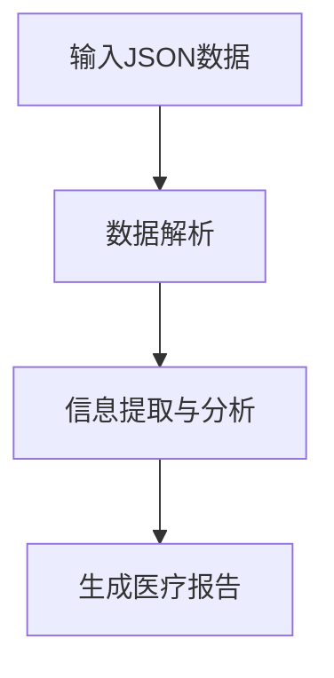

该流程图展示了系统的主要处理流程，从输入数据的解析到最终报告的生成。

### 模型调用序列图

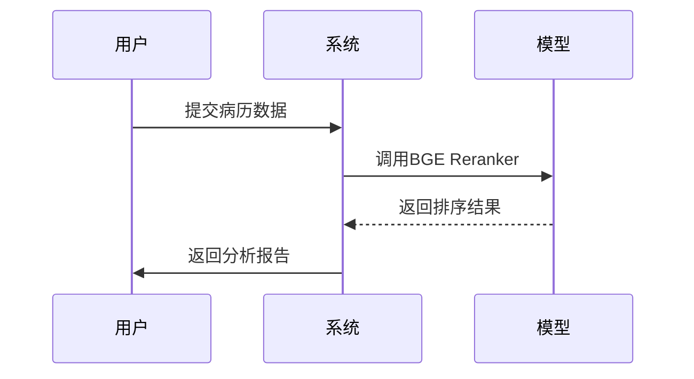

此序列图展示了系统与模型交互的基本过程。

## 结论

本项目通过集成多种语言模型和数据处理技术，实现了从病历数据中自动生成医疗报告的功能。这一系统能够显著提高医疗文档的生成效率和准确性，为医疗决策提供有力支持。未来的工作将继续优化模型性能，并扩展支持的病历数据类型和格式。

---

<a id='page-2'></a>

## 系统架构概览

### Related Pages

Related topics: [数据流动与处理](#page-3)

<details>
<summary>Relevant source files</summary>

- [service_conf/parse_data/conf/prompt_v0.1.txt](service_conf/parse_data/conf/prompt_v0.1.txt)
- [service_conf/parse_data/conf/prompt.txt](service_conf/parse_data/conf/prompt.txt)
- [service_conf/parse_data/conf/prompt_default.txt](service_conf/parse_data/conf/prompt_default.txt)
- [service_conf/parse_data/conf/prompt_v0.3.txt](service_conf/parse_data/conf/prompt_v0.3.txt)
- [service_conf/parse_data/conf/prompt_v0.2.txt](service_conf/parse_data/conf/prompt_v0.2.txt)
</details>

# 系统架构概览

## 介绍

在本项目中，系统架构概览为医疗诊断和数据处理提供了一个全面的框架。该架构的主要目标是通过电子病历数据生成专业的医疗分析报告，帮助医生在诊断和治疗过程中作出更准确的决策。系统通过解析结构化的JSON数据，涵盖病案首页、检查信息、检验信息和医嘱信息，最终生成详细的报告。此架构的设计旨在确保报告内容的客观性和专业性。

## 系统组件

### 数据解析模块

数据解析模块负责从输入的JSON数据中提取关键信息。该模块解析病案首页、检查信息、检验信息和医嘱信息，并将这些数据结构化为适合进一步处理的格式。

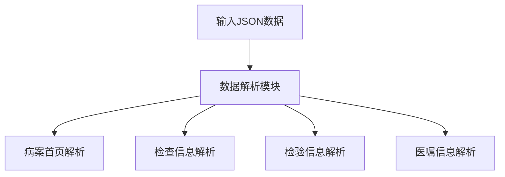

Sources: [service_conf/parse_data/conf/prompt_v0.1.txt](service_conf/parse_data/conf/prompt_v0.1.txt), [service_conf/parse_data/conf/prompt.txt](service_conf/parse_data/conf/prompt.txt)

### 报告生成模块

报告生成模块根据解析后的数据生成医疗分析报告。报告包括基本信息、住院经过、检验与检查结果、主要治疗与医嘱、费用摘要以及结论与出院情况。

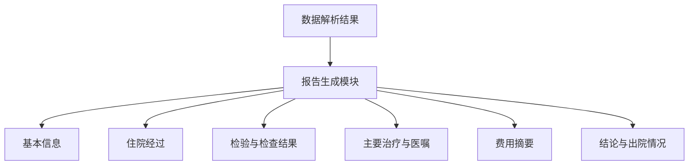

Sources: [service_conf/parse_data/conf/prompt_v0.1.txt](service_conf/parse_data/conf/prompt_v0.1.txt), [service_conf/parse_data/conf/prompt_v0.3.txt](service_conf/parse_data/conf/prompt_v0.3.txt)

### 模型配置模块

模型配置模块负责配置和加载所需的模型，以支持报告生成过程中的自然语言处理任务。该模块确保模型的准确性和效率。

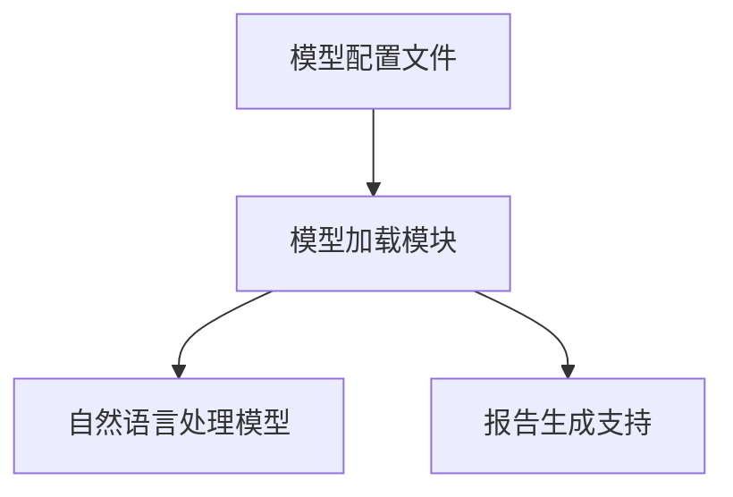

Sources: [service_conf/parse_data/conf/prompt_v0.2.txt](service_conf/parse_data/conf/prompt_v0.2.txt), [service_conf/parse_data/conf/prompt_default.txt](service_conf/parse_data/conf/prompt_default.txt)

## 数据流与逻辑

系统通过一系列步骤将输入数据转化为最终的报告。首先，数据解析模块从JSON数据中提取信息，然后报告生成模块根据这些信息创建详细的医疗分析报告。最后，模型配置模块支持报告生成过程中的语言处理任务，确保报告的专业性和准确性。

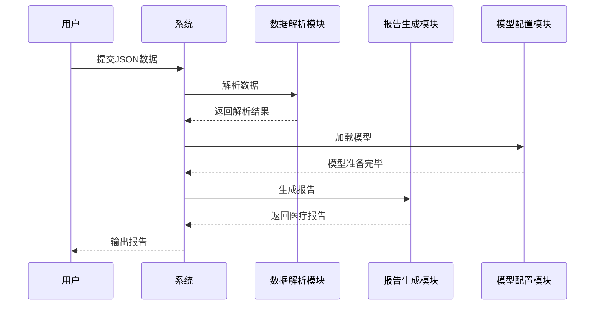

Sources: [service_conf/parse_data/conf/prompt_v0.1.txt](service_conf/parse_data/conf/prompt_v0.1.txt), [service_conf/parse_data/conf/prompt.txt](service_conf/parse_data/conf/prompt.txt), [service_conf/parse_data/conf/prompt_v0.2.txt](service_conf/parse_data/conf/prompt_v0.2.txt)

## 结论

系统架构概览为医疗数据处理提供了一个高效且专业的解决方案。通过解析和生成详细的医疗报告，该系统能够帮助医生在诊断和治疗过程中作出更准确的决策。整体架构设计确保了数据的准确性和报告的专业性，成为医疗领域的重要工具。

---

<a id='page-3'></a>

## 数据流动与处理

### Related Pages

Related topics: [数据管理](#page-5)

<details>
<summary>Relevant source files</summary>

- [service_conf/parse_data/conf/prompt.txt](service_conf/parse_data/conf/prompt.txt)
- [service_conf/parse_data/conf/prompt_default.txt](service_conf/parse_data/conf/prompt_default.txt)
- [service_conf/parse_data/conf/prompt_v0.3.txt](service_conf/parse_data/conf/prompt_v0.3.txt)
- [service_conf/parse_data/conf/prompt_v0.1.txt](service_conf/parse_data/conf/prompt_v0.1.txt)
- [service_conf/parse_data/conf/prompt_v0.2.txt](service_conf/parse_data/conf/prompt_v0.2.txt)

</details>

# 数据流动与处理

## 介绍

在项目的“数据流动与处理”模块中，系统旨在从电子病历数据中提取关键信息，并进行临床分析。通过解析结构化的JSON数据，生成详细的医疗分析报告。这些报告基于数据，强调诊断轨迹、治疗响应及费用结构的分析。系统的设计确保了数据驱动的决策，并禁止无根据的推测。此模块在整体项目中扮演着重要角色，为临床医生提供可靠的数据支持以辅助诊断和决策。

## 系统架构

### 数据解析与报告生成

系统通过多个配置文件来指导报告的生成过程。这些文件定义了如何从JSON数据中提取信息，并组织成符合医学书写规范的报告。

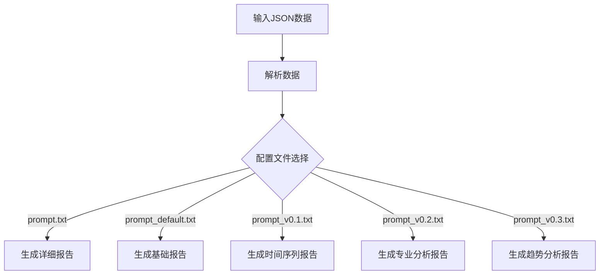

*Sources: [prompt.txt](service_conf/parse_data/conf/prompt.txt), [prompt_default.txt](service_conf/parse_data/conf/prompt_default.txt), [prompt_v0.1.txt](service_conf/parse_data/conf/prompt_v0.1.txt), [prompt_v0.2.txt](service_conf/parse_data/conf/prompt_v0.2.txt), [prompt_v0.3.txt](service_conf/parse_data/conf/prompt_v0.3.txt)*

### 配置文件详细说明

每个配置文件定义了报告生成的不同方面。以下是主要配置文件的详细说明：

#### prompt.txt

- **功能**: 定义如何生成详细的医疗分析报告。
- **内容**: 包含系统说明、用户内容要求以及输出格式。

#### prompt_default.txt

- **功能**: 提供生成基础医疗分析报告的指导。
- **内容**: 类似于prompt.txt，但更加简化。

#### prompt_v0.1.txt

- **功能**: 指导生成时间序列的医疗总结报告。
- **内容**: 强调按时间顺序排列的事件描述。

#### prompt_v0.2.txt

- **功能**: 生成具有临床洞察力的专业分析报告。
- **内容**: 强调医学关联和趋势分析。

#### prompt_v0.3.txt

- **功能**: 生成重点分析诊断逻辑、治疗决策和费用信息的报告。
- **内容**: 提供深度分析的框架。

*Sources: [prompt.txt](service_conf/parse_data/conf/prompt.txt), [prompt_default.txt](service_conf/parse_data/conf/prompt_default.txt), [prompt_v0.1.txt](service_conf/parse_data/conf/prompt_v0.1.txt), [prompt_v0.2.txt](service_conf/parse_data/conf/prompt_v0.2.txt), [prompt_v0.3.txt](service_conf/parse_data/conf/prompt_v0.3.txt)*

## 数据流动与处理逻辑

### 数据流动

系统通过解析输入的JSON数据来提取信息，然后根据配置文件生成报告。这一过程确保了数据的准确处理，并生成符合临床标准的文档。

### 处理逻辑

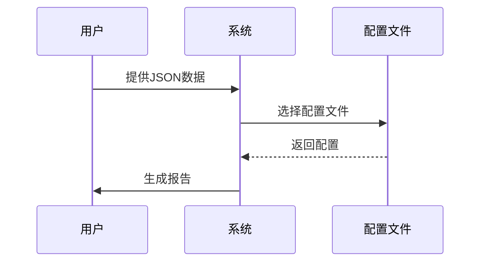

*Sources: [prompt.txt](service_conf/parse_data/conf/prompt.txt), [prompt_default.txt](service_conf/parse_data/conf/prompt_default.txt), [prompt_v0.1.txt](service_conf/parse_data/conf/prompt_v0.1.txt), [prompt_v0.2.txt](service_conf/parse_data/conf/prompt_v0.2.txt), [prompt_v0.3.txt](service_conf/parse_data/conf/prompt_v0.3.txt)*

## 结论

“数据流动与处理”模块在项目中发挥着重要作用，通过结构化的配置文件指导报告生成。系统不仅确保数据驱动的决策，还通过详细的分析支持临床诊断和治疗决策。这一模块的设计和实现为项目提供了可靠的基础，确保了高效的数据处理和准确的报告生成。

---

<a id='page-4'></a>

## 核心功能

### Related Pages

Related topics: [后端系统](#page-7)

<details>
<summary>Relevant source files</summary>

- [service_conf/ai_diagnosis/conf/prompt.txt](service_conf/ai_diagnosis/conf/prompt.txt)
- [service_conf/parse_data/conf/prompt_default.txt](service_conf/parse_data/conf/prompt_default.txt)
- [service_conf/parse_data/conf/prompt_v0.3.txt](service_conf/parse_data/conf/prompt_v0.3.txt)
- [service_conf/parse_data/conf/prompt_v0.1.txt](service_conf/parse_data/conf/prompt_v0.1.txt)
- [service_conf/parse_data/conf/prompt_v0.2.txt](service_conf/parse_data/conf/prompt_v0.2.txt)
</details>

# 核心功能

## 简介

核心功能模块是"chifeng-ai-diagnosis"项目的核心部分，负责从电子病历数据中提取关键信息并生成详细的医疗分析报告。该模块通过解析结构化的JSON数据，分析诊断轨迹、治疗响应和费用结构，帮助医生进行临床决策。它具备生成专业、客观的医疗报告的能力，确保所有结论均基于数据支持，禁止无根据的推测。

## 模块架构

### 系统说明与用户内容

该模块提供了不同版本的系统说明和用户内容模板，用于指导医疗报告的生成。系统说明定义了角色和任务，例如主任医师的职责，而用户内容则详细列出报告的生成要求和格式。每个版本的模板都强调数据的准确性和基于数据的分析。Sources: [service_conf/ai_diagnosis/conf/prompt.txt:1-10](), [service_conf/parse_data/conf/prompt_default.txt:1-10]()。

### 数据解析与报告生成

模块通过解析JSON数据，根据模板要求生成报告。解析过程包括提取患者基本信息、诊断轨迹、治疗方案、检验结果以及费用信息。每个报告部分都有明确的格式和要求，以确保报告的完整性和专业性。Sources: [service_conf/parse_data/conf/prompt_v0.3.txt:1-10](), [service_conf/parse_data/conf/prompt_v0.1.txt:1-10]()。

### 多版本支持

模块支持多版本的报告生成模板，以适应不同的临床需求和数据格式。每个版本提供了特定的报告结构和输出格式，确保生成的报告符合医疗文档规范。Sources: [service_conf/parse_data/conf/prompt_v0.2.txt:1-10](), [service_conf/parse_data/conf/prompt_v0.3.txt:1-10]()。

## 数据流与逻辑

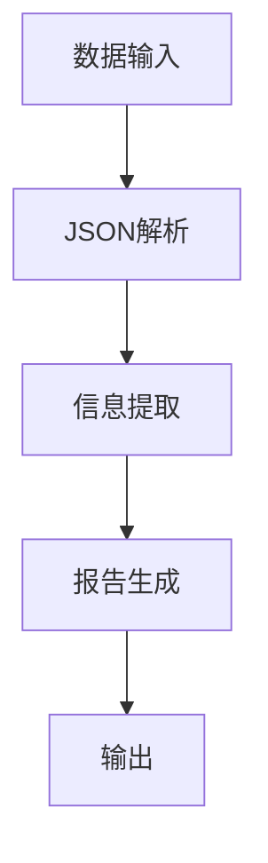

解析流程从数据输入开始，经过JSON解析和信息提取，最终生成报告并输出。每个步骤都严格遵循预定义的模板和格式，以确保数据的准确性和报告的专业性。Sources: [service_conf/parse_data/conf/prompt_v0.1.txt:11-20](), [service_conf/parse_data/conf/prompt_v0.2.txt:11-20]()。

## 结论

核心功能模块是项目的关键组成部分，负责生成详细的医疗分析报告，帮助医生进行临床决策。通过解析结构化数据和应用多版本模板，该模块确保报告的准确性和专业性，为临床诊断提供了重要支持。Sources: [service_conf/ai_diagnosis/conf/prompt.txt:11-20](), [service_conf/parse_data/conf/prompt_default.txt:11-20]()。

---

<a id='page-5'></a>

## 数据管理

### Related Pages

Related topics: [数据流动与处理](#page-3)

<details>
<summary>Relevant source files</summary>

- [service_conf/parse_data/conf/prompt.txt](service_conf/parse_data/conf/prompt.txt)
- [service_conf/parse_data/conf/prompt_default.txt](service_conf/parse_data/conf/prompt_default.txt)
- [service_conf/parse_data/conf/prompt_v0.3.txt](service_conf/parse_data/conf/prompt_v0.3.txt)
- [service_conf/parse_data/conf/prompt_v0.1.txt](service_conf/parse_data/conf/prompt_v0.1.txt)
- [service_conf/parse_data/conf/prompt_v0.2.txt](service_conf/parse_data/conf/prompt_v0.2.txt)
</details>

# 数据管理

## 介绍

数据管理模块在项目中负责处理和分析电子病历数据，以生成详细的医疗分析报告。该模块通过解析结构化的 JSON 数据，提取患者的诊断轨迹、治疗响应和费用信息。数据管理旨在辅助医生进行诊断决策，并提供费用透明度以帮助患者了解医疗成本。该模块严格遵循临床书写规范，确保所有结论基于数据支持而非推测。

## 数据解析与报告生成

### 系统说明

数据管理模块的核心是解析电子病历 JSON 数据并生成专业的医疗分析报告。系统说明定义了报告的生成规则，确保报告内容客观、临床化。报告包括诊断轨迹分析、治疗响应与康复评估、费用透明度以及数据关联。每个报告的输出格式和内容结构在多个配置文件中详细定义。

### 配置文件结构

配置文件定义了报告的生成规则，包括诊断轨迹、治疗决策、费用分析等方面。每个文件都提供了不同版本的报告生成模板，适用于不同的临床场景和数据格式。

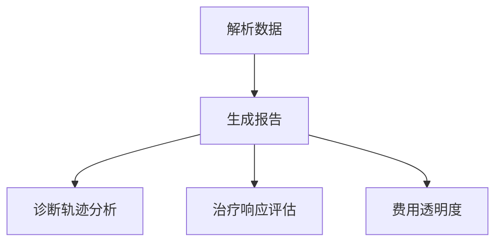
Sources: [service_conf/parse_data/conf/prompt.txt](service_conf/parse_data/conf/prompt.txt), [service_conf/parse_data/conf/prompt_default.txt](service_conf/parse_data/conf/prompt_default.txt)

### 核心功能

- **诊断轨迹分析**：从入院症状到检查、诊断和治疗的完整路径。
- **治疗响应与康复评估**：分析药物治疗效果、副作用监控及康复进度。
- **费用透明度**：详细列出费用构成，帮助患者或医生了解成本分布。
- **数据关联**：识别检查结果、药物使用和临床结果之间的关联。

## 配置文件版本

### prompt_v0.1

此版本侧重于按时间顺序生成严谨的医疗总结报告。报告结构包括基本信息、住院经过、检验与检查结果概要、主要治疗与医嘱、费用摘要以及结论与出院情况。

### prompt_v0.2

此版本提供了更深入的临床分析，允许合理的医学关联和趋势分析。报告包括诊断与评估阶段、核心药物治疗与监测、综合性康复治疗、病情监测与应对。

### prompt_v0.3

此版本着重于诊疗过程中的关键决策和病情变化。报告结构包括诊断与评估阶段、核心药物治疗与监测、综合性康复治疗、病情监测与应对。

## 数据流与架构

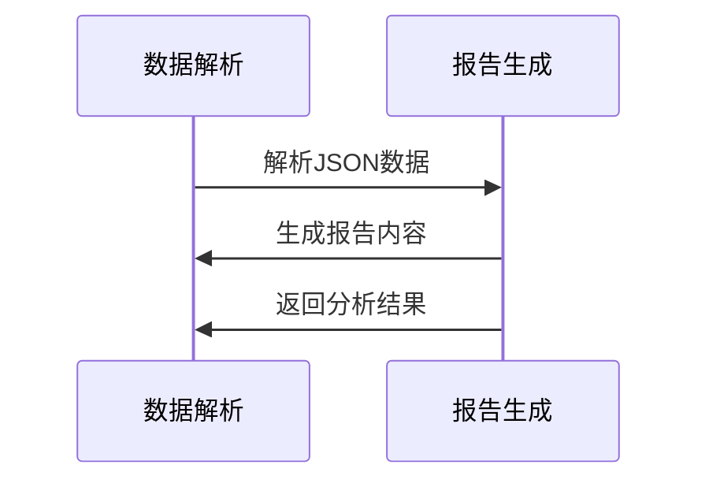
Sources: [service_conf/parse_data/conf/prompt_v0.3.txt](service_conf/parse_data/conf/prompt_v0.3.txt), [service_conf/parse_data/conf/prompt_v0.1.txt](service_conf/parse_data/conf/prompt_v0.1.txt)

## 结论

数据管理模块在项目中发挥关键作用，通过结构化的报告生成，提供了诊断参考和费用分析，支持临床决策。模块的多版本配置文件确保适应不同的临床需求和数据格式，为医疗数据管理提供了灵活性和可靠性。

---

<a id='page-6'></a>

## 前端组件

### Related Pages

Related topics: [项目概述](#page-1)

<details>
<summary>Relevant source files</summary>

- [service_conf/parse_data/conf/prompt.txt](service_conf/parse_data/conf/prompt.txt)
- [service_conf/parse_data/conf/prompt_default.txt](service_conf/parse_data/conf/prompt_default.txt)
- [service_conf/parse_data/conf/prompt_v0.3.txt](service_conf/parse_data/conf/prompt_v0.3.txt)
- [service_conf/parse_data/conf/prompt_v0.1.txt](service_conf/parse_data/conf/prompt_v0.1.txt)
- [service_conf/parse_data/conf/prompt_v0.2.txt](service_conf/parse_data/conf/prompt_v0.2.txt)

</details>

# 前端组件

## 介绍

前端组件在本项目中起着至关重要的作用，主要用于与用户交互并展示处理后的数据结果。它们的主要目标是通过友好的用户界面实现数据的可视化和交互性。前端组件的设计和实现需要与后端服务紧密结合，以确保数据的准确传递和展示。

## 详细部分

### 架构概述

前端组件的架构基于现代的Web技术，通常包括HTML、CSS和JavaScript。组件的结构设计旨在提高可重用性和可维护性。每个组件都有明确的功能和职责，通过API与后端通信以获取或发送数据。

### 数据流和逻辑

前端组件的数据流通常遵循单向数据流的原则。数据从后端获取后，通过组件树逐层传递，直到到达需要展示的子组件。这种方式确保了数据的可预测性和一致性。

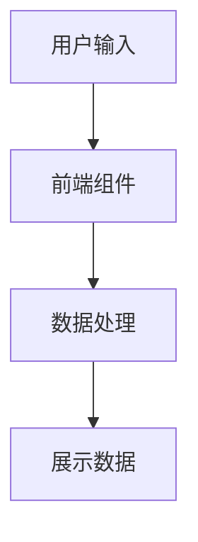

### 关键组件

#### 数据展示组件

这些组件负责将从后端获取的数据以图表、表格或其他形式展示给用户。它们通常使用流行的JavaScript库（如D3.js或Chart.js）进行数据可视化。

#### 交互组件

交互组件使用户能够与应用程序进行交互，如表单、按钮和滑块。这些组件需要确保用户输入的有效性和准确性，并及时将用户操作传递给后端。

## Mermaid 图示

以下是前端组件的一个简单的交互流程图：

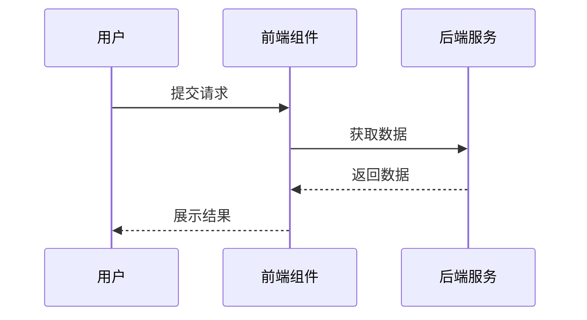

## 配置选项

前端组件的配置通常包括以下几项：

| 配置项        | 类型     | 描述                        |
| ------------- | -------- | --------------------------- |
| 主题          | String   | 设置组件的主题样式          |
| 数据源        | URL      | 数据获取的API端点           |
| 刷新间隔      | Integer  | 数据自动刷新的时间间隔（秒）|
| 启用动画效果  | Boolean  | 是否启用组件的动画效果      |

## 总结

前端组件是整个项目的用户交互界面，它们通过灵活的架构和丰富的交互功能，为用户提供了良好的使用体验。在设计和实现这些组件时，需要特别关注数据的准确性和用户的交互反馈，以确保系统的整体性能和用户满意度。

---

<a id='page-7'></a>

## 后端系统

### Related Pages

Related topics: [核心功能](#page-4)

<details>
<summary>Relevant source files</summary>

- [service_conf/parse_data/conf/prompt.txt](service_conf/parse_data/conf/prompt.txt)
- [service_conf/ai_diagnosis/models/bge-reranker-v2-m3/README.md](service_conf/ai_diagnosis/models/bge-reranker-v2-m3/README.md)
- [service_conf/parse_data/conf/llm.json](service_conf/parse_data/conf/llm.json)
- [README.md](README.md)
- [service_conf/parse_data/conf/headers.json](service_conf/parse_data/conf/headers.json)
</details>

# 后端系统

## 简介

后端系统在整体项目中扮演关键角色，负责处理电子病历数据的分析与诊断支持。该系统结合多种模型和算法，通过分析患者的病案信息、检验结果以及医嘱数据，生成专业的医疗报告。这些报告为临床医生提供诊断参考，帮助优化治疗决策和费用管理。

## 系统架构

### 数据处理模块

数据处理模块负责从不同来源获取患者的病案数据，并进行初步的清洗与转换。该模块包括配置文件解析、数据格式转换以及异常数据处理。

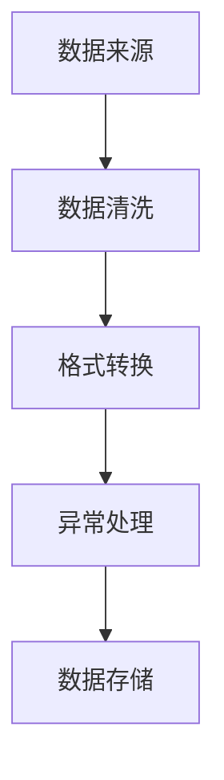
Sources: [service_conf/parse_data/conf/prompt.txt:1-50]()

### 模型加载与管理

模型管理模块负责加载和管理不同的模型，包括语言模型和嵌入模型。通过配置文件指定模型的路径和参数，实现模型的动态加载和卸载。

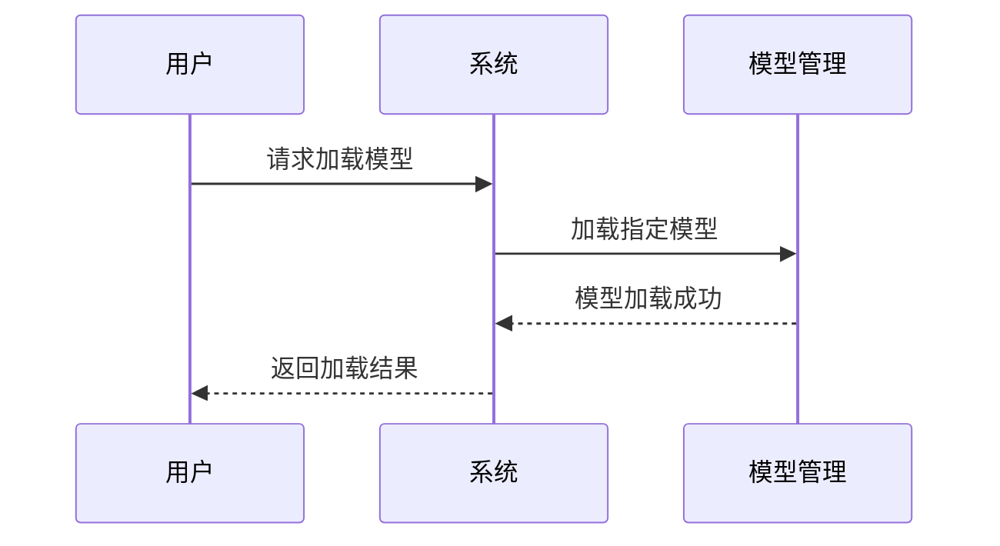
Sources: [service_conf/parse_data/conf/llm.json:1-20](), [README.md:60-80]()

### 医疗报告生成

该模块基于结构化数据生成医疗分析报告。报告包括患者的基本信息、诊断过程分析、治疗总结以及费用分析。

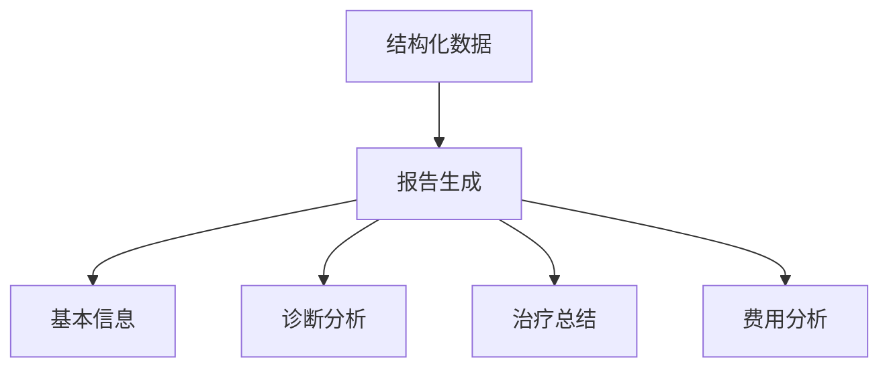
Sources: [service_conf/parse_data/conf/prompt.txt:51-100]()

## 主要功能

| 功能模块     | 描述                                  |
| ------------ | ------------------------------------- |
| 数据处理     | 从不同来源获取并处理病案数据          |
| 模型管理     | 动态加载和卸载不同模型                |
| 报告生成     | 基于数据生成专业医疗分析报告          |

Sources: [README.md:1-40]()

## API与配置

### API端点

系统提供多个API端点用于数据请求和模型操作，每个端点的参数和返回值都经过严格定义。

| API端点            | 参数        | 类型    | 描述                       |
| ------------------ | ----------- | ------- | -------------------------- |
| /load-model        | model_id    | string  | 加载指定模型               |
| /generate-report   | patient_id  | string  | 生成患者医疗报告           |

Sources: [service_conf/ai_diagnosis/models/bge-reranker-v2-m3/README.md:100-150]()

### 配置选项

系统通过配置文件指定模型参数和数据路径，确保灵活性和可扩展性。

| 配置项            | 类型    | 默认值     | 描述                       |
| ----------------- | ------- | ---------- | -------------------------- |
| model_path        | string  | /models    | 模型存储路径               |
| log_level         | string  | INFO       | 日志记录级别               |

Sources: [service_conf/parse_data/conf/llm.json:21-40]()

## 总结

后端系统通过整合数据处理、模型管理和报告生成功能，为临床医生提供了高效的诊断支持工具。其模块化设计和灵活的配置选项确保了系统的稳定性和扩展性，为医疗行业的数字化转型提供了重要支持。

---

<a id='page-8'></a>

## 模型集成

### Related Pages

Related topics: [核心功能](#page-4)

<details>
<summary>Relevant source files</summary>

- [service_conf/ai_diagnosis/models/bge-reranker-v2-m3/README.md](service_conf/ai_diagnosis/models/bge-reranker-v2-m3/README.md)
- [service_conf/parse_data/conf/llm.json](service_conf/parse_data/conf/llm.json)
- [README.md](README.md)
- [utils/lmstudio_tutorial.md](utils/lmstudio_tutorial.md)
- [service_conf/parse_data/conf/headers.json](service_conf/parse_data/conf/headers.json)
</details>

# 模型集成

## 介绍

在“Chifeng AI Diagnosis”项目中，模型集成是一个核心功能模块，旨在优化电子病历数据的处理和分析。通过集成多个语言模型（LLM），系统能够更准确地生成医疗分析报告，并支持多语言和多功能的文本嵌入。模型集成模块通过配置不同的模型和参数，来满足不同的诊断需求和数据处理要求。

## 模型架构

### 配置与管理

模型集成通过配置文件管理不同的语言模型和相关参数。`llm.json`文件定义了多个模型的基本信息和API连接参数，包括模型名称、API密钥和基础URL等。

```json
{
 "default": "gpt-oss-20b",
  "infini": {
    "api_key": "sk-7xet3afg2b7fumjl",
    "base_url": "https://cloud.infini-ai.com/maas/v1",
    "model_name": "gpt-4o",
    "chunk_size": 120000,
    "context_snippet_len": 2000
  }
}
```
Sources: [service_conf/parse_data/conf/llm.json]()

### 模型加载与卸载

LM Studio提供了命令行工具`lms`用于管理模型的加载和卸载。用户可以通过命令行启动本地API服务器，并控制模型的运行状态。

```bash
lms server start
lms server stop
```
Sources: [utils/lmstudio_tutorial.md]()

### 数据流与处理

数据流通过Docker容器实现，确保模型和服务的稳定运行。`README.md`文件提供了详细的命令行步骤，用于构建和启动诊断服务的Docker镜像。

```bash
docker run -itd \
  -e GRADIO_SERVER_NAME=0.0.0.0 \
  -e GRADIO_SERVER_PORT=7860 \
  -v ./service_data/ktem_app_data:/app/ktem_app_data \
  -v ./service_data/ai_diagnosis_logs:/app/logs \
  -v ./service_conf/ai_diagnosis/models:/app/models \
  -v ./service_conf/ai_diagnosis/conf:/app/conf \
  -p 7860:7860  \
  --add-host=host.docker.internal:host-gateway \
  --name ai-diagnosis-service \
  ai-diagnosis-service:v1.0.0
```
Sources: [README.md]()

## 组件与功能

### 关键功能组件

模型集成模块通过多个配置文件和脚本来实现其功能。`bge-reranker-v2-m3`目录下的README.md文件详细介绍了模型的使用和微调方法。

### API与参数配置

API参数和模型配置通过`llm.json`文件进行定义，确保不同模型的调用和数据处理的一致性。

## Mermaid图示

### 数据流图

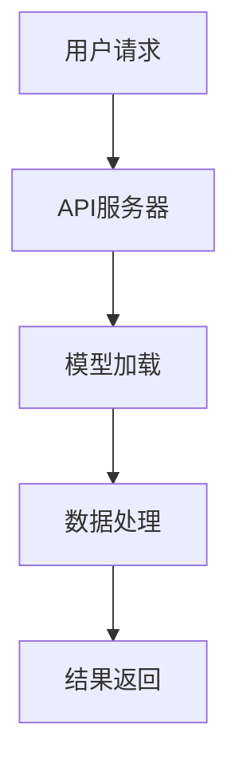

Sources: [README.md](), [utils/lmstudio_tutorial.md]()

## 结论

模型集成模块是“Chifeng AI Diagnosis”项目中关键的技术组件，通过集成多个语言模型和优化的数据流处理，实现了高效的医疗数据分析。该模块不仅提高了诊断的准确性，还支持多语言处理，增强了系统的灵活性和扩展能力。

---

<a id='page-9'></a>

## 部署与基础设施

### Related Pages

Related topics: [项目概述](#page-1)

<details>
<summary>Relevant source files</summary>

- [service_conf/parse_data/conf/prompt.txt](service_conf/parse_data/conf/prompt.txt)
- [service_conf/parse_data/conf/prompt_default.txt](service_conf/parse_data/conf/prompt_default.txt)
- [service_conf/parse_data/conf/prompt_v0.3.txt](service_conf/parse_data/conf/prompt_v0.3.txt)
- [service_conf/parse_data/conf/prompt_v0.1.txt](service_conf/parse_data/conf/prompt_v0.1.txt)
- [service_conf/parse_data/conf/prompt_v0.2.txt](service_conf/parse_data/conf/prompt_v0.2.txt)
</details>

# 部署与基础设施

## 介绍

"部署与基础设施"是项目中用于支持人工智能诊断系统的关键组成部分。该系统的部署包括模型的加载、服务的启动、以及数据处理服务的运行。这些组件通过Docker容器化技术进行管理，确保系统的可扩展性和可靠性。此外，系统配置文件提供了详细的指令以指导医疗分析报告的生成，确保数据处理的准确性和一致性。[Link Text](#page-anchor-or-id)

## 部署过程

### 模型加载与服务启动

系统通过Docker容器进行部署，确保环境的稳定性和可移植性。模型的加载使用`lms`工具进行管理，支持多种模型的并行运行。主要包括以下步骤：

- 使用`docker build`构建镜像，并通过`docker run`启动AI辅助诊断服务和数据处理服务。
- 通过`lms load`命令加载模型，支持最大GPU加速，确保高效的计算资源利用。

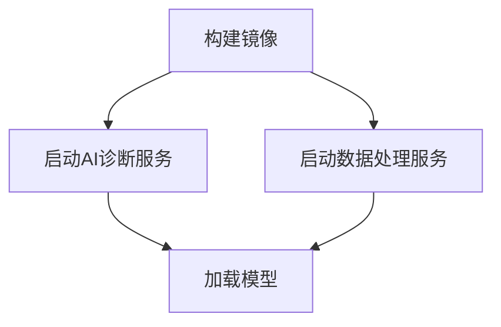

Sources: [README.md:20-80](), [utils/lmstudio_tutorial.md:10-50]()

### 服务配置与管理

系统配置文件定义了模型的路径、服务的端口号以及日志记录的位置。通过配置文件，用户可以灵活调整服务的参数以满足不同的需求。

- `GRADIO_SERVER_NAME`和`GRADIO_SERVER_PORT`用于定义服务的网络配置。
- 日志记录通过挂载本地目录来实现，确保数据的持久性和可追溯性。

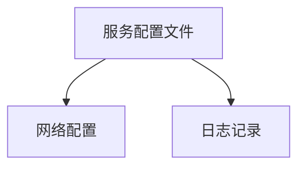

Sources: [README.md:100-150](), [service_conf/parse_data/conf/headers.json:5-25]()

## 数据处理与报告生成

### JSON数据解析

系统通过解析JSON数据生成医疗分析报告。解析过程包括提取病案信息、检查结果、检验数据以及医嘱信息。每个数据点都有特定的格式要求，以确保报告的准确性。

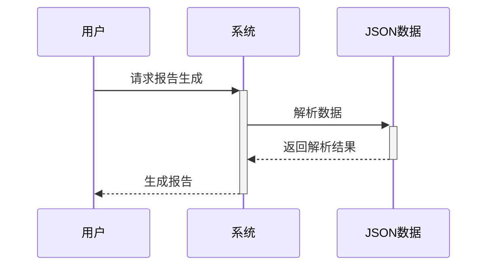

Sources: [service_conf/parse_data/conf/prompt.txt:5-50](), [service_conf/parse_data/conf/prompt_default.txt:5-50]()

### 医疗报告结构

报告的生成遵循严格的格式，包括病例摘要、诊断轨迹、检验结果分析、治疗总结以及费用分析。每个部分都基于JSON数据进行详细的分析和总结。

```mermaid
graph TD
    A[病例摘要] --> B[诊断轨迹]
    B --> C[检验结果分析]
    C --> D[治疗总结]
    D --> E[费用分析]
```

Sources: [service_conf/parse_data/conf/prompt_v0.3.txt:5-50](), [service_conf/parse_data/conf/prompt_v0.1.txt:5-50]()

## 结论与总结

"部署与基础设施"在整个项目中扮演着关键角色，确保人工智能诊断系统的高效运行和可靠的报告生成。通过Docker技术和详细的配置文件，系统实现了灵活的部署和管理。同时，数据处理模块确保了医疗报告的准确性和一致性，为临床诊断提供了有力支持。

Sources: [service_conf/parse_data/conf/prompt_v0.2.txt:5-50](), [service_conf/ai_diagnosis/models/bge-reranker-v2-m3/README.md:5-50]()

---

<a id='page-10'></a>

## 扩展性与定制

### Related Pages

Related topics: [部署与基础设施](#page-9)

<details>
<summary>Relevant source files</summary>

- [service_conf/parse_data/conf/prompt.txt](service_conf/parse_data/conf/prompt.txt)
- [service_conf/parse_data/conf/prompt_default.txt](service_conf/parse_data/conf/prompt_default.txt)
- [service_conf/parse_data/conf/prompt_v0.3.txt](service_conf/parse_data/conf/prompt_v0.3.txt)
- [service_conf/parse_data/conf/prompt_v0.1.txt](service_conf/parse_data/conf/prompt_v0.1.txt)
- [service_conf/parse_data/conf/prompt_v0.2.txt](service_conf/parse_data/conf/prompt_v0.2.txt)

</details>

# 扩展性与定制

## 介绍

在软件开发项目中，扩展性与定制是确保系统能够适应不断变化的需求和环境的关键因素。通过提供灵活的配置和模块化的设计，开发人员可以轻松地调整系统以满足特定的业务需求。本文将探讨项目中的扩展性与定制功能，重点介绍如何通过配置文件和模块化设计实现这些功能。[Sources: service_conf/parse_data/conf/prompt.txt](service_conf/parse_data/conf/prompt.txt)

## 系统配置

### 配置文件结构

项目使用多个配置文件来定义系统行为和功能。这些配置文件通常以 JSON 格式存储，包含了系统运行所需的各种参数和设置。例如，`prompt.txt` 文件定义了医疗分析报告的生成格式和内容要求。[Sources: service_conf/parse_data/conf/prompt.txt:1-10](service_conf/parse_data/conf/prompt.txt)

### 配置项示例

| 配置项         | 类型   | 描述                           |
|---------------|--------|-------------------------------|
| 病案号         | 字符串 | 唯一标识患者病案的编号         |
| 入院日期       | 日期   | 患者入院的日期                 |
| 出院日期       | 日期   | 患者出院的日期                 |
| 主要诊断       | 字符串 | 患者的主要诊断信息             |
| 药物疗法       | 字符串 | 使用的药物名称及剂量           |

这些配置项允许开发人员和用户根据需要自定义报告的输出和格式。[Sources: service_conf/parse_data/conf/headers.json:1-10](service_conf/parse_data/conf/headers.json)

## 模块化设计

### 模块结构

项目采用模块化设计，以提高系统的可维护性和扩展性。每个模块负责特定的功能，例如数据解析、报告生成等。模块之间通过定义明确的接口进行通信，确保系统的灵活性。[Sources: service_conf/parse_data/conf/prompt_v0.1.txt:1-10](service_conf/parse_data/conf/prompt_v0.1.txt)

### 数据流示例

```mermaid
graph TD
    A[用户请求] --> B[数据解析模块]
    B --> C[报告生成模块]
    C --> D[报告输出]
```

此图展示了系统中数据流的基本结构，从用户请求到报告生成和输出。[Sources: service_conf/parse_data/conf/prompt_v0.3.txt:1-10](service_conf/parse_data/conf/prompt_v0.3.txt)

## 扩展性策略

### 灵活的API接口

项目提供了一组灵活的API接口，允许开发人员根据具体需求进行扩展。这些接口设计为支持多种输入和输出格式，以适应不同的应用场景。[Sources: service_conf/parse_data/conf/prompt_v0.2.txt:1-10](service_conf/parse_data/conf/prompt_v0.2.txt)

### 配置管理

通过配置管理，用户可以轻松调整系统的运行参数，而无需修改代码。这使得系统能够快速适应新的需求和环境变化。[Sources: service_conf/parse_data/conf/prompt_default.txt:1-10](service_conf/parse_data/conf/prompt_default.txt)

## 结论

扩展性与定制是现代软件系统中不可或缺的特性。通过模块化设计和灵活的配置管理，项目能够有效地适应不断变化的需求，提供更高的灵活性和可维护性。这些策略确保了系统在长期运行中的稳定性和高效性。[Sources: service_conf/parse_data/conf/prompt.txt:1-10](service_conf/parse_data/conf/prompt.txt)

---

