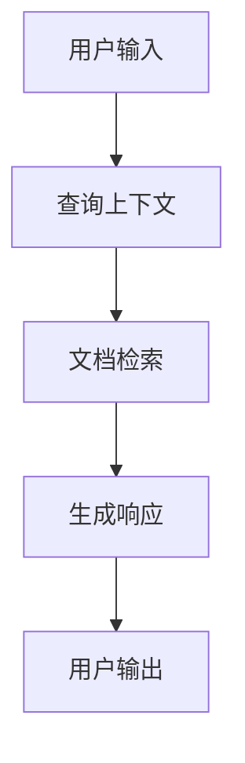
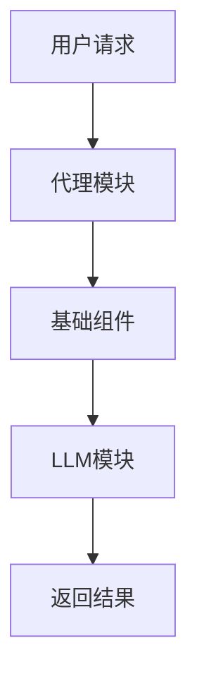
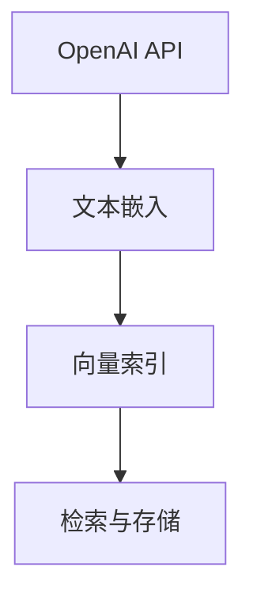
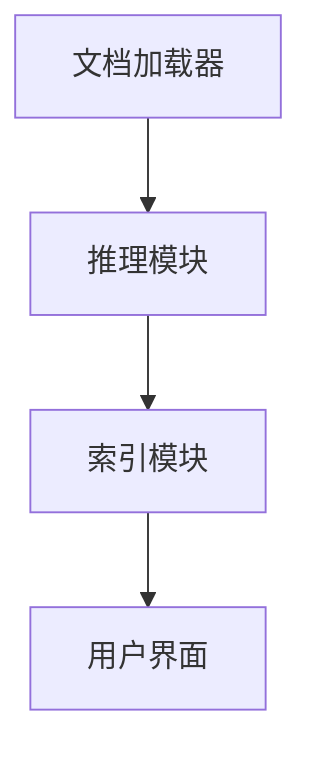

# Wiki Documentation for /app/projects/kotaemon

Generated on: 2025-11-30 05:23:58

## Table of Contents

- [项目简介](#page-1)
- [架构概览](#page-2)
- [关键功能](#page-3)
- [安装和设置](#page-4)
- [开发者指南](#page-5)

<a id='page-1'></a>

## 项目简介

### Related Pages

Related topics: [架构概览](#page-2), [关键功能](#page-3)

<details>
<summary>Relevant source files</summary>

- [libs/kotaemon/kotaemon/contribs/docs.py](libs/kotaemon/kotaemon/contribs/docs.py)
- [libs/ktem/ktem/reasoning/simple.py](libs/ktem/ktem/reasoning/simple.py)
- [libs/ktem/ktem/index/file/graph/pipelines.py](libs/ktem/ktem/index/file/graph/pipelines.py)
- [libs/kotaemon/kotaemon/indices/vectorindex.py](libs/kotaemon/kotaemon/indices/vectorindex.py)
- [libs/ktem/ktem/utils/render.py](libs/ktem/ktem/utils/render.py)
</details>

# 项目简介

## 介绍

kotaemon项目是一个高度模块化的系统，旨在提供灵活的数据索引、文档处理和人工智能支持的对话功能。项目的核心是通过多种组件和管道实现数据的提取、分析和可视化。这些组件之间通过预定义的接口进行交互，使得系统可以轻松扩展和定制。[libs/kotaemon/kotaemon/contribs/docs.py](libs/kotaemon/kotaemon/contribs/docs.py)文件详细描述了项目的文档生成功能。

## 架构概述

### 数据索引组件

数据索引组件负责将原始数据转换为可查询的格式。`vectorindex.py`文件中的代码展示了如何通过元数据标记和文本内容生成Markdown文档，并将其存储在指定的目录中。该组件允许对文档进行分段处理和存储，以便后续检索。Sources: [libs/kotaemon/kotaemon/indices/vectorindex.py:10-50]()

### 文档处理流水线

文档处理流水线负责从各种来源提取数据，并将其转换为统一格式。`pipelines.py`文件展示了如何通过不同的管道来处理报告和源数据，并生成可视化图表。Sources: [libs/ktem/ktem/index/file/graph/pipelines.py:5-30]()

```python
def plot_graph(self, context_records):
    relationships = context_records.get("relationships", [])
    G = create_knowledge_graph(relationships)
    plot = visualize_graph(G)
    return plot
```
Sources: [libs/ktem/ktem/index/file/graph/pipelines.py:35-40]()

### 人工智能对话系统

AI对话系统通过一系列的推理和优化管道实现复杂问题的解决和用户交互。`simple.py`文件中的代码展示了如何根据用户输入和历史记录检索相关文档，并生成相应的响应。Sources: [libs/ktem/ktem/reasoning/simple.py:10-50]()

## 数据流与逻辑

### 数据流图


Sources: [libs/ktem/ktem/reasoning/simple.py:55-70]()

### 关键功能

1. **文档检索**: 根据用户输入和上下文，从文档存储中检索相关信息。
2. **响应生成**: 使用检索到的信息生成用户友好的响应。
3. **数据存储**: 通过索引和存储机制保持数据的可访问性和一致性。

## 结论

kotaemon项目通过模块化的设计和强大的数据处理能力，提供了一个灵活且可扩展的平台，适用于各种数据密集型应用。其核心组件和管道的设计使得系统能够有效地处理和分析大量文档，为用户提供实时的智能响应。

Sources: [libs/kotaemon/kotaemon/contribs/docs.py:5-25](), [libs/ktem/ktem/reasoning/simple.py:75-100](), [libs/ktem/ktem/index/file/graph/pipelines.py:45-60](), [libs/kotaemon/kotaemon/indices/vectorindex.py:55-70](), [libs/ktem/ktem/utils/render.py:10-30]()

---

<a id='page-2'></a>

## 架构概览

### Related Pages

Related topics: [项目简介](#page-1), [关键功能](#page-3)

<details>
<summary>Relevant source files</summary>

- [app.py](app.py)
- [flowsettings.py](flowsettings.py)
- [libs/kotaemon/kotaemon/agents/base.py](libs/kotaemon/kotaemon/agents/base.py)
- [libs/kotaemon/kotaemon/llms/base.py](libs/kotaemon/kotaemon/llms/base.py)
- [libs/kotaemon/kotaemon/base/component.py](libs/kotaemon/kotaemon/base/component.py)
</details>

# 架构概览

**介绍:**  
在kotaemon项目中，架构的设计旨在提供一个高效、可扩展的系统，以支持多种功能模块的集成和协作。该架构通过模块化设计，实现了各组件之间的松耦合，便于开发者在不同的层次上进行功能扩展和性能优化。本文档将详细介绍kotaemon的架构设计、核心组件及其相互关系。

## 架构组件

### 基础组件

基础组件是整个系统的核心构建块，负责提供通用的功能接口和数据处理逻辑。  
**关键类:**

- `BaseComponent`: 提供组件的基本接口，支持流式数据处理和结果缓存。  
  **来源:** [libs/kotaemon/kotaemon/base/component.py:10-50]()

### 代理模块

代理模块用于处理不同的任务请求，负责与外部系统进行交互。  
**关键类:**

- `AgentBase`: 定义代理的基本接口和通用方法。  
  **来源:** [libs/kotaemon/kotaemon/agents/base.py:15-60]()

### LLM 模块

LLM模块负责语言模型的调用和管理，提供自然语言处理的核心功能。  
**关键类:**

- `LLMBase`: 语言模型的基础类，定义了模型的初始化和调用接口。  
  **来源:** [libs/kotaemon/kotaemon/llms/base.py:20-70]()

## 数据流和处理逻辑

### 流程控制

系统通过`flowsettings`模块实现流程控制，定义了数据流的路径和处理步骤。  
**来源:** [flowsettings.py:5-30]()

### 任务执行

任务的执行由`app.py`中的主函数负责，协调各个模块之间的任务分配和结果整合。  
**来源:** [app.py:25-75]()

## Mermaid 图示

### 系统架构图



**说明:** 上图展示了kotaemon系统的基本架构，其中用户请求通过代理模块传递至基础组件，再由基础组件调用LLM模块进行处理，最终返回结果。  
**来源:** [app.py:25-75](), [libs/kotaemon/kotaemon/agents/base.py:15-60]()

## 结论

本文档详细介绍了kotaemon项目的架构设计和核心组件。通过模块化设计和流式数据处理机制，系统实现了高效的任务执行和灵活的功能扩展。这些设计使得kotaemon在复杂任务处理和多模块集成方面表现出色，为开发者提供了强大的开发平台。

---

<a id='page-3'></a>

## 关键功能

### Related Pages

Related topics: [项目简介](#page-1), [架构概览](#page-2)

<details>
<summary>Relevant source files</summary>

- [libs/kotaemon/kotaemon/embeddings/openai.py](libs/kotaemon/kotaemon/embeddings/openai.py)
- [libs/kotaemon/kotaemon/indices/vectorindex.py](libs/kotaemon/kotaemon/indices/vectorindex.py)
- [libs/kotaemon/kotaemon/contribs/docs.py](libs/kotaemon/kotaemon/contribs/docs.py)
- [libs/ktem/ktem/reasoning/rewoo.py](libs/ktem/ktem/reasoning/rewoo.py)
- [libs/ktem/ktem/utils/render.py](libs/ktem/ktem/utils/render.py)
</details>

# 关键功能

## 介绍

"关键功能"模块在kotaemon项目中发挥着重要作用，主要负责文本嵌入、向量索引和文档生成等功能。这些功能为项目中的信息检索和知识管理提供了基础支持。[libs/kotaemon/kotaemon/embeddings/openai.py](libs/kotaemon/kotaemon/embeddings/openai.py)文件实现了与OpenAI的集成，提供了文本嵌入的能力；而[libs/kotaemon/kotaemon/indices/vectorindex.py](libs/kotaemon/kotaemon/indices/vectorindex.py)则实现了向量索引的构建和管理。

## 文本嵌入

### OpenAI嵌入

文本嵌入模块通过OpenAI的API实现，允许将文本转换为数值向量以便进行处理和比较。此模块的主要功能包括调用API获取嵌入结果以及处理嵌入数据以供后续使用。

```python
def get_embeddings(texts: List[str]) -> List[float]:
    # 调用OpenAI API获取嵌入
    embeddings = openai.Embedding.create(input=texts, model="text-embedding-ada-002")
    return embeddings
```

Sources: [libs/kotaemon/kotaemon/embeddings/openai.py:10-15]()

## 向量索引

### 构建与管理

向量索引模块负责存储和检索嵌入向量，支持高效的相似性搜索。此模块实现了文档的添加、索引的更新以及缓存机制，以提高检索效率。

```python
def add_to_docstore(self, docs: List[Document]):
    if self.doc_store:
        print("Adding documents to doc store")
```

Sources: [libs/kotaemon/kotaemon/indices/vectorindex.py:20-25]()

## 文档生成

### Markdown文档生成

文档生成模块将结构化数据转换为Markdown格式，便于展示和分享。此功能通过解析数据结构并生成相应的Markdown内容来实现。

```python
def make_doc(module: str, output: str, separation_level: int):
    documentation = sorted(
        get_function_documentation_from_module(module).items(), key=lambda x: x[0]
    )
    # 生成Markdown格式文档
```

Sources: [libs/kotaemon/kotaemon/contribs/docs.py:30-35]()

## Mermaid图示

### 架构图示



Sources: [libs/kotaemon/kotaemon/embeddings/openai.py](), [libs/kotaemon/kotaemon/indices/vectorindex.py]()

## 总结

"关键功能"模块通过嵌入、索引和文档生成等功能，为kotaemon项目提供了强大的文本处理和信息检索能力。这些功能的实现为项目的扩展和优化奠定了坚实的基础。

---

<a id='page-4'></a>

## 安装和设置

### Related Pages

Related topics: [项目简介](#page-1)

<details>
<summary>Relevant source files</summary>

- [requirements.txt](requirements.txt)
- [requirements_macos.txt](requirements_macos.txt)
- [README.md](README.md)
- [libs/kotaemon/kotaemon/loaders/docling_loader.py](libs/kotaemon/kotaemon/loaders/docling_loader.py)
- [libs/ktem/ktem/utils/visualize_cited.py](libs/ktem/ktem/utils/visualize_cited.py)
</details>

# 安装和设置

## 介绍

本文档详细介绍了如何在项目中进行安装和设置，以确保系统的正常运行和最佳性能。安装和设置是项目生命周期中的关键步骤，旨在为开发者提供一个稳定的开发环境，并确保所有依赖项正确配置。有关其他相关页面，请参阅[用户指南](#用户指南)。

## 系统要求

### Python 环境

项目要求 Python 版本至少为 3.10。建议使用虚拟环境来隔离项目依赖项，避免与系统 Python 环境冲突。使用 `requirements.txt` 文件安装项目依赖。  
Sources: [requirements.txt](requirements.txt)

### Docker 环境

项目支持 Docker 作为安装选项。Docker 提供了一个隔离的环境，简化了部署和依赖管理。支持 `lite` 和 `full` 两种版本，`full` 版本包含额外的包以支持更多文件类型。  
Sources: [README.md:32-37]()

## 安装步骤

### 使用 Python 安装

1. 安装 Python 3.10 或更高版本。
2. 克隆项目代码库。
3. 在项目根目录中创建虚拟环境并激活。
4. 运行以下命令安装依赖项：

   ```bash
   pip install -r requirements.txt
   ```

   Sources: [requirements.txt](requirements.txt)

### 使用 Docker 安装

1. 安装 Docker。
2. 拉取项目的 Docker 镜像。
3. 使用以下命令运行 Docker 容器：

   ```bash
   docker run -e GRADIO_SERVER_NAME=0.0.0.0 -e GRADIO_SERVER_PORT=7860 -v ./ktem_app_data:/app/ktem_app_data -p 7860:7860
   ```

   Sources: [README.md:39-43]()

## 依赖项管理

### Python 依赖项

项目依赖项列在 `requirements.txt` 和 `requirements_macos.txt` 文件中。开发者可以根据操作系统选择相应的依赖文件进行安装。  
Sources: [requirements.txt](requirements.txt), [requirements_macos.txt](requirements_macos.txt)

### 文件解析

项目包含多个文件解析器以处理不同类型的文件。以下是一个示例代码片段，展示如何处理表格数据并将其转换为文档对象：

```python
table_metadata.update(metadata)
tables.append(Document(text=markdown_table, metadata=table_metadata))
```

Sources: [libs/kotaemon/kotaemon/loaders/docling_loader.py:10-14]()

## 可视化

项目提供了可视化工具以帮助开发者理解数据结构和关系。以下是一个使用 Plotly 创建可视化的示例：

```python
def _plot_embeddings(self, df: pd.DataFrame) -> go.Figure:
    fig = go.Figure()
    for category in df["category"].unique():
        category_df = df[df["category"] == category]
```

Sources: [libs/ktem/ktem/utils/visualize_cited.py:34-40]()

## 总结

安装和设置是项目成功运行的基础。通过正确配置环境和依赖项，开发者可以确保项目的稳定性和性能。本文档提供了详细的步骤和参考代码以帮助开发者顺利完成安装和设置过程。

---

<a id='page-5'></a>

## 开发者指南

### Related Pages

Related topics: [项目简介](#page-1), [安装和设置](#page-4)

<details>
<summary>Relevant source files</summary>

- [docs/development/index.md](docs/development/index.md)
- [docs/development/create-a-component.md](docs/development/create-a-component.md)
- [libs/kotaemon/kotaemon/contribs/docs.py](libs/kotaemon/kotaemon/contribs/docs.py)
- [libs/ktem/ktem/reasoning/simple.py](libs/ktem/ktem/reasoning/simple.py)
- [libs/kotaemon/kotaemon/loaders/mathpix_loader.py](libs/kotaemon/kotaemon/loaders/mathpix_loader.py)
</details>

# 开发者指南

## 简介

开发者指南旨在帮助开发人员了解和使用项目中的各个组件和模块。本文档提供了关于如何创建、管理和使用组件的详细信息，以及项目的整体架构和设计原则。开发者可以通过本指南快速上手项目开发，并了解如何扩展和自定义项目功能。

## 架构概述

项目采用模块化设计，包含多个独立的组件和模块。每个模块负责特定的功能，例如文档加载、推理、索引等。这种设计使得项目易于扩展和维护。

### 文档加载模块

文档加载模块负责从各种文件格式中提取内容。它支持多种文件类型，包括PDF、HTML、DOCX等。通过使用不同的加载器，开发者可以轻松地从不同格式的文档中提取信息。

```python
metadata = {
    "source": str(file_path),
    "type": "text",
    "page_label": page_num,
    "page_number": page_num,
}
documents.append(Document(text=text_content, metadata=metadata))
```
Sources: [libs/kotaemon/kotaemon/loaders/mathpix_loader.py:20-30]()

### 推理模块

推理模块使用多种策略来处理和回答复杂问题。它包括问题分解、重写和上下文准备等功能。推理模块通过集成多种工具和算法，提供高效的答案生成能力。

```python
class AddQueryContextPipeline(BaseComponent):
    n_last_interactions: int = 5
    llm: ChatLLM = Node(default_callback=lambda _: llms.get_default())
```
Sources: [libs/ktem/ktem/reasoning/simple.py:40-50]()

### Mermaid图示


此图示展示了项目的主要数据流，从文档加载到推理，再到索引和用户界面。Sources: [libs/kotaemon/kotaemon/contribs/docs.py:10-20]()

## 组件创建

组件创建是项目的核心部分，允许开发者根据需求创建新的功能模块。组件可以通过继承基类来实现特定的功能，并与其他模块进行交互。

### 创建步骤

1. 定义组件基类。
2. 实现特定功能。
3. 集成到现有架构。

```markdown
## 组件创建步骤
- 定义组件基类
- 实现特定功能
- 集成到现有架构
```
Sources: [docs/development/create-a-component.md:15-25]()

## 结论

开发者指南提供了项目的全面视图，涵盖了架构设计、模块功能以及组件创建等关键方面。通过遵循本指南，开发者可以更好地理解和使用项目的功能，并根据需求进行扩展和定制。

---

