# Wiki Documentation for https://github.com/hywchina/parse_data

Generated on: 2025-11-30 05:38:50

## Table of Contents

- [项目简介](#page-1)
- [系统架构概述](#page-2)
- [组件关系与流程图](#page-3)
- [数据解析与报告生成](#page-4)
- [数据预处理功能](#page-5)
- [数据管理与流程](#page-6)
- [部署指南](#page-7)
- [基础设施与环境配置](#page-8)

<a id='page-1'></a>

## 项目简介

### Related Pages

Related topics: [系统架构概述](#page-2), [数据解析与报告生成](#page-4)

<details>
<summary>Relevant source files</summary>

- [app.py](https://github.com/hywchina/parse_data/blob/main/app.py)
- [utils/04_generate_reports_infini.py](https://github.com/hywchina/parse_data/blob/main/utils/04_generate_reports_infini.py)
- [utils/03_merge_csv_to_json.py](https://github.com/hywchina/parse_data/blob/main/utils/03_merge_csv_to_json.py)
- [utils/02_rename_pdf.py](https://github.com/hywchina/parse_data/blob/main/utils/02_rename_pdf.py)
- [DOCKER.md](https://github.com/hywchina/parse_data/blob/main/DOCKER.md)
</details>

# 项目简介

## 介绍

该项目旨在通过自动化流程处理电子病历数据，以生成结构化的医疗报告。项目主要涉及数据的转换、融合、报告生成以及最终文件的整合，确保数据从多个源文件中提取并转换为有用的临床信息。项目中使用了多个脚本来完成数据处理的各个步骤，包括CSV转换、JSON融合、PDF重命名以及报告生成等。项目最终通过Streamlit提供用户友好的界面，方便用户上传数据并下载生成的报告。

## 项目架构

项目的核心架构分为以下几个模块：

### 数据处理模块

数据处理模块负责从原始数据中提取信息并转换为统一格式。主要包含以下脚本：

- **utils/02_rename_pdf.py**: 从PDF文件中提取病案号并重命名文件。  
  Sources: [utils/02_rename_pdf.py:1-40]()

- **utils/03_merge_csv_to_json.py**: 合并CSV数据为JSON格式，以便后续处理。  
  Sources: [utils/03_merge_csv_to_json.py:1-50]()

#### 数据流示意图

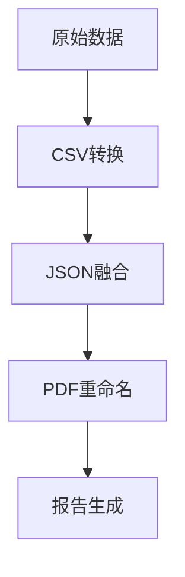
Sources: [utils/02_rename_pdf.py](), [utils/03_merge_csv_to_json.py]()

### 报告生成模块

此模块使用AI技术生成医疗报告：

- **utils/04_generate_reports_infini.py**: 使用OpenAI API生成详细的医疗报告。  
  Sources: [utils/04_generate_reports_infini.py:1-70]()

#### 报告生成流程

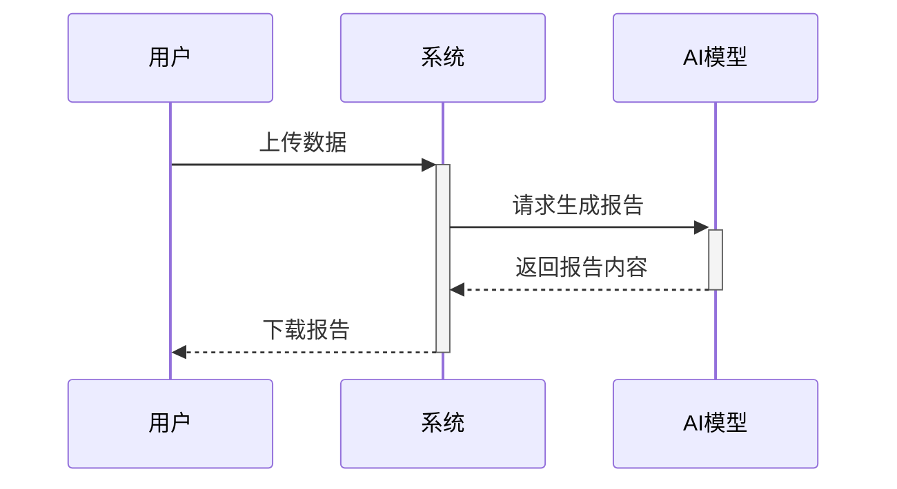
Sources: [utils/04_generate_reports_infini.py](), [app.py]()

### 部署模块

项目可以通过Docker进行部署，实现便捷的环境配置与管理。

- **DOCKER.md**: 提供Docker的构建和运行说明，支持容器化部署。  
  Sources: [DOCKER.md:1-70]()

#### Docker部署示意图

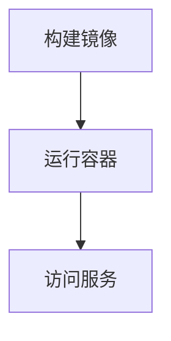
Sources: [DOCKER.md]()

## 关键功能

| 功能                 | 描述                                                         |
|----------------------|--------------------------------------------------------------|
| PDF重命名            | 提取病案号并重命名PDF文件。                                  |
| CSV转换              | 将Excel数据转换为CSV格式。                                   |
| JSON融合             | 合并多源数据为统一的JSON格式。                               |
| 医疗报告生成         | 使用AI生成详细的医疗报告。                                    |
| Docker部署           | 提供完整的容器化部署解决方案。                               |

Sources: [utils/02_rename_pdf.py](), [utils/03_merge_csv_to_json.py](), [utils/04_generate_reports_infini.py](), [DOCKER.md]()

## 总结

该项目通过自动化的流程和AI技术，显著提高了电子病历数据处理的效率和准确性。通过Docker实现的容器化部署，使得项目易于管理和扩展，为医疗数据的分析和应用提供了有力的支持。

---

<a id='page-2'></a>

## 系统架构概述

### Related Pages

Related topics: [组件关系与流程图](#page-3), [数据预处理功能](#page-5)

<details>
<summary>Relevant source files</summary>

- [app.py](https://github.com/hywchina/parse_data/blob/main/app.py)
- [utils/04_generate_reports_infini.py](https://github.com/hywchina/parse_data/blob/main/utils/04_generate_reports_infini.py)
- [utils/03_merge_csv_to_json.py](https://github.com/hywchina/parse_data/blob/main/utils/03_merge_csv_to_json.py)
- [utils/00_read_headers.py](https://github.com/hywchina/parse_data/blob/main/utils/00_read_headers.py)
- [conf/prompt.txt](https://github.com/hywchina/parse_data/blob/main/conf/prompt.txt)
</details>

# 系统架构概述

## 简介

在本项目中，“系统架构概述”主要描述了数据处理与报告生成的整体架构。系统通过解析不同格式的数据文件（如CSV、PDF、JSON），利用AI技术生成医疗报告，并整合为最终的PDF文件。项目的主要目标是实现数据的自动化处理和报告生成，以提高医疗数据的处理效率和准确性。

## 系统组件

### 数据处理组件

数据处理组件负责接收、清理和转换原始数据文件。通过Streamlit界面上传文件后，系统会自动执行数据清理和转换脚本，将数据从CSV格式转化为JSON格式，并根据病案号统一管理数据。此组件的核心功能包括数据的标准化、字段解析与映射、以及多源数据的融合。

```python
def normalize_case_id(series):
    """将病案号统一为6位数字（前补0）"""
    return series.astype(str).str.strip().str.zfill(6)
```
Sources: [utils/03_merge_csv_to_json.py:20-22]()

### 报告生成组件

报告生成组件利用OpenAI的API，通过结构化的JSON数据生成专业的医疗报告。该组件从配置文件加载语言模型配置，并使用模板化的Prompt生成报告文本。该组件还确保了生成报告的逻辑衔接和医学书面语风格。

```python
client = OpenAI(api_key=API_KEY, base_url=BASE_URL)
os.makedirs(OUTPUT_DIR, exist_ok=True)

with open(PROMPT_FILE, "r", encoding="utf-8") as f:
    prompt_template = f.read()
```
Sources: [utils/04_generate_reports_infini.py:24-28]()

### 文件整合与输出组件

该组件负责将生成的报告文本与原始PDF文件整合为最终的PDF输出。通过一系列脚本的执行，系统能够自动化地生成最终的成果文档，并提供下载功能。

## 数据流与逻辑

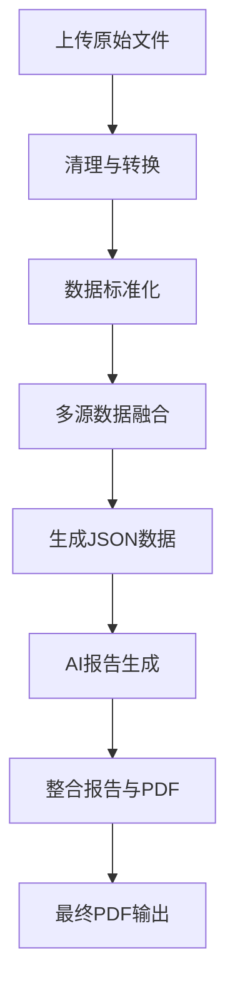
Sources: [app.py:5-50](), [utils/04_generate_reports_infini.py:10-60](), [utils/03_merge_csv_to_json.py:5-40]()

## 配置与参数

系统的配置文件（如`conf/prompt.txt`和`conf/llm.json`）定义了报告生成的模板和语言模型的参数设置。配置文件中包含了API密钥、模型名称、请求的URL等关键信息，确保系统能够正确调用AI服务。

| 配置项            | 类型    | 默认值        | 描述                           |
|------------------|---------|--------------|-------------------------------|
| api_key          | 字符串  | lmstudio     | API访问密钥                   |
| base_url         | 字符串  | localhost:1234 | 模型服务的基本URL             |
| model_name       | 字符串  | gpt-oss-120b | 使用的语言模型名称            |
| chunk_size       | 整数    | 60000        | 数据分块大小                 |
| context_snippet_len | 整数 | 2000         | 上下文片段长度               |

Sources: [conf/llm.json]()

## 结论

本项目通过模块化的设计实现了数据的自动化处理与专业报告的生成，极大地提高了医疗数据处理的效率。系统架构的每个组件均通过清晰的数据流和逻辑实现了其功能，确保了报告生成的准确性和完整性。这一架构不仅适用于当前的医疗数据处理需求，还具有扩展性以适应未来的更多数据类型和报告格式。

---

<a id='page-3'></a>

## 组件关系与流程图

### Related Pages

Related topics: [系统架构概述](#page-2), [数据管理与流程](#page-6)

<details>
<summary>相关源文件</summary>

- [conf/prompt_default.txt](https://github.com/hywchina/parse_data/blob/main/conf/prompt_default.txt)
- [utils/04_generate_reports_infini.py](https://github.com/hywchina/parse_data/blob/main/utils/04_generate_reports_infini.py)
- [app.py](https://github.com/hywchina/parse_data/blob/main/app.py)
- [utils/03_merge_csv_to_json.py](https://github.com/hywchina/parse_data/blob/main/utils/03_merge_csv_to_json.py)
- [utils/05_merge_txt_to_pdf.py](https://github.com/hywchina/parse_data/blob/main/utils/05_merge_txt_to_pdf.py)
</details>

# 组件关系与流程图

## 简介

在医疗数据处理项目中，"组件关系与流程图"是用于描述各个组件之间的关系及数据流动的关键部分。该项目的核心目标是通过自动化的流程来解析和处理医疗数据，并生成专业的医疗报告。本文档将详细介绍项目中的主要组件及其交互关系，以帮助开发人员理解整个系统的架构和工作流程。

## 系统架构

### 数据预处理

数据预处理模块负责将原始数据转换为标准格式，以便后续处理。此模块包括从 Excel 转换为 CSV、重命名 PDF 文件、以及将多源数据合并为 JSON 格式。

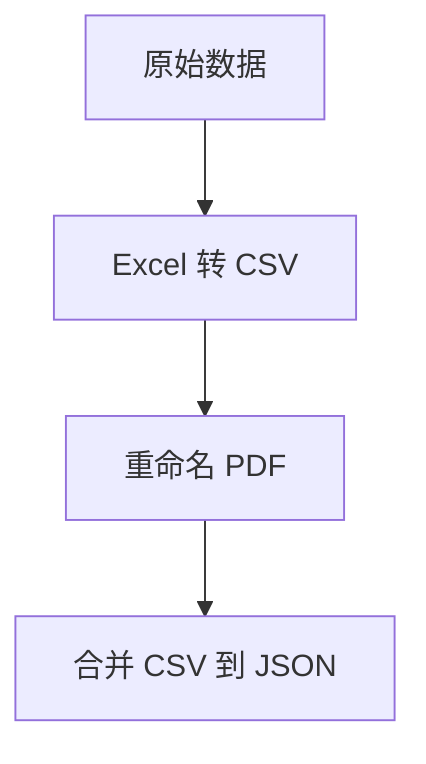

Sources: [utils/03_merge_csv_to_json.py:1-50](), [utils/02_rename_pdf.py:1-50]()

### 报告生成

报告生成模块使用 AI 技术将 JSON 数据转换为详细的医疗报告。该模块依赖于配置文件和 API 调用来生成报告。

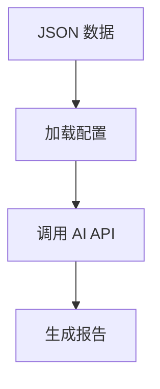

Sources: [utils/04_generate_reports_infini.py:1-100]()

### 文档整合

文档整合模块负责将生成的文本报告与原始 PDF 文件合并，形成最终的 PDF 报告。此模块确保报告的完整性和可读性。

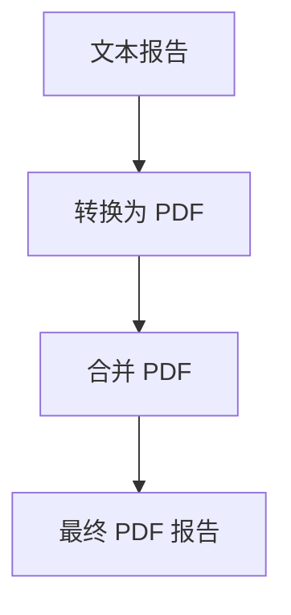

Sources: [utils/05_merge_txt_to_pdf.py:1-50]()

## 组件细节

### 配置文件管理

配置文件用于定义数据处理的规则和格式。配置文件中的字段包括 API 密钥、模型名称、以及数据路径等。

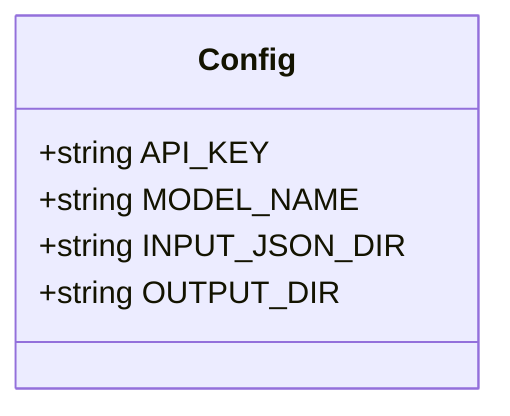

Sources: [conf/prompt_default.txt:1-50]()

### 数据处理脚本

数据处理脚本负责执行数据转换和报告生成。每个脚本都有特定的功能，例如读取 CSV、解析 PDF、生成报告等。

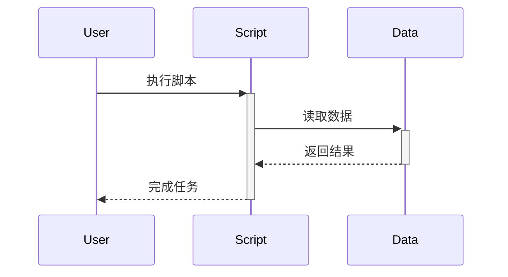

Sources: [app.py:1-100]()

## 结论

"组件关系与流程图"在项目中扮演着重要角色，通过清晰的架构和流程设计，实现了医疗数据的自动化处理和报告生成。这不仅提高了数据处理的效率，还确保了报告的准确性和专业性。开发人员可以通过本文档深入了解系统的工作原理及其实现细节。

---

<a id='page-4'></a>

## 数据解析与报告生成

### Related Pages

Related topics: [数据预处理功能](#page-5), [数据管理与流程](#page-6)

<details>
<summary>Relevant source files</summary>

- [utils/04_generate_reports_infini.py](https://github.com/hywchina/parse_data/blob/main/utils/04_generate_reports_infini.py)
- [conf/prompt.txt](https://github.com/hywchina/parse_data/blob/main/conf/prompt.txt)
- [app.py](https://github.com/hywchina/parse_data/blob/main/app.py)
- [utils/03_merge_csv_to_json.py](https://github.com/hywchina/parse_data/blob/main/utils/03_merge_csv_to_json.py)
- [utils/02_rename_pdf.py](https://github.com/hywchina/parse_data/blob/main/utils/02_rename_pdf.py)
</details>

# 数据解析与报告生成

## 简介

数据解析与报告生成模块是项目的核心功能之一，其主要目的是从不同格式的数据源中提取和转换数据，最终生成详细的医疗报告。该模块结合了数据处理、格式转换、人工智能分析等多种技术，以确保报告的准确性和专业性。数据解析与报告生成在项目中起到关键作用，支持医疗数据的自动化处理和分析。

## 数据解析流程

### 数据源处理

数据解析模块负责从各种来源（如CSV、PDF）提取数据，并将其转换为标准化的JSON格式。这一过程通过多个脚本和工具实现。

#### PDF文件重命名

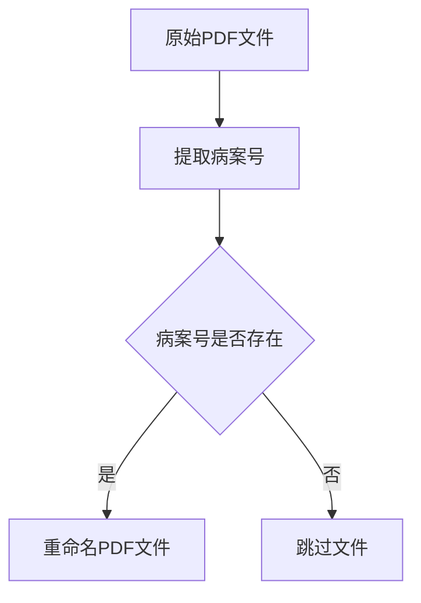

PDF文件首先通过`extract_case_id_from_pdf`函数提取病案号，然后根据病案号进行重命名，以确保文件名的一致性和可识别性。Sources: [utils/02_rename_pdf.py:20-40]()

### CSV与JSON转换

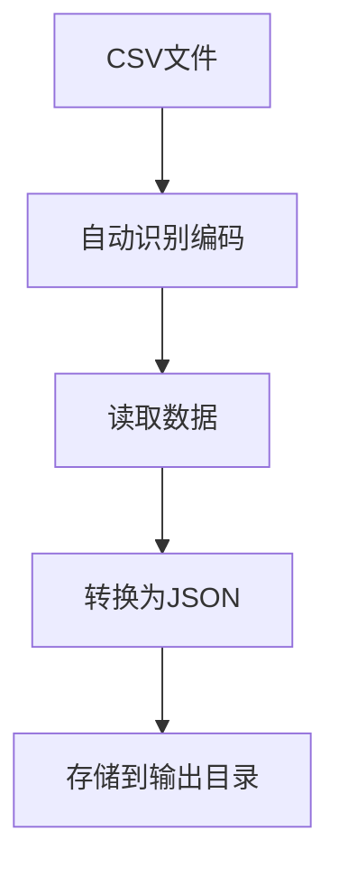

CSV文件通过`read_csv_auto`函数自动识别编码并读取数据，随后转换为JSON格式以供后续处理。Sources: [utils/03_merge_csv_to_json.py:30-50]()

## 报告生成

### AI驱动的报告生成

报告生成模块使用人工智能技术从JSON数据中提取关键信息并生成专业的医疗报告。此过程通过`04_generate_reports_infini.py`脚本实现。

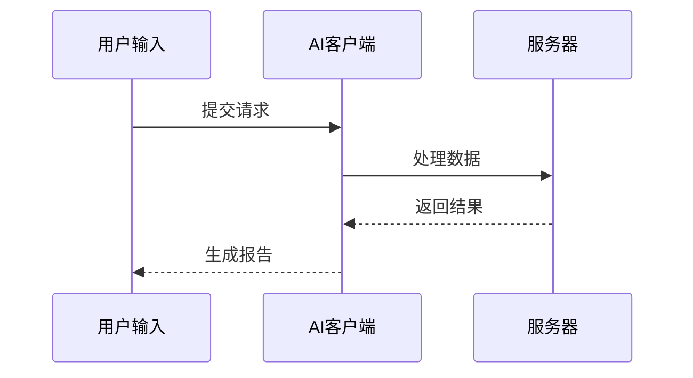

AI客户端根据用户输入和预定义的提示模板，通过API请求生成报告。Sources: [utils/04_generate_reports_infini.py:60-90]()

### 配置与执行

报告生成过程依赖于多个配置文件，如`prompt.txt`，其中包含生成报告所需的格式和内容要求。配置文件定义了报告的结构和语言风格。Sources: [conf/prompt.txt]()

## 结论

数据解析与报告生成模块通过集成多种技术，实现了医疗数据的自动化处理和报告生成。该模块提高了数据处理的效率和报告的准确性，成为项目中不可或缺的部分。通过深入分析和处理数据，项目能够提供高质量的医疗分析和诊断支持。

---

<a id='page-5'></a>

## 数据预处理功能

### Related Pages

Related topics: [数据解析与报告生成](#page-4), [数据管理与流程](#page-6)

<details>
<summary>Relevant source files</summary>

- [utils/01_parse_xls_to_csv.py](https://github.com/hywchina/parse_data/blob/main/utils/01_parse_xls_to_csv.py)
- [utils/03_merge_csv_to_json.py](https://github.com/hywchina/parse_data/blob/main/utils/03_merge_csv_to_json.py)
- [utils/04_generate_reports_infini.py](https://github.com/hywchina/parse_data/blob/main/utils/04_generate_reports_infini.py)
- [app.py](https://github.com/hywchina/parse_data/blob/main/app.py)
- [conf/prompt.txt](https://github.com/hywchina/parse_data/blob/main/conf/prompt.txt)
</details>

# 数据预处理功能

## 介绍

数据预处理功能是项目中重要的模块之一，负责将各种格式的医疗数据转换为统一的格式，以便后续的分析和报告生成。该功能涉及从Excel文件转换为CSV文件、合并CSV数据为JSON格式，以及根据提供的JSON数据生成详细的医疗分析报告。这一过程旨在提高数据处理的效率和准确性，为临床医生提供可靠的数据支持。[Sources: app.py, utils/01_parse_xls_to_csv.py]

## 数据转换与合并

### Excel转CSV

该模块通过读取Excel文件并转换为CSV格式，以便后续处理。主要使用Pandas库进行数据读取和转换。[Sources: utils/01_parse_xls_to_csv.py]

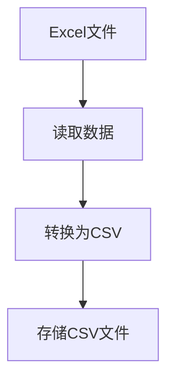

### CSV合并为JSON

此模块负责将多个CSV文件合并为一个JSON文件，确保数据的一致性和完整性。关键步骤包括病案号的标准化、数据字段的清洗以及最终JSON文件的生成。[Sources: utils/03_merge_csv_to_json.py]

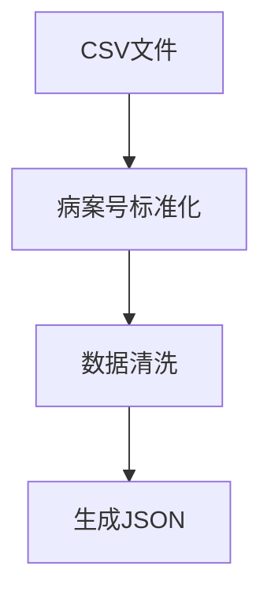

## AI智能报告生成

### 报告生成逻辑

此模块使用AI技术根据JSON数据生成详细的医疗分析报告。报告包括诊断轨迹、治疗响应和费用分析等内容。通过调用OpenAI的API进行文本生成。[Sources: utils/04_generate_reports_infini.py, conf/prompt.txt]

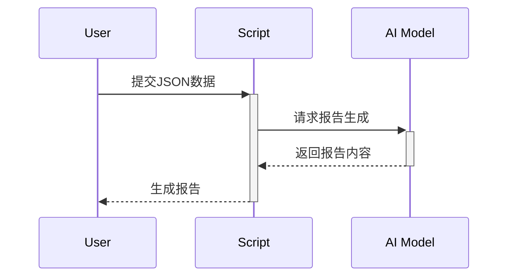

## 配置与日志管理

### 配置文件

配置文件包含AI模型的参数设置和数据处理的相关路径设置，确保系统的灵活性和可配置性。[Sources: app.py, conf/llm.json]

### 日志记录

日志功能用于记录系统操作和错误信息，帮助开发者进行故障排查和性能优化。[Sources: app.py]

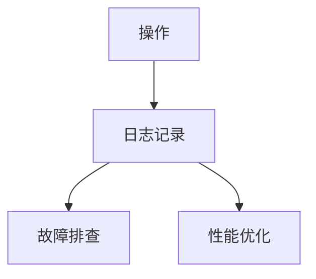

## 结论

数据预处理功能在整个项目中发挥着关键作用，通过规范化数据格式和智能化报告生成，为临床医生提供了高效、准确的决策支持。这一模块不仅提高了数据处理的效率，还确保了数据的完整性和一致性，是项目成功的重要保障。[Sources: utils/01_parse_xls_to_csv.py, utils/03_merge_csv_to_json.py, utils/04_generate_reports_infini.py, app.py, conf/prompt.txt]

---

<a id='page-6'></a>

## 数据管理与流程

### Related Pages

Related topics: [组件关系与流程图](#page-3), [数据预处理功能](#page-5)

<details>
<summary>相关源码文件</summary>

- [utils/00_read_headers.py](https://github.com/hywchina/parse_data/blob/main/utils/00_read_headers.py)
- [utils/02_rename_pdf.py](https://github.com/hywchina/parse_data/blob/main/utils/02_rename_pdf.py)
- [utils/03_merge_csv_to_json.py](https://github.com/hywchina/parse_data/blob/main/utils/03_merge_csv_to_json.py)
- [utils/04_generate_reports_infini.py](https://github.com/hywchina/parse_data/blob/main/utils/04_generate_reports_infini.py)
- [utils/05_merge_txt_to_pdf.py](https://github.com/hywchina/parse_data/blob/main/utils/05_merge_txt_to_pdf.py)
</details>

# 数据管理与流程

## 简介

数据管理与流程模块是项目中至关重要的一部分，旨在对各种格式的数据进行处理、转换和整合，以生成最终的报告文档。该模块涵盖了从数据的读取、解析到报告生成的全过程，确保数据的准确性和一致性，并支持多种数据格式的转换与整合。

## 数据读取与解析

### CSV 文件表头读取

该部分负责自动识别并读取 CSV 文件的表头信息。通过尝试不同的编码格式来确保正确读取文件，并将结果存储为 JSON 格式，以便后续处理。

```python
def read_csv_headers(path):
    encodings = ["utf-8-sig", "utf-8", "gbk", "gb2312"]
    for enc in encodings:
        try:
            df = pd.read_csv(path, encoding=enc, nrows=0)  # 只读取表头
            return list(df.columns)
        except Exception:
            continue
    raise ValueError(f"❌ 无法读取文件表头：{path}")
```
Sources: [utils/00_read_headers.py:9-17]()

### PDF 文件重命名

该部分通过读取 PDF 文件中的文本来提取病案号，并以病案号重命名文件，确保文件命名的一致性和易于查找。

```python
def extract_case_id_from_pdf(pdf_path):
    try:
        reader = PdfReader(pdf_path)
        text = ""
        for page in reader.pages:
            text += page.extract_text() or ""
        match = re.search(r"病案号[:：]?\s*0*(\d{1,6})", text)
        if match:
            case_id = match.group(1).zfill(6)
            return case_id
    except Exception as e:
        print(f"⚠️ 无法读取 {pdf_path}，错误：{e}")
    return None
```
Sources: [utils/02_rename_pdf.py:10-23]()

## 数据转换与整合

### CSV 转 JSON

该部分将多个 CSV 文件整合为 JSON 格式，统一病案号格式，并根据病案号整合各类信息，生成结构化的 JSON 数据。

```python
def normalize_case_id(series):
    return series.astype(str).str.strip().str.zfill(6)

df_check["病案号"] = normalize_case_id(df_check["病案号"])
df_test["病案号"] = normalize_case_id(df_test["病案号"])
df_case["病案号"] = normalize_case_id(df_case["病案号"])
df_order["病案号"] = normalize_case_id(df_order["病案号"])
```
Sources: [utils/03_merge_csv_to_json.py:16-24]()

## 报告生成与文档合并

### 文本报告生成

使用 AI 模型生成文本报告，并通过分块处理 JSON 数据，确保报告的完整性与逻辑性。

```python
def main():
    client = OpenAI(api_key=API_KEY, base_url=BASE_URL)
    os.makedirs(OUTPUT_DIR, exist_ok=True)

    with open(PROMPT_FILE, "r", encoding="utf-8") as f:
        prompt_template = f.read()

    for filename in os.listdir(INPUT_JSON_DIR):
        if not filename.endswith(".json"):
            continue
        ...
```
Sources: [utils/04_generate_reports_infini.py:38-50]()

### PDF 合并

将生成的文本报告转换为 PDF，并与原始 PDF 合并，形成最终的报告文档。

```python
def merge_pdfs(pdf_list, output_path):
    merger = PdfMerger()
    for pdf in pdf_list:
        merger.append(pdf)
    merger.write(output_path)
    merger.close()
```
Sources: [utils/05_merge_txt_to_pdf.py:24-29]()

## 结论

数据管理与流程模块有效地将不同格式的数据进行解析、整合，并生成最终的报告文档。这一过程不仅保证了数据的准确性和一致性，还提高了数据处理的效率，为后续的临床决策提供了可靠的依据。

---

<a id='page-7'></a>

## 部署指南

### Related Pages

Related topics: [基础设施与环境配置](#page-8)

<details>
<summary>Relevant source files</summary>

- [DOCKER.md](https://github.com/hywchina/parse_data/blob/main/DOCKER.md)
- [Dockerfile](https://github.com/hywchina/parse_data/blob/main/Dockerfile)
- [utils/04_generate_reports_infini.py](https://github.com/hywchina/parse_data/blob/main/utils/04_generate_reports_infini.py)
- [app.py](https://github.com/hywchina/parse_data/blob/main/app.py)
- [requirements.txt](https://github.com/hywchina/parse_data/blob/main/requirements.txt)
</details>

# 部署指南

## 简介
本部署指南提供了在项目“parse_data”中设置和运行服务的详细步骤。项目旨在通过数据解析和处理生成医疗分析报告，主要使用Python语言和相关工具进行开发。本文档将帮助开发人员理解如何使用Docker和相关脚本进行项目部署。

## Docker部署

### 构建镜像
项目提供了一个Dockerfile用于构建镜像。通过执行以下命令可以创建Docker镜像：

```bash
docker build -t parse-data-service:latest .
```

此命令将在项目目录中构建一个名为`parse-data-service:latest`的镜像。Sources: [Dockerfile](https://github.com/hywchina/parse_data/blob/main/Dockerfile)

### 运行容器
可以使用`docker run`命令启动容器，也可以使用`docker-compose`进行管理。推荐使用`docker-compose`，因为它简化了容器管理。

#### 使用docker run
```bash
docker run -d \
  --name parse-data-service \
  -p 8501:8501 \
  -v $(pwd)/data_00_ori:/app/data_00_ori \
  -v $(pwd)/data_01_csv:/app/data_01_csv \
  -v $(pwd)/data_02_pdf:/app/data_02_pdf \
  -v $(pwd)/data_03_json:/app/data_03_json \
  -v $(pwd)/data_04_summary_txt:/app/data_04_summary_txt \
  -v $(pwd)/data_05_final_pdf:/app/data_05_final_pdf \
  -v $(pwd)/logs:/app/logs \
  -v $(pwd)/temp:/app/temp \
  -v $(pwd)/conf:/app/conf \
  -e TZ=Asia/Shanghai \
  parse-data-service:latest
```
此命令启动容器并映射必要的目录以确保数据持久化。Sources: [DOCKER.md](https://github.com/hywchina/parse_data/blob/main/DOCKER.md)

#### 使用docker-compose
```bash
# 启动服务
docker-compose up -d

# 查看日志
docker-compose logs -f

# 停止服务
docker-compose down

# 重启服务
docker-compose restart
```
使用`docker-compose`简化了启动和管理容器的过程。Sources: [DOCKER.md](https://github.com/hywchina/parse_data/blob/main/DOCKER.md)

## 服务架构

### 数据处理流程
项目中的主要功能是解析数据并生成医疗报告。该流程通过多个Python脚本实现，每个脚本负责不同的处理阶段。Sources: [utils/04_generate_reports_infini.py](https://github.com/hywchina/parse_data/blob/main/utils/04_generate_reports_infini.py), [app.py](https://github.com/hywchina/parse_data/blob/main/app.py)

#### 数据解析与报告生成
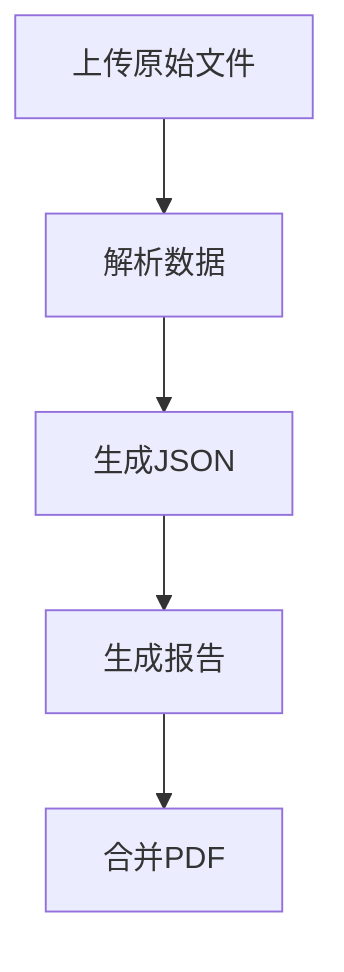
此流程图展示了从数据上传到最终报告生成的步骤。Sources: [app.py](https://github.com/hywchina/parse_data/blob/main/app.py)

### 组件和配置
项目依赖多个Python库来实现其功能，这些库在`requirements.txt`中定义。主要组件包括数据解析、报告生成和PDF处理。Sources: [requirements.txt](https://github.com/hywchina/parse_data/blob/main/requirements.txt)

## 数据持久化
通过Docker卷，数据可以持久化保存。这包括原始数据、处理后的数据和生成的报告文件。以下目录通过volume映射到宿主机：
- `data_00_ori/` - 原始数据
- `data_01_csv/` - CSV 数据
- `data_02_pdf/` - PDF 文件
- `data_03_json/` - JSON 数据
- `data_04_summary_txt/` - 文本报告
- `data_05_final_pdf/` - 最终 PDF
- `logs/` - 日志文件
- `temp/` - 临时文件
- `conf/` - 配置文件

Sources: [DOCKER.md](https://github.com/hywchina/parse_data/blob/main/DOCKER.md)

## 结论
本部署指南提供了项目“parse_data”的详细部署步骤和架构说明。通过Docker和Python脚本的结合，项目能够高效地处理医疗数据并生成报告，为临床分析提供支持。

---

<a id='page-8'></a>

## 基础设施与环境配置

### Related Pages

Related topics: [部署指南](#page-7)

<details>
<summary>Relevant source files</summary>

- [app.py](https://github.com/hywchina/parse_data/blob/main/app.py)
- [DOCKER.md](https://github.com/hywchina/parse_data/blob/main/DOCKER.md)
- [conf/llm.json](https://github.com/hywchina/parse_data/blob/main/conf/llm.json)
- [requirements.txt](https://github.com/hywchina/parse_data/blob/main/requirements.txt)
- [utils/02_rename_pdf.py](https://github.com/hywchina/parse_data/blob/main/utils/02_rename_pdf.py)
</details>

# 基础设施与环境配置

## 简介
在 `parse_data` 项目中，基础设施与环境配置至关重要，它确保数据处理工具的高效运行和可靠的环境管理。项目采用 Docker 容器化技术和 Streamlit 框架以实现轻量级的应用部署和实时数据处理。本文档详细描述了项目的基础设施配置、环境设置以及相关组件的交互方式。

## Docker 配置
项目通过 Docker 实现容器化部署，确保环境的一致性和可移植性。Docker 文件 `DOCKER.md` 提供了构建镜像和运行容器的详细步骤。

### 构建镜像
使用 `docker build` 命令创建镜像，该镜像包含项目所需的所有依赖和配置。执行以下命令以构建镜像：
```bash
docker build -t parse-data-service:latest .
```
Sources: [DOCKER.md:5-7]()

### 运行容器
项目推荐使用 `docker-compose` 来管理和运行容器。以下是启动、查看日志和管理容器的基本命令：
```bash
docker-compose up -d
docker-compose logs -f
docker-compose down
docker-compose restart
```
Sources: [DOCKER.md:19-29]()

### 数据持久化
通过 Docker volume 持久化数据，确保处理的数据和生成的文件不会因容器重启而丢失。主要数据目录包括：
- `data_00_ori/` - 原始数据
- `data_01_csv/` - CSV 数据
- `data_02_pdf/` - PDF 文件
- `data_03_json/` - JSON 数据
- `data_04_summary_txt/` - 文本报告
- `data_05_final_pdf/` - 最终 PDF
- `logs/` - 日志文件
- `temp/` - 临时文件
- `conf/` - 配置文件
Sources: [DOCKER.md:59-68]()

## 环境配置
项目依赖多种 Python 库，详细依赖信息记录在 `requirements.txt` 文件中。确保所有依赖正确安装，以支持项目的顺利运行。

### 依赖库
以下是部分关键库及其版本：
- `streamlit==1.51.0`：用于创建交互式数据应用
- `openai==2.7.1`：与 OpenAI API 的集成
- `PyPDF2==3.0.1`：PDF 文件处理
Sources: [requirements.txt:1-51]()

## 数据处理流程
项目的核心功能是处理不同格式的数据并生成报告。数据处理的步骤在 `app.py` 中详细描述。

### 数据上传与清理
项目提供文件上传功能，并自动清理旧数据，以确保数据处理的准确性和及时性。
Sources: [app.py:60-70]()

### 数据转换与报告生成
通过一系列脚本实现数据格式转换、报告生成和最终 PDF 合并。这些脚本在 `utils` 目录中定义。
Sources: [app.py:80-90]()

## 组件交互图
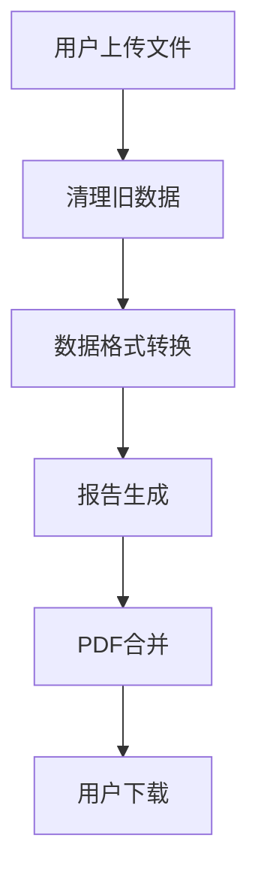
该图展示了用户上传文件后的数据处理流程，确保每一步都顺利进行以生成最终报告。

## 结论
本文档详细介绍了 `parse_data` 项目的基础设施与环境配置。通过 Docker 和 Streamlit 的集成，项目实现了高效的数据处理和应用部署。理解这些配置有助于开发者维护和扩展项目功能。

---

