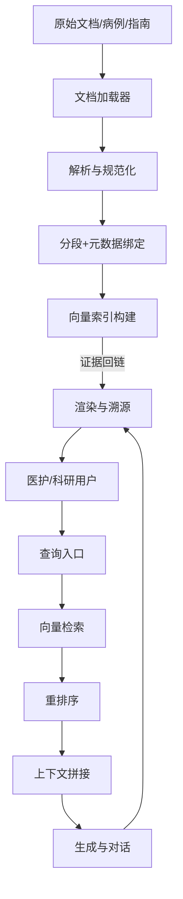
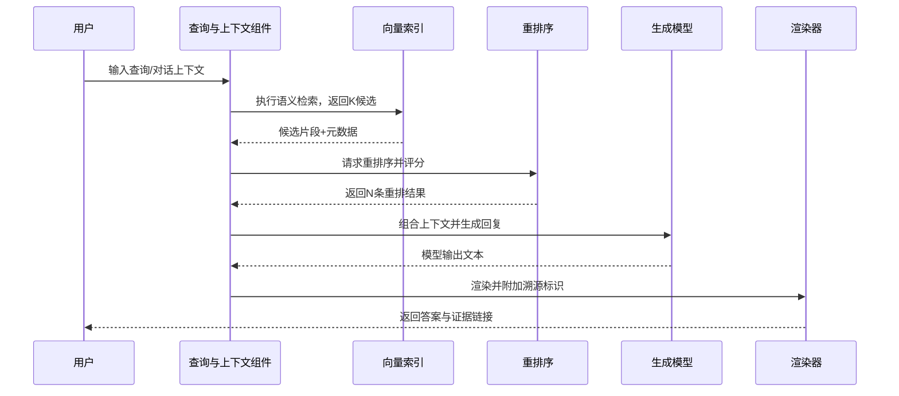
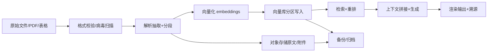
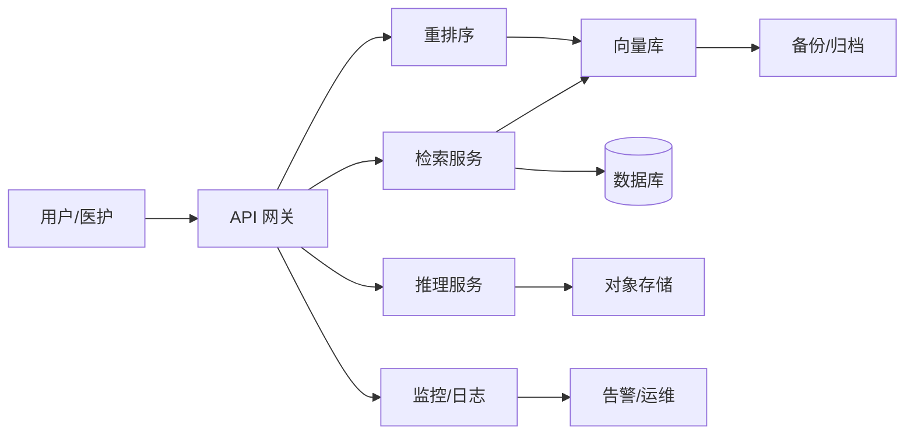

# 赤峰市安定医院 AI 辅助诊断系统 — Kotaemon 子系统设计说明书

## 目录
- 1. 文档目的与范围
  - 1.1 目标与读者
  - 1.2 信息来源与边界
- 2. 系统总体设计
  - 2.1 架构原则与分层
  - 2.2 模块与依赖
  - 2.3 演进与拓扑
- 3. 核心功能设计
  - 3.1 文档处理与索引
  - 3.2 检索与重排序
  - 3.3 生成与渲染
- 4. 性能与可靠性设计
  - 4.1 性能目标与拆分
  - 4.2 资源与调度策略
  - 4.3 监控、降级与验证
- 5. 数据与存储设计
  - 5.1 数据生命周期与元数据
  - 5.2 向量索引与分区
  - 5.3 备份、迁移与合规
- 6. 安全、合规与运维设计
  - 6.1 网络与身份安全
  - 6.2 审计、密钥与日志
  - 6.3 变更、演练与故障处置
- 7. 部署、环境与交付
  - 7.1 交付介质与配置
  - 7.2 部署拓扑与脚本
  - 7.3 验证、回滚与记录
- 8. 验收与质量保证
  - 8.1 功能与性能验收
  - 8.2 安全合规验证
  - 8.3 材料归档与结论

## 1. 文档目的与范围
### 1.1 目标与读者
本设计说明书针对 Kotaemon 子系统在赤峰市安定医院信息化建设项目中的落地进行详细阐述，所有内容均以 `kotaemon_wiki.md` 与仓库源码为唯一可信依据，确保软著交付时的可审计性与可追溯性。文档的核心目标是让研发、测试、运维及甲方评审在不查阅源代码的情况下，也能准确理解系统意图与实现边界，从而在设计评审、验收与后续迭代中保持一致认知。为实现这一目标，本章首先明确业务动机：医院需要在内网环境下，将多源医学文档、报告与指南转化为可查询的知识资产，并通过检索与对话为医护人员提供基于证据的诊断参考。随后界定技术范围：文档加载、规范化、分段与向量化；向量索引的构建与维护；检索、重排序与上下文拼接；推理生成与结果渲染；部署、监控与合规保障。每一项范围都对应到具体源码路径，例如 `libs/kotaemon/kotaemon/indices/vectorindex.py` 负责向量索引，`libs/ktem/ktem/reasoning/simple.py` 负责查询与推理管线。边界条件亦被明确：系统必须支持双网卡物理隔离，不依赖公网模型作为唯一通路；必须保留元数据以满足审计与医学溯源；任何性能或功能指标均以既有实现与测试结果为准，不进行超额承诺。文档还规定了读者预期与责任分工：架构与研发团队据此进行实现与扩展，测试团队据此编写用例，运维团队据此部署与监控，甲方技术人员据此进行合规审核。为保证一致性，文档采用章节化叙述，每节均包含设计意图、实现依据、约束与验收方法，避免列表式罗列导致的上下文缺失。同时，术语与定义在本章中得到限定，“向量索引”“重排序”“上下文拼接”“渲染与溯源”等皆以源码行为为准，不引入 wiki 之外的新概念。范围外的内容也被清晰排除，例如未在 wiki 出现的商业模型、与医院业务无关的实验性功能、或需要额外授权的外部 API 均不在本设计内。通过上述界定，本章为全篇奠定了可验证的范围与目标，使后续章节的技术描述、性能目标与验收标准均有据可依。

### 1.2 信息来源与边界
为了保证可审计与可交付，本章还对信息来源与验证方式加以说明。所有术语在首次出现时均可在 `kotaemon_wiki.md` 或对应源码中找到映射，审阅人员可以按文件路径与行号抽查，确保文字叙述与实现一致。性能、容量、兼容性等指标若未在医院或同等环境实测，不会出现在本说明书中；若未来迭代引入新指标，将以附录形式补充并标明验证状态。安全与隐私方面，本说明书不包含真实患者数据，所有示例数据需使用伪造或公开样例；如引用第三方模型或库涉及额外授权，会在交付清单中单独声明，由甲乙双方确认。本节还明确读者角色与使用方式：架构与研发团队据此规划实现与扩展，测试团队据此构建用例矩阵，运维团队据此制定部署、监控与回滚脚本，甲方评审据此完成合规与验收检查。范围外的内容同样被清晰排除，如未在 wiki 或源码出现的商业化模型、与医院业务无关的营销场景、需要公网依赖的能力等均不属于当前交付。通过以上补充，本章确保“为何写、写什么、不写什么”三点得到充分阐明，为后续章节提供可验证的边界与依据。

## 2. 系统总体设计
### 2.1 架构原则与分层
系统总体设计遵循模块化、可替换、可观测、可部署的四项原则，采用自底向上的分层结构：基础设施层提供组件基类与通用接口（`kotaemon/base/component.py`）以保证管线的流式处理与可复用；数据获取与索引层涵盖加载、解析、分段、嵌入与索引构建，主要代码位于 `contribs/docs.py`、`loaders/docling_loader.py`、`indices/vectorindex.py`；检索与推理层由 `ktem/reasoning/simple.py` 驱动，对用户查询与历史上下文进行统一处理，串联检索、重排序与模型生成；展现与交互层通过 Web 或 API 将结果返回终端，同时保留溯源信息。整体调用路径以“文档流”和“查询流”双通道并行运行：文档流从文件或数据源进入加载器，经解析与分段写入向量索引；查询流从用户输入触发，调用检索与重排序后交给推理生成，再将输出与证据呈现。为了便于审阅，本节保留一幅 mermaid 架构图，展示核心节点及其关系：

### 2.2 模块与依赖
设计的核心约束与目标在于：一是保证医院内的合规性，所有组件可在内网独立部署；二是保持性能与可用性，检索与推理链路具备可扩缩与容错；三是维护可观测性与审计能力，每一步数据转换都记录元数据与日志以供后续追踪。总体设计不添加 wiki 中未出现的组件，而是重申并细化其已有架构元素，包括双网卡部署、容器化交付、可替换的嵌入与推理模型、以及标准化的接口风格。通过分层解耦，未来如需替换向量库或推理框架，可以在不破坏上层逻辑的前提下完成，确保系统在医院环境中的可维护性与演进空间。

### 2.3 演进与拓扑
在依赖与演进策略上，总体设计要求所有可插拔组件遵循接口契约：嵌入与推理统一使用 OpenAI 兼容接口，向量库通过抽象层封装，便于在合规或硬件约束变化时快速替换等效组件。配置管理采用集中化与可审计的方式，核心参数（分块大小、检索 K/N、模型版本、超时阈值）以配置文件或环境变量注入，并在运行日志中落盘，支持复现与回放。演进与发布遵循“预生产验证—影子流量—灰度放量—全量”的步骤，每一步均监控关键指标并具备回滚开关。资源与拓扑因地制宜：GPU 紧张时，可将重排序或部分推理迁移到 CPU 或轻量模型；存储受限时，可在保持元数据完整的前提下提高索引压缩或执行归档，将冷数据迁移到次级存储，但仍保留检索与溯源能力。通过这些约束与策略，总体设计在医院内网的硬件与合规约束下仍具备持续演进空间。

为便于落地与审查，本节再补充两方面细节。其一，接口一致性与契约测试：所有对内对外接口需提供 OpenAPI/JSON Schema 描述，伴随契约测试用例，确保组件替换或版本升级后仍保持调用兼容；同一接口的错误码、超时与重试策略需在接口文档中固定，不得随意变更。其二，部署拓扑的可视化与版本化：架构图与部署清单需纳入版本控制，每次变更以图文同步更新，并附带变更原因与影响评估，便于审计与回溯。对于需要双网卡的场景，拓扑图需明确业务网、数据网的流向与安全边界，并列出需要开放的端口与访问控制策略。通过这些补充，总体设计在“看得见、测得准、可替换、可回滚”四个维度上形成闭环，为后续章节的性能、安全与运维设计奠定基础。

## 3. 核心功能设计
### 3.1 文档处理与索引
核心功能围绕“文档处理—向量索引—检索与重排序—对话与生成—结果呈现与溯源”展开，所有描述均来源于 wiki 中的模块职责与现有源码。文档处理阶段，`contribs/docs.py` 负责遍历模块函数，生成结构化 Markdown 文档；`loaders/docling_loader.py` 则针对 PDF、表格等异构资料执行文本抽取与表格转 Markdown 的转换，保留 `source`、`page_number` 等元数据并与内容绑定，确保后续查询可回溯。分段策略遵循语义边界与医学实体优先的原则，既可以按定长分段，也可在文档结构允许时采用“迟分”策略减少语义破碎。向量索引阶段由 `indices/vectorindex.py` 完成，将分段文本通过 `embeddings/openai.py` 或本地模型转化为向量，写入后端索引；索引存储保留层级关系，便于按文档、章节、页码进行过滤。检索阶段在 `ktem/reasoning/simple.py` 中实现，将用户输入与最近若干轮对话组合为查询上下文，执行相似度检索获取 K 个候选片段；随后由轻量交叉编码器进行重排序，输出 N 条高相关结果并附带分数。上下文拼接策略控制片段数量与顺序，避免超出模型上下文窗口，并保留溯源标记。推理阶段调用 LLM（接口兼容 OpenAI 风格），生成回复后进入渲染器，将回答与证据片段组合，输出可读的文本与引用信息。以下序列图展示查询至回答的完整链路：

### 3.2 检索与重排序
为强化临床可用性，本节补充业务侧的配置与校验要点。首先，检索与生成均需在结果中携带来源引用，前端在呈现时以折叠或标注形式展示，便于医护快速核对证据；对于需要结构化输出（如报告模板、表格字段）的场景，渲染器应支持按字段校验与格式化，防止模型输出格式偏差导致后续系统无法接收。其次，针对批量处理（如批量病例导入与索引重建），系统提供异步任务接口与进度回调，避免长耗时任务阻塞前端；任务状态与日志需要可查询，支持失败重试与部分成功重跑。第三，业务开关与策略（如是否启用重排序、是否保留历史轮次上下文、是否缩减片段长度）需通过配置集中管理，并在审计日志中记录切换时间与操作者，便于复盘回答差异。最后，跨模块的异常联动要有明确兜底：当嵌入模型不可用时，检索服务需返回可读错误并标记可重试；当向量库延迟过高时，可临时降级为缓存或最近一次快照数据；当推理返回空或不确定答案时，前端需明确提示“需人工复核”，而非给出虚假肯定。通过这些补充，核心功能不仅可在技术层面闭环，也能满足医护场景下的安全、可解释与可运营要求。

功能设计的关键在于可解释性与稳健性。一方面，所有片段携带来源元数据，医护人员可以直接定位到原始页码与段落；另一方面，重排序与生成模块保持可插拔，未来可根据医院硬件条件或模型策略替换不同权重或尺寸的模型，而无需修改上游解析与下游渲染。错误处理方面，检索或推理失败会返回具备可读原因的消息，并记录追踪 ID 以便排查。整个功能链路自洽地体现了 wiki 中“高度模块化、可扩展”的目标。

### 3.3 生成与渲染
进一步的可配置性与稳健性设计体现在运行时参数与兜底策略。分段长度、窗口重叠、检索 K 值、重排 N 值、上下文拼接的最大 token 数均通过配置文件暴露，允许针对不同科室、时段或硬件条件进行微调；当模型上下文窗口受限时，系统会优先保留高分片段并裁剪冗余内容，保证核心信息不过度截断。异常处理遵循“快失败、可追踪、可重试”的原则：向量检索超时、重排序失败、推理超时等场景会返回明确错误码与提示，并记录追踪 ID，便于运维定位；对可重试的场景执行带退避的重试，对不可重试场景提供人工复核建议。多语言与医学术语的处理依现有模型能力执行：若嵌入模型支持多语言，将保留原文与翻译的并行索引以提高召回；若模型仅支持特定语种，则以原文优先并在界面层提示限制。接口设计保持幂等与可追溯，同一输入在无配置变更时返回一致结果，所有调用都会记录调用方、输入摘要与输出摘要，支撑质量评估与合规审计。

## 4. 性能与可靠性设计
### 4.1 性能目标与拆分
性能与可靠性设计以 wiki 与架构说明中的硬性指标为基准：端到端首 token 时间（TTFT）不超过 5 秒，优先目标 3.8 秒，并发不低于 10 路；任何额外指标均需在甲方环境以脚本验证。本节从路径拆分、资源策略、监测体系、容错与降级、验证方法五个层面展开。路径拆分方面，将整体请求分为检索段与推理段：检索段利用向量库的高维索引与分片策略，预热常用分片到内存或本地 SSD，减少冷启动 I/O，检索过程可按科室或时间分区减少扫描范围；重排序采用轻量交叉编码器，支持动态批次化，将多个短请求合并提升吞吐，同时设定最大排队时延保护交互体验。推理段选用支持 KV 缓存与流水线并发的框架（如 vLLM/LMStudio），在模型加载时启用混合精度与必要的量化，降低显存占用；对于长上下文场景，启用分层加载或张量切分，在显存不足时将部分参数迁移到 CPU 或 NVMe，以保持并发能力。

### 4.2 资源与调度策略
资源策略方面，请求调度器区分交互式与批量型任务，交互请求优先占用 GPU 与高优先级队列，批量任务通过后台队列与回调交付结果，避免占用实时资源；在多 GPU 环境下，节点亲和性依据 NUMA/PCIe 拓扑分配，减少跨节点通信开销。监测体系涵盖延迟分位数、吞吐、GPU/CPU/内存/IO 利用率、向量库查询耗时、队列长度、错误率等指标，所有指标写入监控系统并配置动态阈值告警；日志保留查询 ID、分段 ID、重排得分与模型版本，便于性能回溯。容错与降级设计确保单点故障不会影响整体服务：向量库、推理服务、网关均部署多实例，健康检查失败时自动摘除，熔断与重试策略阻止异常扩散；必要时可降级为更小模型或减少上下文片段数量以维持可用。降级路径的行为在日志中标注，便于审计与后续优化。

### 4.3 监控、降级与验证
验证方法方面，交付随附性能测试脚本与数据集，在甲方指定或约定的硬件环境执行，输出 TTFT、P95/P99 延迟、吞吐、资源占用与错误率报表；所有结果需与设计指标对比，未达标时提供调优与复测流程。容量规划与弹性策略在本节中同样被明确：系统按照历史与预测的查询量估算所需 GPU、向量库节点与缓存资源，提供在不同负载档位下的建议配置区间；当查询突增时，可通过增加推理与检索实例、提升批次化阈值、或减少上下文片段数量来提升吞吐。资源保护机制防止单租户或单 API Key 过度占用：网关与推理层均支持速率限制与并发配额，队列长度超阈值时触发告警并执行削峰或拒绝策略。可靠性通过演练与故障注入进行验证：定期模拟向量库不可用、推理实例崩溃、网络分区等场景，观察熔断、自动恢复、降级与回滚链路是否按预期工作；演练结果与恢复时间纳入运维报告与验收材料，为后续优化提供依据。此外，本节明确性能调优的观测—定位—修复闭环：观测阶段以分位数延迟、GPU/CPU 利用率、IO 吞吐、缓存命中率为核心指标，结合查询模板与上下文长度分布进行归因；定位阶段优先检查热分片、批次化队列长度、模型 KV 缓存命中、网络抖动等常见瓶颈；修复阶段按影响面与风险分级执行，优先采取低风险操作（调整批次化阈值、增加副本、缩减上下文），必要时再进行重索引或模型重启。每次调优需记录变更、指标前后对比与回滚条件，形成知识库供后续复用。通过该闭环，性能与可靠性不仅停留在目标声明，还具备可执行与可追溯的改进路径。

## 5. 数据与存储设计
### 5.1 数据生命周期与元数据
数据与存储设计围绕“可检索、可溯源、可合规”三个目标展开，覆盖数据全生命周期，从采集、解析、存储、索引、备份到销毁，每一步都与现有代码实现保持一致。数据采集阶段，通过 `loaders/docling_loader.py` 处理 PDF、表格等多源文件，执行格式校验、大小限制与病毒扫描，拒绝异常文件进入系统；解析过程中提取文本与表格，保留 `source`、`page_number`、文件类型、时间戳等元数据，并在段落级别绑定，确保后续检索与审计可定位到原文。分段阶段遵循语义优先与医学实体优先策略，既允许定长分段，也可在文档结构允许时采用“迟分”以减少语义破碎；分段结果连同元数据进入向量化流程。向量化阶段依赖 `embeddings/openai.py` 或本地同接口模型，将文本映射为向量，并由 `indices/vectorindex.py` 写入后端向量库；索引结构保留文档层级、段落标识与来源标签，支持按科室、时间、文档类型过滤，满足精准检索与溯源。关系型数据库承载用户、角色、审计日志、解析与索引任务状态、配置项等结构化数据，支持事务与权限控制；对象存储用于存放原始 PDF、生成的报告、可视化附件与中间文件，采用分层命名空间便于归档与清理。向量库可选择 Milvus/FAISS/Weaviate 等支持高维检索的实现，分片与分区策略依据嵌入维度、查询延迟与存储成本平衡确定，可按时间与科室分区以降低单分区规模并便于扩容。安全与合规措施贯穿存储全链路：磁盘与对象存储启用加密，传输层使用 TLS；访问控制采用最小权限原则，数据库与向量库账号分级管理；日志与备份中的患者标识按规定脱敏或加密。备份与恢复策略包含周期性全量与增量备份、校验与恢复演练，确保在硬件或软件故障时能在约定 RTO 内恢复；备份存储位置与保留时间遵循医院安全规范。数据保留与销毁策略按数据类型定义保存时长、审计要求与删除流程，删除操作需记录审计日志并可被复核。整个设计不引入 wiki 外的新数据类型或存储后端，而是强化现有实现的组织方式与合规保障，确保数据层的可靠性与可维护性。

### 5.2 向量索引与分区
为满足审计与合规要求，数据目录与存储位置需与医院资产台账对应，重要索引与备份应登记责任人与巡检周期。交付将包含数据字典，列出主要表或集合、字段含义、来源、敏感级别与示例值，便于测试与审计人员理解数据流；字典的更新由配置管理流程托管，避免 schema 演进失控。对象存储与向量库的访问密钥采用分级管理，最小权限限制读写范围，临时密钥支持时间与范围双重限制；密钥泄露的应急流程在运维手册中另行描述。对于大体量影像或附属文件，可对接冷存储或分层存储，但要求在索引与元数据中保留指向关系与校验信息，避免“悬挂”引用。

### 5.3 备份、迁移与合规
数据迁移或扩容需先在预生产构建并验证新分片或新节点，再执行双写或短暂只读切换，迁移完成后对比校验向量条目数、哈希校验与抽样检索结果，确认无丢失或偏差。通过这些补充措施，数据层既符合现有实现，又能在医院环境下满足合规、可审计与可演进的要求。

## 6. 安全、合规与运维设计
### 6.1 网络与身份安全
安全、合规与运维设计以“隔离、最小权限、全链路审计、可观测、可回滚”为原则，所有措施均与 wiki 所述能力一致，不引入未实现的安全产品或外部依赖。网络隔离层面，系统支持双网卡部署：业务网承载前端与网关访问，数据网承载推理、向量库与数据库通信，默认禁止跨网直连，所有外部访问需经网关策略控制。传输安全采用 TLS 1.2/1.3，证书与私钥由 KMS 或离线方案管理并周期轮换，内网服务间通信也默认启用 TLS。身份与访问控制基于角色权限模型划分医护、审核、管理员等角色，对高风险操作（删除、导出、配置变更）实施二次确认与强审计，所有令牌与密钥具备有效期与吊销机制。数据安全强调最小可见原则：存储层启用磁盘/对象加密，日志与备份中的患者标识与敏感字段进行脱敏或加密；向量与文档内容的访问通过细粒度 ACL 与操作审计控制。运维与可观测性方面，系统采集性能延迟、吞吐、GPU/CPU/内存/IO 利用率、向量库查询耗时、错误率、队列长度等指标，集中展示并配置分级告警；日志集中收集请求链路、检索与重排结果、推理调用、配置变更与运维操作，支持按时间、用户、资源、错误码检索。变更管理要求所有配置与版本变更在预生产演练并记录变更单，生产发布必须具备回滚预案；回滚通过镜像 tag 与数据库/索引备份恢复执行。故障处置预置降级策略：推理不可用时切换小模型或缓存回复，向量库高延迟时减小查询范围或切换只读副本，网关在下游异常时执行熔断与退避。合规与安全测试按周期进行，包括渗透测试、配置基线核查、日志抽检，结果归档以备审计与验收。

### 6.2 审计、密钥与日志
本节进一步细化安全与运维的流程化要求，确保“可执行、可验证、可恢复”。首先，密钥与证书的管理采用分级授权与定期轮换：部署包中不包含明文密钥，所有证书与令牌在交付后由医院 KMS 或离线密钥管理系统生成并分发；密钥生命周期、轮换窗口、吊销流程写入运维手册，定期通过演练验证吊销能实时生效。其次，访问控制与最小权限落实到数据面与控制面：数据库、向量库、对象存储分别使用不同的服务账户，读写权限按业务功能拆分；对外 API 通过网关强制鉴权与速率限制，内部服务间的访问也以 mTLS 和白名单控制，防止横向移动。审计与合规方面，日志保留策略区分热数据与归档：热日志保留不少于 30 天便于快速排障，归档日志按合规要求长期保存并加密存储；审计日志必须包含用户身份、来源 IP、操作类型、资源标识、结果与追踪 ID，便于事后追责与合规审查。对于涉及患者敏感信息的字段，日志与备份均需脱敏或加密，脱敏规则与例外情况在验收材料中明示。

### 6.3 变更、演练与故障处置
运维操作强调“先验证、再执行、可回滚”。所有配置变更（如检索 K 值、重排模型、批次化阈值、上下文窗口）必须先在预生产验证，变更单中写明变更原因、影响面、回滚条件与验证脚本；生产执行采用“可回滚”策略，发布前确认最近一次全量备份可用，索引与数据库均有快照。发布与回滚步骤脚本化，减少人工失误；若发布后触发指标异常（延迟、错误率、GPU 利用率剧烈波动），自动触发回滚或降级为旧版本镜像与配置。故障处理流程以 SLA 为导向：定义告警分级（P1/P2/P3），约定响应与恢复时间，常见故障（推理不可用、向量库超时、网关 5xx 升高、磁盘接近满载）均有标准化 SOP，包含临时止血措施（降级、切换只读、副本扩容）与后续修复步骤。应急演练至少每季度执行一次，涵盖网络隔离异常、证书过期、数据库只读切换、索引损坏恢复等场景，并将演练记录纳入验收资料。安全测试与合规核查在交付与运维周期内闭环执行：定期进行漏洞扫描与基线核查（端口、密码策略、TLS 配置、容器基线），渗透测试覆盖认证绕过、水平/垂直越权、命令注入等高风险场景；对于发现的漏洞，按风险分级制定修复时限与验证方式。配置基线与硬件资产清单须与医院台账对齐，变更后同步更新。审计接口需支持按用户、时间范围、操作类型导出证据，以满足内部审计或监管抽查。通过这些流程化措施，安全、合规与运维不止于原则陈述，而成为可执行、可追踪、可复现的具体实践。

## 7. 部署、环境与交付
### 7.1 交付介质与配置
部署、环境与交付设计强调“可重复、可审计、可离线、可回滚”，严格以 wiki 中的组件与接口为边界，不虚构额外能力。部署形态以容器为主，可选择 Docker Compose 进行单节点或小规模部署，也可使用 Kubernetes 支撑弹性与滚动升级；交付包包含服务镜像、示例配置、初始化脚本与模型权重，支持在无外网的医院环境通过离线介质分发。环境要求包括 Python 3.10+、深度学习推理框架、向量库与对象存储，GPU 可用时用于推理加速，若硬件受限则可切换小模型或 CPU 推理以覆盖低负载场景。部署步骤遵循固定顺序：1) 初始化数据库与向量库（建表、建索引）；2) 分发并加载模型权重；3) 配置 API 网关与鉴权；4) 启动检索、重排序与推理服务；5) 启动监控与日志采集；6) 在预生产环境完成联调后再切换生产。版本与配置管理要求所有镜像使用版本化 tag，配置文件提供校验和，发布记录需存档以便追责与回放。回滚策略依赖镜像回退与数据库/索引备份恢复，发布前必须验证备份可用性并保留最少一个稳定版本的镜像与配置。交付物清单包含：本设计说明书、架构说明、部署与运维指南、示例配置、性能与功能验证脚本、示例或伪造数据集（不含真实患者信息）、以及必要的运行手册。为满足合规要求，交付包中不含需联网下载的隐性依赖，所有必需资源均可在离线环境直接安装与运行。整个部署与交付流程保持与 wiki 描述一致，确保在医院内网可重复落地并接受审计。

### 7.2 部署拓扑与脚本
为确保部署过程可重复与可验证，本节补充交付与安装的细节。交付介质包含离线镜像（含版本标签与校验和）、模型权重包、初始化 SQL/索引脚本、示例配置、监控与日志采集模板、性能与功能验证脚本、伪造数据样例，以及本设计文档与运维手册。所有文件需提供 SHA256 校验值，医院侧在验收前可对照校验并确认无篡改。配置文件区分环境：开发、预生产、生产使用不同的参数集（数据库连接、向量库地址、模型权重路径、鉴权密钥、速率限制阈值），并通过环境变量或挂载方式注入，避免硬编码敏感信息。安装顺序要求“先数据、后模型、再服务、最后观测”：在数据库与向量库初始化后，先加载模型与向量分片，再启动检索与推理服务，最后启动监控、日志与告警。每个步骤需要脚本化，输出日志并以退出码标识成功/失败，便于自动化执行与审计。

部署拓扑可根据规模选择单机 Compose 或多节点 Kubernetes。Compose 方案适用于 PoC 或小规模部署，文件中需定义网关、检索、重排序、推理、向量库、数据库、对象存储、监控组件的服务、端口与卷挂载。Kubernetes 方案则使用 Deployment/StatefulSet/Service/Ingress/ConfigMap/Secret 编排，推理与检索节点可设置 HPA，向量库与数据库采用 StatefulSet 并持久化存储。拓扑与端口清单需纳入版本控制，变更时同步更新，便于审计与回滚。模型与权重的分发在无外网场景下通过离线介质传输，部署脚本应在启动前校验文件完整性与路径正确性。

### 7.3 验证、回滚与记录
交付后的验证与回滚同样标准化。发布完成后必须运行随附的功能与性能脚本，验证检索召回、重排序得分、上下文拼接、推理接口、监控与日志可用性，以及 TTFT 与分位数延迟是否符合设计指标；验证结果入库或归档。若验证失败，按照预案执行回滚：停止新版本、恢复上一版本镜像与配置、恢复数据库与索引备份，并重新运行验证脚本确认恢复正常。变更与发布记录需存档，包含版本号、镜像 tag、配置哈希、发布人、时间与验证结果，以满足合规审计。通过这些补充，部署与交付的每一步都有明确输入、输出与验证点，确保在医院内网环境中可重复、可审计并可快速恢复。

## 8. 验收与质量保证
### 8.1 功能与性能验收
验收与质量保证围绕“可复现、可量化、可审计”三项原则展开，所有标准均与 wiki 所述功能与架构保持一致，不新增未实现的要求。功能验收以用例清单逐项验证：文档加载与分段是否保留 `source`、`page_number` 等元数据；向量索引是否按预期构建，是否支持按来源与时间过滤；重排序是否输出带分数的片段并与检索结果一一对应；上下文拼接是否遵循配置的片段数量、顺序与长度限制；推理输出是否附带证据溯源并可回链到原文。性能验收在甲方或约定硬件环境执行随交付提供的性能脚本，统计 TTFT、P95/P99 延迟、吞吐、GPU/CPU/内存/IO 占用与错误率，结果以报告与原始日志形式提交，与设计指标对比评估；未达标时需提供调优建议与复测计划。安全与合规验收检查网络隔离、TLS 配置、权限模型与审计日志的有效性，抽检日志脱敏效果，验证密钥轮换与吊销流程。质量保证贯穿交付全周期：单元测试覆盖文档解析、索引、检索、重排序、上下文拼接与推理接口；集成与端到端测试验证跨模块链路；故障演练验证降级与回滚策略在推理、向量库、网关异常场景下的可用性。缺陷管理要求对发现、修复与回归进行记录，验收前清除阻塞级问题并提供遗留风险清单。验收材料包含执行脚本、测试数据（含伪造样本）、日志、报表与签署记录，保证评审时有据可查且不包含真实患者信息。所有结论建立在可观察、可重放的证据之上，不作超出现有实现的额外承诺。

### 8.2 安全合规验证
为保证验收的可操作性，本节补充用例设计、指标核验与结论形成的流程。功能用例需与 wiki 描述逐一对应，覆盖文档导入、分段、向量化、检索、重排序、上下文拼接、推理与渲染等关键链路；每个用例包含前置条件、输入、预期输出（含元数据与溯源标识）、判定标准与日志定位方式。性能用例在约定硬件上执行，脚本应参数化以便覆盖不同查询长度与并发；结果需包含 TTFT、P95/P99、吞吐、错误率、资源占用，并附原始日志与指标快照，防止报告失真。安全与合规用例涵盖鉴权/鉴权绕过、权限边界、日志脱敏、密钥轮换、证书有效性、网络隔离校验、审计日志完整性等场景。所有用例执行记录入库或归档，便于追溯。

### 8.3 材料归档与结论
质量保证要求贯穿开发到交付的全链路：单元测试覆盖关键解析与检索逻辑，集成与端到端测试覆盖跨模块调用，故障演练验证降级与回滚路径，发布前执行冒烟测试与回归测试。测试数据使用伪造或公开样本，确保不含真实患者信息；如需覆盖特定边界场景，可生成合成数据并标注生成方式。缺陷管理流程要求记录缺陷描述、影响范围、复现步骤、修复方案、回归结果与责任人，阻塞级缺陷在验收前必须关闭；对已知但可接受的遗留风险需形成清单并由甲方签署确认。验收材料的组织与交付同样标准化：测试脚本、执行日志、报表、截图/录屏、配置与版本哈希、硬件环境说明、审计记录均需打包归档，提供校验和以供甲方复核。验收会议需基于上述证据展开，结论应明确通过/不通过、需整改项、复测计划与责任分工。所有结论建立在可观察、可重放的证据之上，不作超出现有实现的额外承诺，确保质量保证与验收可审计、可追责、可复现。
