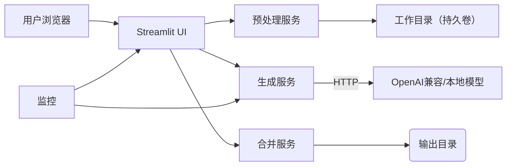

# 医疗数据解析与报告生成子系统设计说明书（parse_data）

## 目录
- 1. 文档目的与范围
  - 1.1 编写目的与读者
  - 1.2 信息来源与边界
- 2. 系统总体设计
  - 2.1 架构原则与分层
  - 2.2 模块关系与数据流
- 3. 核心功能设计
  - 3.1 数据预处理与标准化
  - 3.2 报告生成与文件整合
- 4. 性能与可靠性设计
  - 4.1 性能目标与路径拆分
  - 4.2 容错、监控与调优
- 5. 数据与存储设计
  - 5.1 数据模型与元数据管理
  - 5.2 存储、备份与文件组织
- 6. 安全、合规与运维设计
  - 6.1 网络与访问控制
  - 6.2 审计、密钥与运维流程
- 7. 部署、环境与交付
  - 7.1 环境要求与交付物
  - 7.2 部署流程与拓扑
- 8. 验收与质量保证
  - 8.1 功能与性能验收
  - 8.2 安全合规与材料归档

## 1. 文档目的与范围
### 1.1 编写目的与读者
本节明确本设计说明书的目标、适用范围与预期读者，旨在为 parse_data 子系统的开发、测试、部署与验收提供一份可操作、可审计且源自仓库现实实现的参考文档。文档基于仓库内的 `parse_data_wiki.md`、实现脚本（`utils/*.py`）、前端调度（`app.py`）与配置示例（`conf/`），所有设计意见均与这些源材料保持可追溯映射，避免超出仓库能力的主张或未经验证的性能承诺。

详细目的分为四条：
1) 固定实现契约：将模块边界、文件与 JSON 字段约定、Prompt 模板位置（`conf/prompt.txt`）与模型调用配置（`conf/llm.json`）以书面形式固化，便于不同角色在实施或替换模块时保持兼容；
2) 指导测试与验收：为测试工程师提供明确的预处理规则、异常样例与验收脚本入口（例如 `utils/03_merge_csv_to_json.py`、`utils/04_generate_reports_infini.py` 的调用点），降低因语义差异导致的缺陷回归；
3) 支撑运维与交付：为运维人员列出部署先决条件、数据持久化与备份步骤、回滚策略与日志定位路径，确保在内网或容器化环境中的可重复部署；
4) 满足合规审计：为甲方或合规团队提供审计包结构（`manifest`、`audit`、日志样例），以及对敏感配置与密钥管理的合规建议，便于现场合规检查与签署。

目标读者及其关注点：

使用准则与文档约束：
1) 所有实现细节应可在仓库源文件中找到映射；若新增配置或流程，须在变更记录中写明新增文件与提交哈希；
2) 文档采用“最小承诺”原则：不对模型能力、吞吐或 SLA 作出未经实测的承诺，性能目标以观测数据为准并通过验收报告固化；
3) 文档为活动文档：任何对 `conf/`、Prompt 模板或关键脚本的变更应伴随本说明书的增补，以保证文档与实际部署的一致性。

通过以上条目，本文档成为开发、测试、运维与合规团队之间的共识载体，使 parse_data 子系统在交付、运维与审计过程中具备可验证、可追溯的运行基础。

### 1.2 信息来源与边界
本说明书严格限定内容来源于仓库内已有材料与可直接证实的实现路径，避免任何未经验证的扩展性声明或对外能力的夸大。主要信息来源包括但不限于：

明确边界以避免误解：
1) 功能边界：本说明书仅阐述仓库内已有脚本与流程的设计与约束，包含从 CSV/Excel 到 JSON 的转换、PDF 的重命名规则、基于病案号的聚合、Prompt 驱动的文本生成以及文本与 PDF 的合并输出。任何外部系统接入（如医院 HIS 或第三方 KMS）均视为集成范围外，需额外评估与合同条款；
2) 性能边界：wiki 未提供吞吐或延迟的量化指标，因此本文对性能的描述限定为工程化的优化策略（批量化、并发度控制、流式处理、超时与重试策略），任何具体 SLA 必须通过目标环境下的基准测试与验收报告来确认；
3) 安全边界：文中提出的密钥注入、配置审计等做法基于仓库现有实践（环境变量注入、`DOCKER.md` 示例），并不默认机构采用外部 KMS 或云安全服务；若有额外合规需求，应在交付清单中作为单独改造项列出。

版本控制与变更流程：为保证文档与实现保持一致，任何对脚本、Prompt 模板或关键配置的更改都需伴随变更记录（提交哈希、变更说明、受影响文件列表），并在本说明书的变更日志中反映，确保交付与审计时能还原对应实现。通过严格的来源与边界定义，本文档既为实施提供清晰指引，也为验收与合规审计建立可追溯的证据链。

## 2. 系统总体设计
# 2. 系统总体设计
### 2.1 软件概述
本软件实现基于颜色表的二维标量场数据可视化系统，输入二维标量场数据，以二维数组形式存储，自动生成基于数据个数分布的颜色表以及二维标量场数据的渲染结果，使得渲染结果展现更多的数据信息。

### 2.2 硬件运行环境
- **处理器**：Intel CPU i5 或更高。
- **内存**：16GB 或更高。

### 2.3 软件运行环境
- **操作系统**：WINDOWS 操作系统（Windows 7、Windows 8、Windows 10）。
- **开发工具**：Visual Studio。
- **编程语言**：C++。

### 2.4 软件总体结构
系统整体逻辑图如 1 所示（在最终文档中放置相应的架构或流程图）。

系统总体结构描述如下：
- **数据输入层**：负责接收并校验二维标量场输入数据（二维数组格式），进行基本的完整性与边界检查；支持从文件、网络或内存缓冲区加载数据。
- **颜色表生成模块**：根据输入数据的数值分布自动生成颜色映射表，支持多种映射策略（线性、对数、分位数等）和自适应分段，能根据数据的统计分布调整颜色渐变以提升可读性。
- **渲染引擎**：将二维数组与颜色表映射为可视化图像，支持不同分辨率、抗锯齿处理、以及可选的插值方法（最近邻、双线性、双立方等）。
- **后处理与输出**：提供伪彩色图、等值线叠加、缩放与裁切等功能；支持将渲染结果导出为常见图像格式（PNG、JPEG）或向量格式（SVG）、以及将元数据（颜色表、数值范围、渲染参数）输出为 JSON 以便复现。
- **配置与接口层**：暴露配置接口以调整颜色映射策略、渲染参数和输出选项；提供简易的 C++ API 供上层应用调用，并预留与 GUI 或命令行工具的集成点。

系统设计原则继承项目整体架构的模块化、接口契约与可追溯性要求：各模块通过明确的数据结构与接口进行交互，关键参数与版本信息记录在渲染元数据中以支持结果复现与审计。
本子系统设计基于清晰的架构原则，以降低医院内网部署的风险并提升可演进性与可维护性。核心原则包括：模块化分层（将复杂流程拆分为职责单一的组件）、接口契约（通过文件名与 JSON 字段约定实现模块间解耦）、可追溯性（中间产物与日志需保留以支持审计）、以及最小侵入（不改动医院现有系统时的最小集成成本）。下面逐项展开说明：

模块化分层：架构分为以下明确层次，每一层负责边界清晰的职责

接口契约：模块间通过文件系统约定实现松耦合。预处理输出的 JSON 必须包含约定字段（病案号、来源文件名、段落/表格映射等），报告生成仅按约定字段拼装 Prompt，不解析原始 CSV；合并阶段通过病案号进行一对一匹配。所有约定均在 `conf/` 文档中以示例 JSON、字段说明与示例路径进行固定，保证替换模块（如更换合并脚本或报告生成脚本）时，只需遵守契约而不修改整体流程。

可追溯性与审计：系统在每个阶段输出日志与元数据快照。预处理阶段输出字段统计、异常行清单和病案号对齐报告；生成阶段捕获模型请求/响应摘要（不保存模型返回的敏感文本原始拷贝，除非另行约定）；合并阶段记录输入文本、PDF 路径与输出文件哈希。通过这些留痕，可以在审计时按文件、病案号和时间窗口逐步回溯处理链路，满足合规审查需求。

最小侵入原则：为便于医院在内网环境离线交付，系统避免引入需公网访问的组件，所有外部依赖仅限于可配置的模型终端；部署包在离线场景中应包含示例配置与说明，运维可按 `DOCKER.md` 进行本地镜像构建与运行。此分层与契约化架构使系统在保证功能的同时便于单元替换与逐步演进。

graph TD
### 2.2 模块关系与数据流
本节从工程执行角度详细阐述模块之间的调用关系、触发机制、异常传播路径与恢复方案，旨在为开发、测试与运维人员提供可实施的交互细节。模块间以“文件+元数据”的契约进行交互，具体数据流如下：

1) 上传与触发：用户通过 Streamlit 前端提交 CSV/Excel、PDF 等原始文件。前端对上传做初步校验（文件大小、扩展名），并将上传事件投递到本地工作目录（`input/`）中形成批次 ID（例如 `batch_YYYYMMDD_HHMMSS`）。前端记录上传时的用户信息与时间戳以便审计。 
2) 预处理（批量任务）：预处理脚本检测 CSV 编码并按行读取，应用字段映射规则与 `normalize_case_id` 等标准化函数生成病案号并补零，遇到无法解析的行会记录到 `error_report/` 并按策略跳过或标记为需人工干预。PDF 文件通过 `utils/02_rename_pdf.py` 提取病案号并重命名，未提取到病案号的 PDF 被放入隔离目录供人工比对。预处理阶段最终产物包括结构化 JSON（按病案号索引）、重命名后的 PDF 副本，以及字段统计与异常清单。 
3) 报告生成（可配置并行度）：报告生成脚本轮询 `work/` 目录中的 JSON，按每个病案发起模型请求。为防止并发风暴，生成脚本支持可配置并发度与请求节流策略，能在调用返回错误码时弹性重试（带指数退避），并将失败请求记录到 `retry_queue/`。生成脚本在调用完成后会写入元数据（模型参数、响应时间、响应码、摘要哈希）以便事后审计。 
4) 文本合并与输出：合并脚本根据病案号将生成文本与重命名 PDF 进行配对，执行排版（如页眉页脚注入病案号等）并导出最终 PDF 到 `output/`，同时写入输出清单（病案号、输出路径、生成时间、输入哈希）。若有不匹配或文本缺失，合并脚本会将该病案标记为“待人工复核”，并将错误原因写入日志。 

异常传播与恢复：任何一步失败会在日志中记录错误级别、文件名与位置，并触发相应的恢复策略。例如：预处理阶段遇到编码异常则将该文件复制到 `quarantine/` 并通知运维；生成阶段若模型调用 5xx，系统会将请求放入 `retry_queue/` 并在重试多次后报警；合并失败则保留中间文本与 PDF 并以人工复核标记阻断下游导出。所有这些错误记录应包含批次 ID 以便快速定位并重现。

可观测性契约：为便于监控与告警，建议在每个阶段输出统一格式的处理事件（JSON-Lines），字段至少包括 `batch_id`、`case_id`、`stage`、`status`、`duration_ms`、`error_code`、`operator_hint`。通过该契约，运维可在监控系统中构建仪表盘（成功率、平均延时、失败分布），并设置基于阈值的告警规则，从而保证整条链路在生产环境中的可维护性与可恢复性。

## 3. 核心功能设计
### 3.1 数据预处理与标准化
数据预处理与标准化是整个系统的数据质量网关，其目标是将原始、多样且可能包含噪声的院内资料（CSV、Excel、PDF）转化为结构化、统一且可被上游模块安全消费的 JSON 产物。该阶段的工程重要性在于：上游生成模块对于输入的数据格式与字段一致性存在强依赖，任何未规范化的输入都会放大在生成环节中导致的错误或不确定性，因此预处理阶段必须保证 determinism（确定性）、可审计性与可回溯性。

处理职责与实现要点：
1) 编码检测与稳健读取：`utils/03_merge_csv_to_json.py` 应先自动检测文件编码（例如通过 BOM、chardet 探测、或试读法），并以稳健的读取逻辑对 CSV/Excel 进行流式解析。对超大文件采用逐行处理或分块读取策略，避免一次性内存暴涨导致的作业失败；对于失败的解析行，记录原因并保留原始片段到 `quarantine/`，便于人工重放与修正。 
2) 病案号抽取与标准化：病案号作为主键需实现一致性校验逻辑。`normalize_case_id` 的行为说明应明确：若输入已为数字但长度不足则左侧补零至 6 位；若含非数字字符应先做清洗（去空格、去控制字符），清洗后若不可解析则记录并报警。PDF 的病案号抽取由 `utils/02_rename_pdf.py` 负责，抽取失败的 PDF 不自动删除，而是放到隔离目录并在重命名日志中给出人工处理建议。 
3) 字段映射与类型转换：不同来源的 CSV 字段名称在医疗场景中常有差异（如 `case_id`、`patient_no`、`病案号`），预处理需要基于映射表（可配置 `conf/field_map.json`）对字段重命名、类型转换（日期、数值、枚举）并填充缺省值或记录异常行。映射规则应保持可版本化，便于在字段演进时回滚或对照。 
4) 多源聚合策略：在合并多张表时，采用以病案号为主键的左外连接策略或自定义聚合函数（如取最近一次入院记录、合并表格行为数组），并在输出 JSON 中保留源信息（来源文件名、原始列名、解析时间），使得每一条数据在出现问题时都有可追溯的来源。 
5) 中间产物与审计：每个批次生成的 JSON、字段统计表、重命名日志、错误清单及处理脚本版本信息都需保存到 `work/{batch_id}/` 目录，且记录为可下载的审计包，便于甲方审核与回放。 

行为约束与兜底：预处理阶段坚守“不伪造患者信息”的原则，遇到缺失或异常字段一律记录并跳过或标注待人工处理，而非凭空生成猜测值。对于需强制补齐的字段（例如补零的病案号），补齐策略必须是可逆与记录化的（日志记录补齐规则与时间），以便事后核对。通过严格的工程实践，预处理与标准化不仅保证了上游生成模块的可靠性，也为合规审计与质量回溯提供了坚实基础。

### 3.2 报告生成与文件整合
报告生成是将结构化临床数据转化为具有可阅读性与临床参考价值的文本说明的过程，工程上包含 Prompt 模板管理、模型接口调用控制、生成结果校验、文本转排版与与原始 PDF 的合并等一系列环节。本子系统采用“模板驱动 + 可审计调用 + 明确失败回退”的实践，以在医院合规环境下提供稳定的文本产物。

关键实现要点：
1) Prompt 模板管理：`conf/prompt.txt` 及 `conf/prompt_default.txt` 提供多级模板（总框架、字段占位、摘要风格），模板应支持变量替换（例如 `{{case_id}}`、`{{diagnosis_list}}`）与条件段落（当字段存在时插入相应段落）。模板变更必须进行版本化管理并记录变更说明，以便审计与回溯。 
2) 模型接口与调用治理：`utils/04_generate_reports_infini.py` 读取 `conf/llm.json` 的 endpoint、api_key、model_name 等信息构造请求；为防止模型端压力及异常影响整体流水线，调用器支持可配置并发度、超时阈值、重试策略（带指数退避）以及失败降级策略（例如在连续失败时将请求置为人工复核队列并通知运维）。所有请求与响应摘要（不保存敏感原文，除非合同允许）需写入调用日志以支持审计。 
3) 结果校验与结构化输出：模型返回文本后，系统需进行最基本的结构化校验：是否包含必需字段（例如患者基本信息段、结论段）、字数或段落数是否在合理范围、是否包含异常标记（如 `[[UNSURE]]`）。校验未通过的条目应标记为“待人工复核”，并将原始 JSON、Prompt 与模型响应摘要归档以便排查。 
4) 文本排版与 PDF 合并：`utils/05_merge_txt_to_pdf.py` 将生成文本转换为 PDF 格式（保证编码为 UTF-8、字体嵌入），然后与重命名后的原始 PDF 做页合并或封面插入，形成最终报告文件。合并过程会注入页眉或元数据页，写明病案号、生成时间、模型版本与处理批次，确保输出文件自带溯源信息。 

可靠性与合规考量：
- 不伪造诊断或结论：系统明确禁止在无足够证据时让模型输出断言式诊断结论；当模型输出不确定或模糊时，文本应以“建议”、“参考”措辞呈现，并在界面或文档中提醒需人工核对。 
- 敏感信息控制：生成日志中不保存完整模型响应的原文（除非医院有合同允许），只保存响应摘要、哈希与结构化校验结果，避免日志泄露风险。 
- 审计合规：每一次生成行为应记录 `case_id`、`batch_id`、`model_name`、`prompt_hash`、`response_status` 等元数据，支持事后基于这些字段的回溯与抽查。 

交互流程与异常处理：若模型调用失败或返回不合规文本，系统将该条目置入人工复核队列并在 Streamlit 界面突出显示，同时生成补救建议（如重新生成、简化 Prompt、或人工编辑）。通过这种“自动生成 + 人工复核”混合模式，系统在提高效率的同时保持临床安全与合规性。

## 4. 性能与可靠性设计
### 4.1 性能目标与路径拆分
鉴于仓库与 wiki 并未提供明确的吞吐或延迟硬指标，本小节侧重于对性能瓶颈的工程化识别与可执行的缓解方案，帮助在医院指定硬件和网络环境下逐步达成可验证的性能目标。性能治理基于“分段测量、局部优化、可配置降级”三步法：先以可观测指标量化瓶颈，再针对瓶颈执行低侵入优化，最后用降级策略保障关键路径的可用性。

关键路径拆分与优化点：
1) 预处理 IO 路径：包括 CSV/Excel 读取、编码检测与 PDF 解析。优化要点为流式读取（以行或块为单位）、并行 I/O（针对不同文件同时解析）与本地缓存（在批处理内复用已解析的中间结果）。此外，预处理应尽量在本地完成所有 I/O 密集任务，避免网络存储的频繁交互带来的延迟。统计指标包括文件读取速率（MB/s）、单文件解析时长与异常率。 
2) 模型调用路径：模型调用既依赖外部接口的响应时间，也受制于 Prompt 长度与网络带宽。应对措施包括支持并发度限制（并发数可配置）、批量化调用（对于同类型的小文本可合并请求片段处理）以及使用简化或分段 Prompt 以缩短生成时间。对外部模型的每次请求都应记录响应时延、返回码与字数统计，以便建立性能基线并在负载增加时自动调整并发度。 
3) 合并与输出路径：PDF 合并是 CPU 与磁盘 I/O 密集型操作，建议采用流式合并与增量写入，避免把所有数据一次性加载入内存；并对输出目录进行分区管理，减少单目录文件过多导致的文件系统性能恶化。合并的成功率、平均耗时与重试次数是主要观测指标。 

降级与保底策略：在模型调用不可用或响应严重超时的场景下，系统应切换到降级路径：先出具“结构化数据摘要”或采用模板化占位输出，并将完整文本生成任务放入后台队列或人工复核流程，以保证关键业务（报告可追溯、审计）不因模型不可用而中断。通过这种设计，关键路径的可用性得到优先保障，而性能优化可以分阶段实施并以观测数据为驱动。

### 4.2 容错、监控与调优
系统的可靠性建立在明确的容错策略、全面的可观测能力与基于证据的调优闭环之上。容错不仅要保证局部错误不致导致全链路中断，还要提供足够的诊断信息以便快速恢复。可观测则要求从端到端捕获关键指标，并将日志与指标结构化以便聚合查询与报警。

容错设计要点：
1) 分阶段失败隔离：预处理、生成、合并三阶段采用独立的任务隊列与执行上下文，任何阶段的错误都应被记录并隔离，不应导致整个批次回滚。例如，预处理阶段遇到文件解析错误时，仅将该文件标为异常并继续处理其他文件；生成阶段遇到模型超时时，将该 case 放入重试队列或人工复核队列；合并失败则保留中间产物待修复，而非生成空文件。
2) 智能重试与退避策略：对于可重试的网络或接口错误（例如 5xx 响应或超时），采用指数退避的重试策略并设置重试上限，超过上限后将任务标记为需要人工介入，避免无限重试导致资源浪费或阻塞队列。
3) 错误分级与告警：定义错误级别（WARN/ERROR/FATAL），并将不同级别映射到不同的通知通道（日志、邮件、运维告警）。例如，连续 10 次模型调用失败应触发 P1 告警，而单个文件解析失败只生成周报级别的告警。

可观测性指标集（建议最小指标）：
- 处理吞吐：每批次处理的 case 数、每分钟处理速率；
- 成功率：各阶段成功/失败比率、失败类别分布；
- 延迟指标：预处理平均时长、模型平均响应时长、合并平均时长；
- 系统资源：CPU/GPU 利用率、磁盘 IO、内存占用；
- 队列指标：待处理任务数、重试队列长度、人工复核队列长度。

调优闭环：
1) 观测 — 通过日志与指标识别瓶颈（例如模型响应时长 P95 上升）；
2) 定位 — 以请求 ID、batch ID 定位到具体输入与调用记录，判断是网络、模型还是 Prompt 导致延迟；
3) 修复 — 采取低风险策略（减少并发度、简化 Prompt、提升本地缓存）优先；若无效，采取中高风险操作（增加副本、重索引或模型切换）；
4) 验证 — 重新运行受影响的批次并观测指标恢复情况，记录变更影响与回滚触发条件。

以上策略要求所有变更均有版本记载（配置哈希、脚本版本、镜像 tag）并记录生效时间，以便在回滚或审计时重放环境。通过容错与可观测的工程实践，系统能在医院内网环境中保持高可用并在异常场景下快速恢复。

## 5. 数据与存储设计
### 5.1 数据模型与元数据管理
本小节针对数据在系统中的结构化表示、元数据记录方式与命名约定提供具体规范，确保数据在流转过程中的可追溯、可校验与可恢复。数据模型需兼顾临床语义（如病案号、检查项、诊断）与工程性字段（如来源文件、解析时间、批次 ID、字段映射版本）。

核心实体与字段示例：
- 原始文件（Raw File）：记录 `file_name`、`file_path`、`upload_time`、`uploader`、`file_size`、`mime_type`、`batch_id`；
- 重命名 PDF（PDFReady）：除原始字段外增加 `extracted_case_id`、`rename_time`、`extraction_method`（OCR/正则）、`extraction_confidence`；
- 聚合 JSON（Case JSON）：以 `case_id` 为主键，包含 `demographics`（年龄、性别等）、`visit_records`（表格化条目数组）、`source_files`（引用原始路径）、`parse_version`（脚本哈希或版本）、`ingest_time`；
- 生成文本报告（Gen Text）：包含 `case_id`、`text_path`、`model_name`、`prompt_hash`、`generation_time`、`response_status`、`response_hash`；
- 最终合并 PDF（Final PDF）：包含 `case_id`、`final_path`、`merge_time`、`output_hash`。

元数据管理与保存策略：
1) 分层目录组织：按批次划分目录（`work/{batch_id}/raw/`、`work/{batch_id}/json/`、`work/{batch_id}/txt/`、`work/{batch_id}/out/`），并对每个批次生成 `manifest.json` 列出包含的文件与哈希，便于验证与迁移。 
2) 字段映射与版本化：字段映射规则（如 `field_map.json`）必须具备版本号，更新映射时应生成变更记录并将新版本记录在 `manifest` 中，便于回溯历史解析差异。 
3) 审计元数据：每次处理记录 `operator`（或系统自动发起）、`start_time`、`end_time`、`script_version`（git commit 或脚本哈希）、`error_summary` 与 `artifact_list`，并保存为 `audit/{batch_id}_audit.json`，用于合规审查。 

数据一致性与健检：系统应提供若干健检脚本，用于校验 JSON 与 Final PDF 的一一对应关系、检查病案号是否重复、统计解析失败率与字段缺失率，并在异常阈值时触发告警。通过严格的模型与元数据管理，系统不仅保证了业务链路的正确性，也为未来的数据迁移与分析提供了可治理的基础。

### 5.2 存储、备份与文件组织
针对医院场景下对数据的可用性、完整性与合规要求，本小节规范存储层的目录结构、备份策略、持久化挂载建议与数据生命周期管理，确保在发生硬件故障或需要审计时能够快速恢复与溯源。 

目录与命名规范：
- `input/{batch_id}/raw/`：存放上传的原始文件（只读保留）；
- `work/{batch_id}/json/`：存放预处理生成的 JSON；
- `work/{batch_id}/txt/`：存放模型生成的文本；
- `work/{batch_id}/pdf_ready/`：重命名后的原始 PDF；
- `output/{batch_id}/final/`：最终合并的 PDF 输出；
- `logs/{batch_id}/`：全流程日志与错误清单；
- `audit/{batch_id}_manifest.json`：清单与哈希供审计使用。

备份与恢复策略：
1) 周期性全量与增量备份：对 `work/` 与 `output/` 执行日常增量备份、周全量备份，备份文件采用压缩并附带 `manifest` 与签名以防篡改；备份保存在与主环境物理分离的存储位置（例如独立 NAS 或外接介质），备份保留周期与医院合规要求一致。 
2) 持久化卷掛载：容器化部署时，将上述目录（`input/`、`work/`、`output/`、`logs/`）映射到宿主机持久化卷或网络文件系统，避免容器重建导致数据丢失。建议配置 RAID 或冗余卷以保障磁盘故障时的数据可用性。 
3) 灾备与恢复演练：定期进行恢复演练（例如季度恢复测试），验证在不同故障情景下（单块磁盘损坏、主机崩溃、目录误删）能否在目标 RTO 内恢复生产环境，并将演练结果纳入运维报告。 

数据生命周期與清理：数据保留策略应依据数据类型分级（例如原始上传保留 1 年，工作产物 6 个月，最终合并报告保留 5 年或按医院政策），并提供自动归档与清除脚本。删除操作必须走审批流程并在 `audit` 中记录操作用户与时间，删除前应导出 `manifest` 以备核验。通过这些存储与备份的规范化措施，系统在保证功能的同时也满足医院对数据持久性与审计性的严格要求。

## 6. 安全、合规与运维设计
### 6.1 网络与访问控制
在医院内网部署场景中，网络与访问控制的设计需优先考虑最小暴露面、最小权限原则与可审计入口。系统默认在受控内网环境运行，任何对外通信（例如访问模型终端）都应通过明确配置的代理或 VPN，并记录所有出入流量以便审计。以下为具体建议：

访问控制与身份管理：
1) 应用级鉴权：Streamlit 前端应结合医院的单点登录（SSO）或本地账户系统实现鉴权，限制仅授权医护与审计人员登录与下载报告；对于不具备 SSO 的部署，至少启用 HTTP 基本鉴权或令牌机制并配合 HTTPS。 
2) 最小权限的文件系统策略：运行服务的系统账户仅对 `input/`、`work/`、`output/` 等必要目录拥有读写权限，审计日志目录只读外部访问受限，避免无关用户直接读取生成的医疗报告或上传的原始材料。 
3) 网络策略与端口管理：容器化部署时通过防火墙或 Kubernetes NetworkPolicy 限制 Pod 间可达性，仅允许 Streamlit 与内部脚本间的必要端口，禁止公共 Internet 直接访问模型终端。若必须调用外部模型服务，应通过医院认可的出口代理并记录出口流量。 

配置与密钥管理：
1) 密钥注入与轮换：模型 `api_key` 与任何凭证不应硬编码在仓库中，建议通过环境变量或挂载的密钥文件注入；轮换策略应由运维团队维护，并在轮换后进行连通性测试。 
2) 配置审计与快照：每次部署或重大配置变更需生成配置快照（包含 `conf/llm.json` 的非敏感字段），并将敏感项的引用（例如密钥 ID）写入审计日志而非明文。 

网络监控与异常处理：
1) 出口流量监控：监控对模型终端的调用频率、失败率与数据上行量，若发现异常调用或频率陡增，立即拉起告警并触发临时访问封锁策略。 
2) 入侵与访问日志：记录所有登录行为、下载行为与管理员操作，并支持按用户、时间范围导出，以便合规审计。 

通过以上网络与访问控制策略，可以在保障业务可用性的基础上满足医院对敏感数据保护与最小暴露的合规要求。

### 6.2 审计、密钥与运维流程
运维实践需围绕“可审计、可回滚、可演练”三个目标构建，确保在医院合规框架内完成日常交付与故障处置。以下为建议的运维规范与流程：

审计规范：
1) 批次級审计包：每个处理批次在执行前生成 `manifest`（列出输入文件与配置哈希），执行后生成 `audit`（包含处理结果统计、异常列表、脚本版本、镜像 tag 与处理时长），并将其作为审计包归档。 
2) 操作日志粒度：日志应包括用户与系统触发的操作（上传、启动、回滚）、每个文件的处理状态、模型调用摘要与错误码、以及关键资源的使用情况（CPU/GPU/IO）。所有日志需以不可篡改的方式保存（例如 append-only 文件或受控对象存储）。

密钥管理与轮换：
1) 注入方式：密钥与凭证通过环境变量或秘密管理系统注入（在无 KMS 的环境中，通过运维管理的密钥文件挂载并设置严格的文件权限）。 
2) 轮换流程：轮换时需先在测试环境验证新密钥的连通性，然后在维护窗口内依次更新生产配置并通过快照化的回滚点保证在任意失败时能快速恢复旧密钥。轮换记录应包含变更人、变更时间与验证结果。 

运维流程与演练：
1) 发布流程：发布新版本（脚本或镜像）需遵循“测试环境演练 — 预生产灰度 — 生产放行”的步骤，并在每个阶段运行一套最小化的端到端验证脚本（覆盖上传、预处理、生成、合并）。 
2) 回滚策略：发布失败或监控告警触发时执行回滚：停止新版本服务、恢复上一个镜像与配置快照、恢复 `work/` 与 `output/` 的备份（如有必要）并执行验证脚本；回滚行动需记录并在事后复盘。 
3) 故障演练：至少每季度进行一次灾备演练，涵盖模型不可用、输入目录误删、磁盘故障等场景，记录恢复时间并与 SLA 目标对齐。 

通过上述运维与审计流程，系统不仅能满足医院对操作透明性与数据可追溯的要求，也为日常运维与突发事件处置提供了可执行的、经演练验证的操作规范。

## 7. 部署、环境与交付
### 7.1 环境要求与交付物
为确保 parse_data 子系统在医院内网环境中能够平稳交付与运行，本小节列出最小运行环境要求、可选增强配置，以及交付物清单与交付时的操作注意事项。环境要求应既能覆盖最小可用性，也要为需要更高吞吐与并发的场景给出扩展建议。

最小运行环境：
- 操作系统：Linux（建议 Ubuntu LTS 或 RHEL）；
- 解释器：Python 3.10+，并安装 `requirements.txt` 中列出的依赖包；
- 存储：主机持久化卷（建议至少 200GB，根据业务规模调整），输入/输出均挂载到宿主机目录；
- 网络：内网访问，若需外部模型服务，能够访问 `conf/llm.json` 中配置的 `base_url`；
- 用户权限：运行账户对挂载目录具有读写权限，日志目录应具备 append-only 权限策略；
- 可选：若需更高性能的模型推理，支持 GPU 节点（NVIDIA 驱动与 CUDA 兼容库）。

交付物清单：
1) 源代码与脚本（脚本版本与 git commit 记录）；
2) `conf/` 模板（含 `prompt.txt`、`llm.json.example`、`field_map.json`）与说明文档；
3) 容器構建脚本或 `DOCKER.md` 中记录的镜像构建步骤与示例运行命令；
4) 样例输入数据与对应的预期输出（伪造数据），用于验收演示；
5) 基础运维手册：包含部署步骤、备份/恢复步骤、常见故障排查指南、回滚流程与演练记录模板；
6) 验收脚本：端到端的自动化验收脚本（预处理、生成、合并验证），便于甲方在交付现场复现。 

交付注意事项：
1) 不随交付包配送真实患者数据，仅附带伪造或公开样本；
2) 配置文件中的敏感项（如 api_key）以示例形式提供，实际密钥由运维在部署时注入；
3) 若部署环境无法访问外部模型终端，需在交付前提供离线替代方案或本地测试模型以支持验收演示。 

通过明确的环境要求与交付清单，交付与验收环节将更加顺畅，运维团队能在明确的前提下完成部署并开展后续演练。

### 7.2 部署流程与拓扑
本子系统支持两类主要部署形态：轻量单机部署（适用于 PoC 或小规模试运行）与容器化/集群部署（适用于生产级连续运行）。无论哪种形态，部署均需遵循“先数据后模型、先测试后放量、配置可回滚”的原则。

轻量单机部署（适用于演示或小规模运行）：
1) 环境准备：安装 Python 3.10+，创建虚拟环境并安装依赖；
2) 配置注入：将 `conf/llm.json.example` 复制为 `conf/llm.json` 并注入 `api_key`、`base_url`（若为离线示例，使用本地替代）；
3) 挂载目錄：在宿主机创建 `input/`、`work/`、`output/`、`logs/` 并设置权限；
4) 启动服务：运行 `app.py` 启动 Streamlit，按顺序执行样例批次验证流程；
5) 验证：运行验收脚本并导出 `audit` 包。 

容器化部署（生产建议）：
1) 构建镜像：依据 `DOCKER.md` 构建镜像并打上版本 tag；
2) 配置管理：使用环境变量或 Secrets 机制注入敏感配置（密钥、endpoint），配置挂载卷映射到宿主机持久化卷；
3) 启动与编排：单节点可使用 Docker Compose 启动，生产环境建议使用 Kubernetes（Deployment/StatefulSet）编排，并设置资源限制、持久卷与 ConfigMap/Secret；
4) 横向扩展：报告生成层可按需水平扩展（注意外部模型并发限制），合并层建议保持单副本以减少并发写入冲突；
5) 服务发现与监控：在容器平台上集成日志收集（ELK/Prometheus）与告警机制，确保可观测性。 

典型拓扑示意（可替换模型终端）：

无论拓扑如何，关键部署原则是确保配置与数据路径的可回滚性：每次发布前生成配置快照与镜像 tag，发布失败时可按快照回退并通过验收脚本验证系统恢复情况。通过这些部署与拓扑规范，运维团队能以最小风险将系统从开发环境迁移到生产环境，并保持高可用与可控性。

## 8. 验收与质量保证
### 8.1 功能与性能验收
验收过程以“可复现、可量化、可审计”的原则展开，分为功能验收、性能与稳定性验证以及安全合规审查三大类。每一类验收都必须有可执行的脚本或手工检查清单，并在完成后生成完整的验收包供审计和归档。

功能验收要点（必须逐项通过）：
1) 预处理验证：对提供的一组示例输入（包含正常与异常样例）运行预处理脚本，验证 JSON 输出字段完整性、病案号补零规则是否生效、字段映射是否按照 `field_map` 正确执行；比对 `manifest` 中列出的输入与工作目录，核对文件哈希是否一致。 
2) 报告生成验证：使用同一批次的 JSON，执行生成脚本并验证文本是否满足模板结构（例如包含病案摘要、结论、建议三段），校验生成日志中 `response_status` 为成功，若某些条目被标记为人工复核需记录原因并人工确认。 
3) 合并验证：对生成的文本与重命名后的 PDF 执行合并，验证最终 PDF 包含正确页眉、病案号与元数据页，检查输出文件的 `output_hash` 与 `manifest` 是否一致。 

性能与稳定性验证：
1) 重现性：同一输入与配置重复执行 3 次，结果（文本哈希或输出哈希）应一致或在允许的非确定因素（例如模型随机性）下保持可重复性，并记录差异说明；
2) 批量测试：运行小规模（几十到几百 case）批量处理，记录每阶段耗时、成功率、可处理的并发度上限，并将这些指标作为性能基线；
3) 退化场景：验证模型不可用、部分文件损坏等场景下系统的降级与回退行为（是否进入人工复核队列、是否保持中间产物）。 

验收报告要求：提供功能测试用例、原始日志、生成的样例报告、`manifest`、`audit` 包与性能指标表格，并对每一项不通过的条目列出缺陷、修复期限与责任人。验收通过的判定应由甲方与乙方共同签署并归档。

### 8.2 安全合规与材料归档
验收的安全合规模块须覆盖配置合规、数据访问控制、日志与审计完备性以及材料归档完整性等方面。交付时需提供一份能够支撑合规审计的完整证据包，证明系统在医院业务环境中满足隐私保护与操作可追溯性要求。

合规检查项：
1) 配置与密钥安全：确认 `conf/` 下示例文件不包含明文密钥，运行环境通过 Secrets/Env 注入密钥；密钥轮换策略与审批流程文档齐全并已演练；
2) 最小暴露面：确认部署拓扑中仅开放必要端口，未将敏感存储挂载到公共可访问路径；Streamlit 或服务层已启用鉴权；
3) 日志脱敏與审计性：核验日志中是否存在敏感原文（例如完整身份证号、病历文本）并确认是否已按规则脱敏；审计记录必须至少包含操作用户、时间戳、batch_id 与变更摘要；
4) 数据保留與删除流程：确认数据保留策略已按照医院法规设定（例如原始文件/最终报告保留年限），并演示删除流程（审批、执行、审计记录）。 

材料归档要求：交付时应提供下列归档材料，形成审计包：
- `manifest` 与 `audit`：每个批次的输入输出清单与审计摘要；
- 配置快照：`conf/` 的非敏感快照与敏感项的引用说明（例如 secret id）；
- 生成样例：若干代表性的输入样例与对应的最终报告（伪造数据以保护隐私）；
- 运行日志：覆盖预处理、生成、合并各阶段的原始日志与结构化指标导出；
- 运维手册：部署步骤、回滚流程、常见故障处理清单与联系方式；
- 本说明书与变更记录：含版本号、更新说明与源码引用哈希。 

合规审计建议：建议在交付后由第三方或甲方内部安全团队做一次穿透式审计，包含密钥管理、日志完整性校验、权限测试与数据保留合规性检查。审计发现的问题应形成整改清单并纳入后续版本的发布计划。 

通过上述合规性检查与材料归档，甲方可在交付时有据可查地完成功能与合规验收，并在后续审计或监管要求下提供完整且不可篡改的证据链。
